# Taskforce Architecture Diagrams

Dieses Dokument enthält detaillierte Architekturdiagramme des Taskforce-Frameworks.

---

## 1. High-Level Layer Architecture

Das System folgt Clean Architecture mit vier strikten Schichten:

```mermaid
graph TB
    subgraph "API Layer (Entrypoints)"
        CLI[Typer CLI<br/>main.py]
        REST[FastAPI REST<br/>server.py]
        ChatCLI[Simple CLI Chat<br/>simple_chat.py]
        TUI[Textual TUI<br/>chat_ui/app.py]
        AuthMW[AuthMiddleware<br/>JWT/API-Key Auth]
        AdminAPI[Admin Routes<br/>Users, Roles, Tenants]
    end

    subgraph "Application Layer (Orchestration)"
        Factory[AgentFactory<br/>Dependency Injection]
        Executor[AgentExecutor<br/>Mission Orchestration]
        Registry[AgentRegistry<br/>Unified Agent Sources]
        Resolver[ToolResolver<br/>Tool Resolution]
        InfraBld[InfrastructureBuilder<br/>Adapter Building]
        ToolCatalog[ToolCatalog<br/>Tool Validation]
        PluginLoader[PluginLoader<br/>Plugin Discovery]

        subgraph "Enterprise Services"
            PolicyEngine[PolicyEngine<br/>RBAC Evaluation]
            Reporting[ReportGenerator<br/>Usage & Cost]
            Workflows[WorkflowManager<br/>Approval Flows]
            Retention[RetentionService<br/>GDPR Compliance]
        end
    end

    subgraph "Infrastructure Layer (Adapters)"
        LLM[OpenAIService<br/>LiteLLM Wrapper]
        State[FileStateManager<br/>JSON Persistence]
        ResultStore[FileToolResultStore<br/>Result Caching]
        ToolReg[ToolRegistry<br/>Tool Definitions]

        subgraph "Security"
            JWTProvider[JWTIdentityProvider<br/>Token Validation]
            APIKeyProvider[APIKeyProvider<br/>API Key Auth]
            Encryption[DataEncryptor<br/>AES-256/Fernet]
        end

        subgraph "Observability"
            Metrics[MetricsCollector<br/>Prometheus Export]
            Tracing[PhoenixTracer<br/>Distributed Tracing]
        end

        subgraph "Tools"
            Native[Native Tools<br/>Python, File, Git, Shell, Web]
            RAG[RAG Tools<br/>Semantic Search, Documents]
            MCP[MCP Tools<br/>External Servers]
        end
    end

    subgraph "Core Layer (Domain)"
        Agent[LeanAgent<br/>ReAct Loop]
        Planner[PlannerTool<br/>Plan Management]
        AgentDef[AgentDefinition<br/>Unified Model]
        ConfigSchema[ConfigSchema<br/>Pydantic Validation]

        subgraph "Enterprise Domain"
            Identity[Identity Models<br/>Tenant, User, Session]
            Evidence[Evidence & Citations<br/>Audit Trail]
            MemoryACL[Memory ACL<br/>Access Control]
        end

        subgraph "Protocols"
            LLMProtocol[LLMProviderProtocol]
            StateProtocol[StateManagerProtocol]
            ToolProtocol[ToolProtocol]
            IdentityProtocol[IdentityProviderProtocol]
            PolicyProtocol[PolicyEngineProtocol]
        end

        Models[Domain Models<br/>ExecutionResult, StreamEvent]
        Prompts[System Prompts<br/>Kernel, Specialist]
    end

    %% Layer connections (dependency direction: inward)
    CLI --> Executor
    REST --> AuthMW
    AuthMW --> Executor
    TUI --> Executor
    AdminAPI --> PolicyEngine

    Executor --> Factory
    Executor --> Registry
    Factory --> Agent
    Factory --> InfraBld
    Factory --> Resolver
    Factory --> AgentDef
    Registry --> AgentDef
    ConfigSchema --> AgentDef

    InfraBld --> LLM
    InfraBld --> State
    InfraBld --> MCP
    Resolver --> ToolReg
    ToolReg --> Native
    ToolReg --> RAG

    AuthMW --> JWTProvider
    AuthMW --> APIKeyProvider
    PolicyEngine --> IdentityProtocol
    State --> Encryption

    Agent --> LLMProtocol
    Agent --> StateProtocol
    Agent --> ToolProtocol
    Agent --> Planner
    Agent --> Models
    Agent --> Prompts

    LLM -.->|implements| LLMProtocol
    State -.->|implements| StateProtocol
    Native -.->|implements| ToolProtocol
    RAG -.->|implements| ToolProtocol
    MCP -.->|implements| ToolProtocol
    JWTProvider -.->|implements| IdentityProtocol
    PolicyEngine -.->|implements| PolicyProtocol

    classDef core fill:#e1f5fe,stroke:#01579b
    classDef infra fill:#fff3e0,stroke:#e65100
    classDef app fill:#f3e5f5,stroke:#7b1fa2
    classDef api fill:#e8f5e9,stroke:#2e7d32
    classDef new fill:#c8e6c9,stroke:#2e7d32
    classDef enterprise fill:#fff9c4,stroke:#f9a825

    class Agent,Planner,LLMProtocol,StateProtocol,ToolProtocol,Models,Prompts core
    class LLM,State,ResultStore,ToolReg,Native,RAG,MCP infra
    class Factory,Executor,ToolCatalog,PluginLoader app
    class CLI,REST,TUI api
    class Registry,Resolver,InfraBld,AgentDef,ConfigSchema new
    class AuthMW,AdminAPI,PolicyEngine,Reporting,Workflows,Retention,JWTProvider,APIKeyProvider,Encryption,Metrics,Tracing,Identity,Evidence,MemoryACL,IdentityProtocol,PolicyProtocol enterprise
```

---

## 2. Component Dependency Diagram

Zeigt die Beziehungen zwischen den Hauptkomponenten:

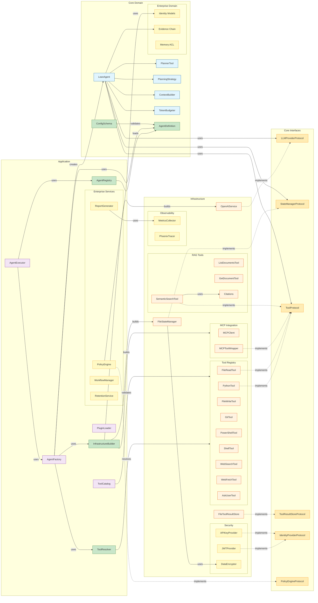
```mermaid
flowchart LR
    subgraph Core["Core Domain"]
        direction TB
        LA[LeanAgent]
        PT[PlannerTool]
        PS[PlanningStrategy]
        CB[ContextBuilder]
        TB[TokenBudgeter]
        AD[AgentDefinition]
        CS[ConfigSchema]

        subgraph EntDomain["Enterprise Domain"]
            IDENT[Identity Models]
            EVID[Evidence Chain]
            MACL[Memory ACL]
        end

        LA --> PT
        LA --> PS
        LA --> CB
        LA --> TB
        LA --> EVID
    end

    subgraph Protocols["Core Interfaces"]
        direction TB
        LLMP[LLMProviderProtocol]
        SMP[StateManagerProtocol]
        TP[ToolProtocol]
        TRSP[ToolResultStoreProtocol]
        IDP[IdentityProviderProtocol]
        PEP[PolicyEngineProtocol]
    end

    subgraph Infra["Infrastructure"]
        direction TB
        OAI[OpenAIService]
        FSM[FileStateManager]
        FTRS[FileToolResultStore]

        subgraph Security["Security"]
            JWTP[JWTProvider]
            APIKP[APIKeyProvider]
            ENCR[DataEncryptor]
        end

        subgraph Observ["Observability"]
            METR[MetricsCollector]
            TRAC[PhoenixTracer]
        end

        subgraph Tools["Tool Registry"]
            PY[PythonTool]
            FR[FileReadTool]
            FW[FileWriteTool]
            GT[GitTool]
            PS2[PowerShellTool]
            SH[ShellTool]
            WS[WebSearchTool]
            WF[WebFetchTool]
            AU[AskUserTool]
        end

        subgraph MCPTools["MCP Integration"]
            MC[MCPClient]
            MW[MCPToolWrapper]
        end

        subgraph RAGTools["RAG Tools"]
            SS[SemanticSearchTool]
            LD[ListDocumentsTool]
            GD[GetDocumentTool]
            CIT[Citations]
        end
    end

    subgraph App["Application"]
        direction TB
        AF[AgentFactory]
        AE[AgentExecutor]
        AR[AgentRegistry]
        TR[ToolResolver]
        IB[InfrastructureBuilder]
        TC[ToolCatalog]
        PL[PluginLoader]

        subgraph EntApp["Enterprise Services"]
            POLENG[PolicyEngine]
            REPGEN[ReportGenerator]
            WFMGR[WorkflowManager]
            RETNSVC[RetentionService]
        end
    end

    %% Protocol implementations
    OAI -.->|implements| LLMP
    FSM -.->|implements| SMP
    FTRS -.->|implements| TRSP
    PY -.->|implements| TP
    FR -.->|implements| TP
    MW -.->|implements| TP
    SS -.->|implements| TP
    JWTP -.->|implements| IDP
    APIKP -.->|implements| IDP
    POLENG -.->|implements| PEP

    %% Core uses protocols
    LA -->|uses| LLMP
    LA -->|uses| SMP
    LA -->|uses| TP

    %% Enterprise integrations
    FSM -->|uses| ENCR
    SS -->|uses| CIT
    POLENG -->|uses| IDENT
    REPGEN -->|uses| METR

    %% New unified flow
    AR -->|loads| AD
    AF -->|uses| AD
    AF -->|uses| TR
    AF -->|uses| IB
    TR -->|resolves| Tools
    IB -->|builds| OAI
    IB -->|builds| FSM
    IB -->|builds| MCPTools

    %% Application wiring
    AF -->|creates| LA
    AE -->|uses| AF
    AE -->|uses| AR
    TC -->|validates| Tools
    CS -->|validates| AD

    classDef protocol fill:#ffecb3,stroke:#ff8f00
    classDef domain fill:#e1f5fe,stroke:#01579b
    classDef adapter fill:#fff3e0,stroke:#e65100
    classDef service fill:#f3e5f5,stroke:#7b1fa2
    classDef new fill:#c8e6c9,stroke:#2e7d32
    classDef enterprise fill:#fff9c4,stroke:#f9a825

    class LLMP,SMP,TP,TRSP,IDP,PEP protocol
    class LA,PT,PS,CB,TB domain
    class OAI,FSM,FTRS,PY,FR,FW,GT,PS2,SH,WS,WF,AU,MC,MW,SS,LD,GD,CIT adapter
    class AF,AE,TC,PL service
    class AR,TR,IB,AD,CS new
    class IDENT,EVID,MACL,JWTP,APIKP,ENCR,METR,TRAC,POLENG,REPGEN,WFMGR,RETNSVC enterprise
```

---

## 3. ReAct Loop Execution Flow

Der Hauptausführungszyklus des Agenten:

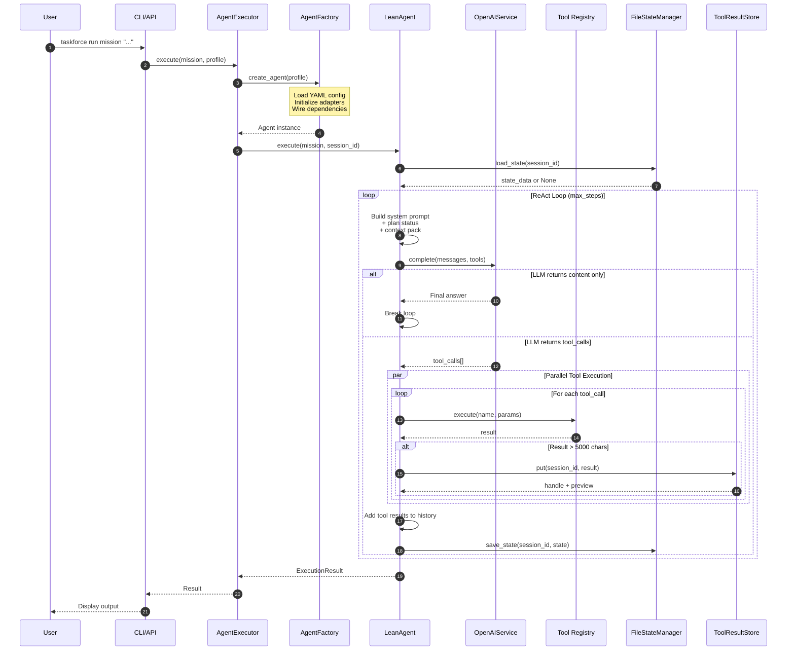
```mermaid
sequenceDiagram
    autonumber
    participant User
    participant CLI/API
    participant Executor as AgentExecutor
    participant Factory as AgentFactory
    participant Agent as LeanAgent
    participant LLM as OpenAIService
    participant Tools as Tool Registry
    participant State as FileStateManager
    participant Store as ToolResultStore

    User->>CLI/API: taskforce run mission "..."
    CLI/API->>Executor: execute(mission, profile)
    Executor->>Factory: create_agent(profile)

    Note over Factory: Load YAML config<br/>Initialize adapters<br/>Wire dependencies

    Factory-->>Executor: Agent instance
    Executor->>Agent: execute(mission, session_id)

    Agent->>State: load_state(session_id)
    State-->>Agent: state_data or None

    loop ReAct Loop (max_steps)
        Agent->>Agent: Build system prompt<br/>+ plan status<br/>+ context pack

        Agent->>LLM: complete(messages, tools)

        alt LLM returns content only
            LLM-->>Agent: Final answer
            Agent->>Agent: Break loop
        else LLM returns tool_calls
            LLM-->>Agent: tool_calls[]

            par Parallel Tool Execution
                loop For each tool_call
                    Agent->>Tools: execute(name, params)
                    Tools-->>Agent: result

                    alt Result > 5000 chars
                        Agent->>Store: put(session_id, result)
                        Store-->>Agent: handle + preview
                    end
                end
            end

            Agent->>Agent: Add tool results to history
            Agent->>State: save_state(session_id, state)
        end
    end

    Agent-->>Executor: ExecutionResult
    Executor-->>CLI/API: Result
    CLI/API-->>User: Display output
```

---

## 4. Tool Ecosystem

Übersicht aller Tool-Typen und deren Integration:

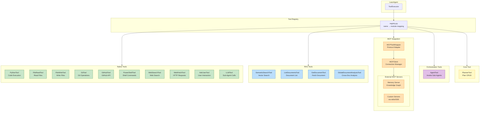
```mermaid
flowchart TB
    subgraph Agent["LeanAgent"]
        TE[ToolExecutor]
    end

    subgraph Registry["Tool Registry"]
        direction LR
        TR[registry.py<br/>name → module mapping]
    end

    subgraph Native["Native Tools"]
        direction TB
        N1[PythonTool<br/>Code Execution]
        N2[FileReadTool<br/>Read Files]
        N3[FileWriteTool<br/>Write Files]
        N4[GitTool<br/>Git Operations]
        N5[GitHubTool<br/>GitHub API]
        N6[PowerShellTool<br/>Shell Commands]
        N7[WebSearchTool<br/>Web Search]
        N8[WebFetchTool<br/>HTTP Requests]
        N9[AskUserTool<br/>User Interaction]
        N10[LLMTool<br/>Sub-Agent Calls]
    end

    subgraph RAGTools["RAG Tools"]
        direction TB
        R1[SemanticSearchTool<br/>Vector Search]
        R2[ListDocumentsTool<br/>Document List]
        R3[GetDocumentTool<br/>Fetch Document]
        R4[GlobalDocumentAnalysisTool<br/>Cross-Doc Analysis]
    end

    subgraph MCPIntegration["MCP Integration"]
        direction TB
        MC[MCPClient<br/>Connection Manager]
        MW[MCPToolWrapper<br/>Protocol Adapter]

        subgraph Servers["External MCP Servers"]
            S1[Memory Server<br/>Knowledge Graph]
            S2[Custom Servers<br/>via stdio/SSE]
        end
    end

    subgraph Orchestration["Orchestration Tools"]
        AT[AgentTool<br/>Invoke Sub-Agents]
    end

    subgraph CoreTool["Core Tool"]
        PT[PlannerTool<br/>Plan CRUD]
    end

    TE --> TR
    TR --> Native
    TR --> RAGTools
    TR --> MCPIntegration
    TR --> Orchestration
    TR --> CoreTool

    MC --> Servers
    MW --> MC

    classDef native fill:#c8e6c9,stroke:#2e7d32
    classDef rag fill:#bbdefb,stroke:#1565c0
    classDef mcp fill:#ffe0b2,stroke:#ef6c00
    classDef orch fill:#e1bee7,stroke:#7b1fa2
    classDef core fill:#fff9c4,stroke:#f9a825

    class N1,N2,N3,N4,N5,N6,N7,N8,N9,N10 native
    class R1,R2,R3,R4 rag
    class MC,MW,S1,S2 mcp
    class AT orch
    class PT core
```

---

## 5. State Management & Persistence

Wie Session-State verwaltet wird:

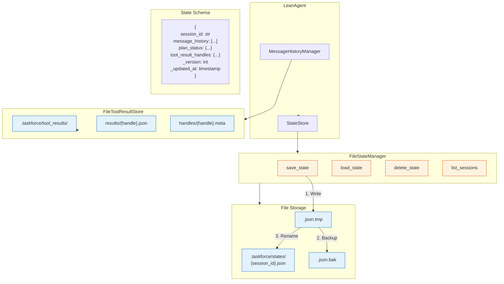
```mermaid
flowchart TB
    subgraph Agent["LeanAgent"]
        MHM[MessageHistoryManager]
        SS[StateStore]
    end

    subgraph State["FileStateManager"]
        direction TB
        SM[save_state]
        LM[load_state]
        DM[delete_state]
        LS[list_sessions]
    end

    subgraph Storage["File Storage"]
        direction TB
        SF[".taskforce/states/<br/>{session_id}.json"]
        TMP[".json.tmp"]
        BAK[".json.bak"]
    end

    subgraph Schema["State Schema"]
        direction LR
        SCH["
        {
          session_id: str
          message_history: [...]
          plan_status: {...}
          tool_result_handles: {...}
          _version: int
          _updated_at: timestamp
        }
        "]
    end

    subgraph ResultStore["FileToolResultStore"]
        direction TB
        RS[".taskforce/tool_results/"]
        RES["results/{handle}.json"]
        HND["handles/{handle}.meta"]
    end

    Agent --> SS
    SS --> State
    State --> Storage

    SM -->|"1. Write"| TMP
    TMP -->|"2. Backup"| BAK
    TMP -->|"3. Rename"| SF

    MHM --> ResultStore
    ResultStore --> RS

    classDef storage fill:#e3f2fd,stroke:#1565c0
    classDef manager fill:#fff3e0,stroke:#e65100

    class SF,TMP,BAK,RS,RES,HND storage
    class SM,LM,DM,LS manager
```

---

## 6. Configuration System

Profile-basierte Konfiguration:

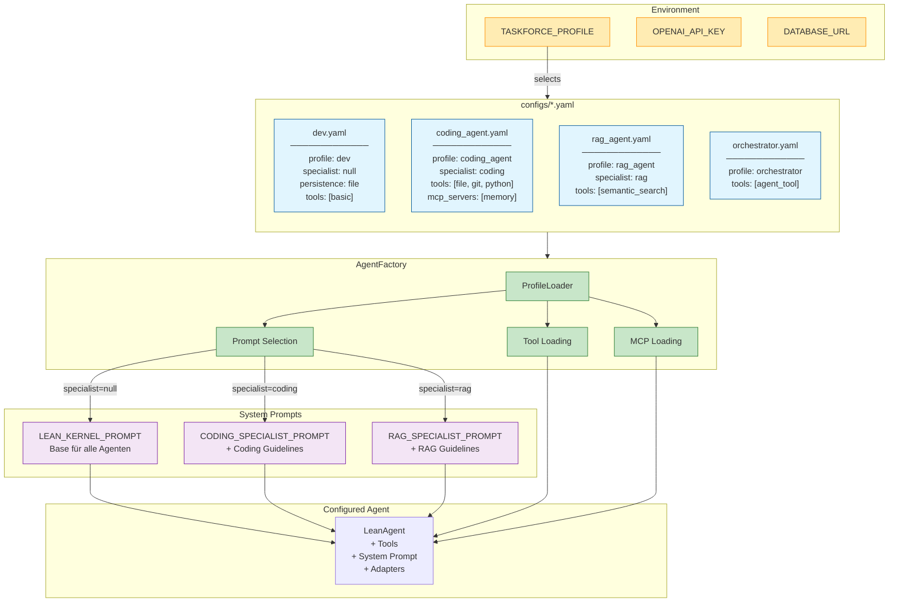
```mermaid
flowchart TB
    subgraph Env["Environment"]
        E1[TASKFORCE_PROFILE]
        E2[OPENAI_API_KEY]
        E3[DATABASE_URL]
    end

    subgraph Profiles["configs/*.yaml"]
        direction TB
        DEV["dev.yaml
        ─────────────
        profile: dev
        specialist: null
        persistence: file
        tools: [basic]"]

        COD["coding_agent.yaml
        ─────────────
        profile: coding_agent
        specialist: coding
        tools: [file, git, python]
        mcp_servers: [memory]"]

        RAG["rag_agent.yaml
        ─────────────
        profile: rag_agent
        specialist: rag
        tools: [semantic_search]"]

        ORCH["orchestrator.yaml
        ─────────────
        profile: orchestrator
        tools: [agent_tool]"]
    end

    subgraph Prompts["System Prompts"]
        direction TB
        KERN[LEAN_KERNEL_PROMPT<br/>Base für alle Agenten]
        SPEC_COD[CODING_SPECIALIST_PROMPT<br/>+ Coding Guidelines]
        SPEC_RAG[RAG_SPECIALIST_PROMPT<br/>+ RAG Guidelines]
    end

    subgraph Factory["AgentFactory"]
        PL[ProfileLoader]
        PS[Prompt Selection]
        TL[Tool Loading]
        ML[MCP Loading]
    end

    subgraph Agent["Configured Agent"]
        LA[LeanAgent<br/>+ Tools<br/>+ System Prompt<br/>+ Adapters]
    end

    E1 -->|selects| Profiles
    Profiles --> Factory

    PL --> PS
    PS -->|specialist=null| KERN
    PS -->|specialist=coding| SPEC_COD
    PS -->|specialist=rag| SPEC_RAG

    KERN --> LA
    SPEC_COD --> LA
    SPEC_RAG --> LA

    PL --> TL --> LA
    PL --> ML --> LA

    classDef env fill:#ffecb3,stroke:#ff8f00
    classDef config fill:#e1f5fe,stroke:#01579b
    classDef prompt fill:#f3e5f5,stroke:#7b1fa2
    classDef factory fill:#c8e6c9,stroke:#2e7d32

    class E1,E2,E3 env
    class DEV,COD,RAG,ORCH config
    class KERN,SPEC_COD,SPEC_RAG prompt
    class PL,PS,TL,ML factory
```

---

## 6a. Unified Agent Definition System (2026-01 Refactoring)

Das neue vereinheitlichte Agent-Definitions-System:

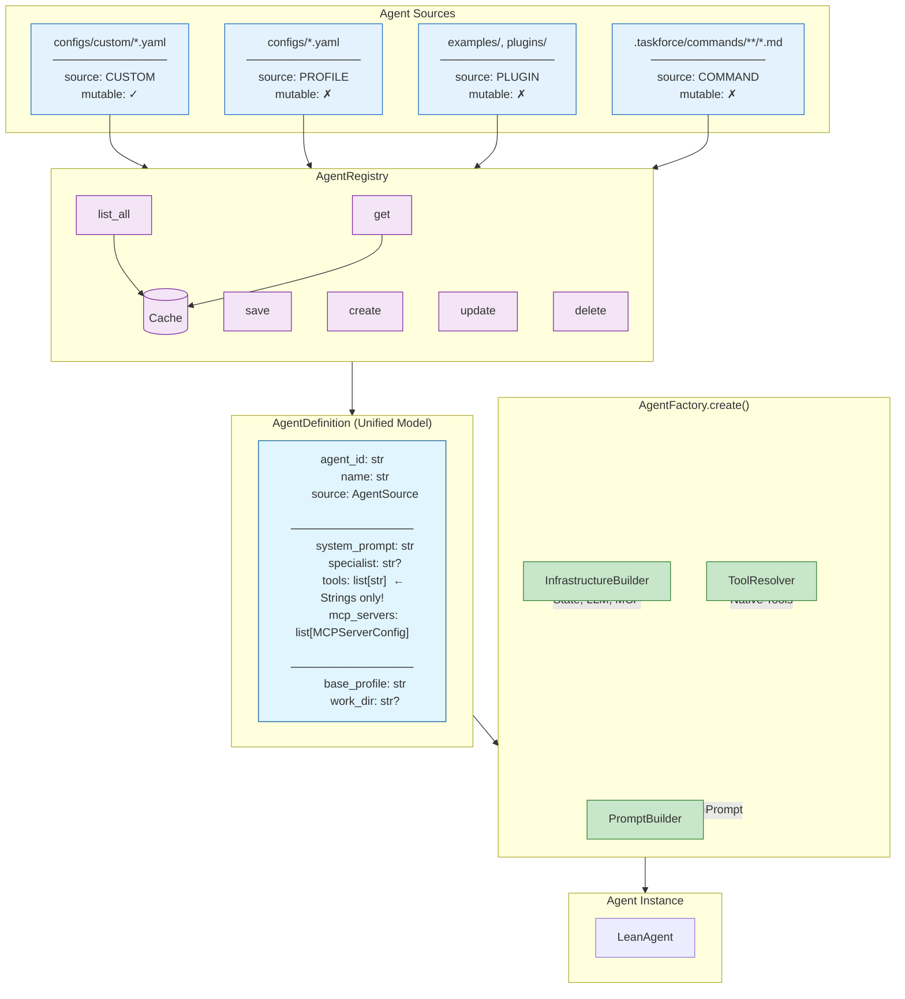
```mermaid
flowchart TB
    subgraph Sources["Agent Sources"]
        direction TB
        CUSTOM["configs/custom/*.yaml<br/>──────────────<br/>source: CUSTOM<br/>mutable: ✓"]
        PROFILE["configs/*.yaml<br/>──────────────<br/>source: PROFILE<br/>mutable: ✗"]
        PLUGIN["examples/, plugins/<br/>──────────────<br/>source: PLUGIN<br/>mutable: ✗"]
        COMMAND[".taskforce/commands/**/*.md<br/>──────────────<br/>source: COMMAND<br/>mutable: ✗"]
    end

    subgraph Registry["AgentRegistry"]
        direction TB
        LIST[list_all]
        GET[get]
        SAVE[save]
        CREATE[create]
        UPDATE[update]
        DELETE[delete]
        CACHE[(Cache)]
    end

    subgraph Definition["AgentDefinition (Unified Model)"]
        direction LR
        DEF["
        agent_id: str
        name: str
        source: AgentSource
        ───────────────
        system_prompt: str
        specialist: str?
        tools: list[str]  ← Strings only!
        mcp_servers: list[MCPServerConfig]
        ───────────────
        base_profile: str
        work_dir: str?
        "]
    end

    subgraph Factory["AgentFactory.create()"]
        direction TB
        IB[InfrastructureBuilder]
        TR[ToolResolver]
        PB[PromptBuilder]
    end

    subgraph Agent["Agent Instance"]
        LA[LeanAgent]
    end

    %% Source loading
    CUSTOM --> Registry
    PROFILE --> Registry
    PLUGIN --> Registry
    COMMAND --> Registry

    Registry --> Definition
    LIST --> CACHE
    GET --> CACHE

    %% Factory flow
    Definition --> Factory
    IB -->|State, LLM, MCP| Factory
    TR -->|Native Tools| Factory
    PB -->|System Prompt| Factory

    Factory --> Agent

    classDef source fill:#e3f2fd,stroke:#1565c0
    classDef registry fill:#f3e5f5,stroke:#7b1fa2
    classDef model fill:#e1f5fe,stroke:#01579b
    classDef factory fill:#c8e6c9,stroke:#2e7d32

    class CUSTOM,PROFILE,PLUGIN,COMMAND source
    class LIST,GET,SAVE,CREATE,UPDATE,DELETE,CACHE registry
    class DEF model
    class IB,TR,PB factory
```

---

## 6b. Tool Resolution Flow

Wie Tools von Namen zu Instanzen aufgelöst werden:

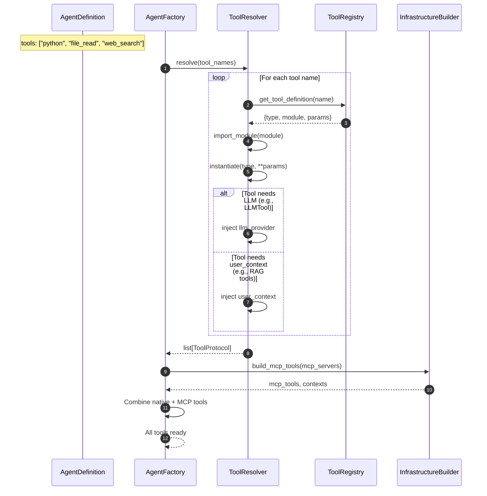
```mermaid
sequenceDiagram
    autonumber
    participant Def as AgentDefinition
    participant Factory as AgentFactory
    participant Resolver as ToolResolver
    participant Registry as ToolRegistry
    participant Infra as InfrastructureBuilder

    Note over Def: tools: ["python", "file_read", "web_search"]

    Factory->>Resolver: resolve(tool_names)

    loop For each tool name
        Resolver->>Registry: get_tool_definition(name)
        Registry-->>Resolver: {type, module, params}

        Resolver->>Resolver: import_module(module)
        Resolver->>Resolver: instantiate(type, **params)

        alt Tool needs LLM (e.g., LLMTool)
            Resolver->>Resolver: inject llm_provider
        else Tool needs user_context (e.g., RAG tools)
            Resolver->>Resolver: inject user_context
        end
    end

    Resolver-->>Factory: list[ToolProtocol]

    Factory->>Infra: build_mcp_tools(mcp_servers)
    Infra-->>Factory: mcp_tools, contexts

    Factory->>Factory: Combine native + MCP tools
    Factory-->>Factory: All tools ready
```

---

## 6c. Unified Config Schema

Pydantic-basierte Validierung:

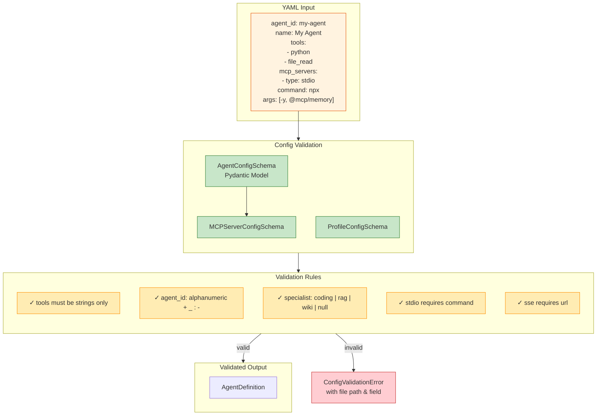
```mermaid
flowchart TB
    subgraph Input["YAML Input"]
        YAML["
        agent_id: my-agent
        name: My Agent
        tools:
          - python
          - file_read
        mcp_servers:
          - type: stdio
            command: npx
            args: [-y, @mcp/memory]
        "]
    end

    subgraph Validation["Config Validation"]
        direction TB
        ACS[AgentConfigSchema<br/>Pydantic Model]
        MCS[MCPServerConfigSchema]
        PCS[ProfileConfigSchema]

        ACS --> MCS
    end

    subgraph Rules["Validation Rules"]
        direction TB
        R1["✓ tools must be strings only"]
        R2["✓ agent_id: alphanumeric + _ : -"]
        R3["✓ specialist: coding | rag | wiki | null"]
        R4["✓ stdio requires command"]
        R5["✓ sse requires url"]
    end

    subgraph Output["Validated Output"]
        AD[AgentDefinition]
    end

    YAML --> Validation
    Validation --> Rules
    Rules -->|"valid"| Output
    Rules -->|"invalid"| ERR[ConfigValidationError<br/>with file path & field]

    classDef input fill:#fff3e0,stroke:#e65100
    classDef valid fill:#c8e6c9,stroke:#2e7d32
    classDef rules fill:#ffecb3,stroke:#ff8f00
    classDef error fill:#ffcdd2,stroke:#c62828

    class YAML input
    class ACS,MCS,PCS valid
    class R1,R2,R3,R4,R5 rules
    class ERR error
```

---

## 7. MCP Server Integration

Wie externe MCP-Server integriert werden:

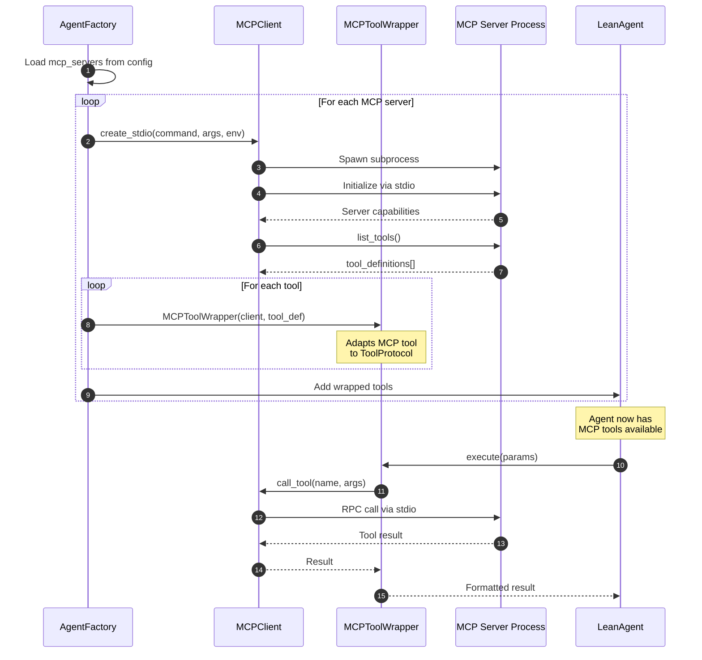
```mermaid
sequenceDiagram
    autonumber
    participant Factory as AgentFactory
    participant Client as MCPClient
    participant Wrapper as MCPToolWrapper
    participant Server as MCP Server Process
    participant Agent as LeanAgent

    Factory->>Factory: Load mcp_servers from config

    loop For each MCP server
        Factory->>Client: create_stdio(command, args, env)
        Client->>Server: Spawn subprocess
        Client->>Server: Initialize via stdio
        Server-->>Client: Server capabilities

        Client->>Server: list_tools()
        Server-->>Client: tool_definitions[]

        loop For each tool
            Factory->>Wrapper: MCPToolWrapper(client, tool_def)
            Note over Wrapper: Adapts MCP tool<br/>to ToolProtocol
        end

        Factory->>Agent: Add wrapped tools
    end

    Note over Agent: Agent now has<br/>MCP tools available

    Agent->>Wrapper: execute(params)
    Wrapper->>Client: call_tool(name, args)
    Client->>Server: RPC call via stdio
    Server-->>Client: Tool result
    Client-->>Wrapper: Result
    Wrapper-->>Agent: Formatted result
```

---

## 8. API Layer Architecture

REST und CLI Entrypoints mit Enterprise Security:

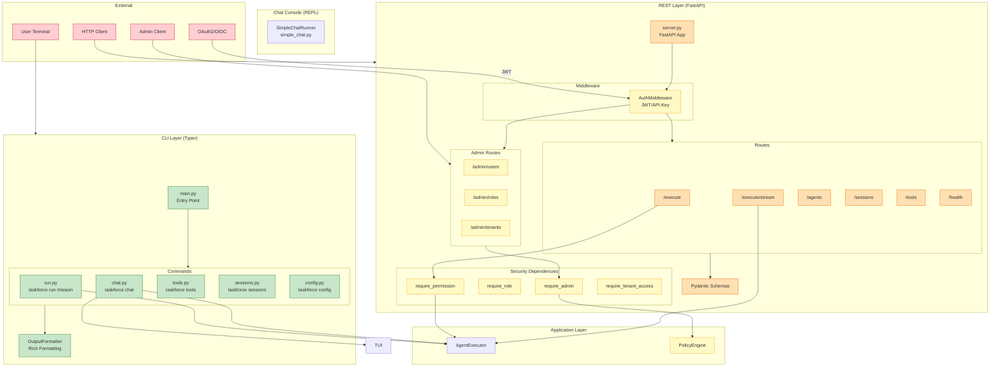
```mermaid
flowchart TB
    subgraph External["External"]
        U1[User Terminal]
        U2[HTTP Client]
        U3[Admin Client]
        OIDC[OAuth2/OIDC]
    end

    subgraph CLI["CLI Layer (Typer)"]
        direction TB
        MAIN[main.py<br/>Entry Point]

        subgraph Commands["Commands"]
            RUN[run.py<br/>taskforce run mission]
            CHAT[chat.py<br/>taskforce chat]
            TOOLS[tools.py<br/>taskforce tools]
            SESS[sessions.py<br/>taskforce sessions]
            CFG[config.py<br/>taskforce config]
        end

        OF[OutputFormatter<br/>Rich Formatting]
    end

    subgraph ChatConsole["Chat Console (REPL)"]
        direction TB
        SIMPLE[SimpleChatRunner<br/>simple_chat.py]
    end

    subgraph REST["REST Layer (FastAPI)"]
        direction TB
        SRV[server.py<br/>FastAPI App]

        subgraph Middleware["Middleware"]
            AUTH[AuthMiddleware<br/>JWT/API-Key]
        end

        subgraph Routes["Routes"]
            EX["/execute"]
            EXS["/execute/stream"]
            AG["/agents"]
            SE["/sessions"]
            TL["/tools"]
            HE["/health"]
        end

        subgraph Admin["Admin Routes"]
            USERS["/admin/users"]
            ROLES["/admin/roles"]
            TENANTS["/admin/tenants"]
        end

        subgraph Dependencies["Security Dependencies"]
            RP[require_permission]
            RR[require_role]
            RA[require_admin]
            RT[require_tenant_access]
        end

        SCH[Pydantic Schemas]
    end

    subgraph App["Application Layer"]
        AE[AgentExecutor]
        PE[PolicyEngine]
    end

    U1 --> CLI
    U2 --> REST
    U3 --> Admin
    OIDC -->|JWT| AUTH

    MAIN --> Commands
    Commands --> OF
    CHAT --> TUI

    RUN --> AE
    CHAT --> AE

    SRV --> AUTH
    AUTH --> Routes
    AUTH --> Admin
    Routes --> SCH
    EX --> RP
    RP --> AE
    EXS --> AE

    Admin --> RA
    RA --> PE

    classDef external fill:#ffcdd2,stroke:#c62828
    classDef cli fill:#c8e6c9,stroke:#2e7d32
    classDef tui fill:#bbdefb,stroke:#1565c0
    classDef rest fill:#ffe0b2,stroke:#ef6c00
    classDef enterprise fill:#fff9c4,stroke:#f9a825

    class U1,U2,U3,OIDC external
    class MAIN,RUN,CHAT,TOOLS,SESS,CFG,OF cli
    class APP,CL,EP,PP,IB tui
    class SRV,EX,EXS,AG,SE,TL,HE,SCH rest
    class AUTH,USERS,ROLES,TENANTS,RP,RR,RA,RT,PE enterprise
```

---

## 9. Complete System Overview

Vollständige Systemübersicht mit allen Komponenten (inkl. Enterprise Features):

```mermaid
graph TB
    subgraph Users["Users"]
        DEV[Developer]
        SVC[Service/API Client]
        ADMIN[Administrator]
    end

    subgraph Entrypoints["API Layer"]
        CLI[CLI<br/>taskforce run/chat]
        REST[REST API<br/>POST /execute]
        TUI[Chat TUI<br/>Interactive]
        AuthMW[Auth Middleware<br/>JWT/API-Key]
        AdminRoutes[Admin API<br/>Users, Roles, Tenants]
    end

    subgraph Application["Application Layer"]
        EXEC[AgentExecutor]
        FACT[AgentFactory]
        REG[AgentRegistry]
        TRES[ToolResolver]
        IBLD[InfrastructureBuilder]
        CAT[ToolCatalog]
        PLUG[PluginLoader]

        subgraph Enterprise["Enterprise Services"]
            POLICY[PolicyEngine<br/>RBAC]
            REPORT[ReportGenerator<br/>Usage & Cost]
            WORKFLOW[WorkflowManager<br/>Approvals]
            RETAIN[RetentionService<br/>GDPR]
        end
    end

    subgraph Domain["Core Domain Layer"]
        AGENT[LeanAgent<br/>ReAct Loop]
        PLAN[PlannerTool]
        STRAT[PlanningStrategy]
        CTX[ContextBuilder]
        TOK[TokenBudgeter]
        ADEF[AgentDefinition<br/>Unified Model]
        CSCH[ConfigSchema<br/>Validation]

        subgraph EnterpriseDomain["Enterprise Domain"]
            IDENT[Identity Models<br/>Tenant, User]
            EVID[Evidence Chain<br/>Citations]
            MACL[Memory ACL]
        end

        subgraph Protocols["Interfaces"]
            P1[LLMProviderProtocol]
            P2[StateManagerProtocol]
            P3[ToolProtocol]
            P4[ToolResultStoreProtocol]
            P5[IdentityProviderProtocol]
            P6[PolicyEngineProtocol]
        end
    end

    subgraph Infrastructure["Infrastructure Layer"]
        subgraph LLMAdapters["LLM"]
            OAI[OpenAIService]
        end

        subgraph Persistence["Persistence"]
            FSM[FileStateManager]
            FTR[FileToolResultStore]
            ENCR[DataEncryptor<br/>AES-256]
        end

        subgraph Security["Security"]
            JWT[JWTProvider]
            APIK[APIKeyProvider]
        end

        subgraph Observability["Observability"]
            METR[MetricsCollector<br/>Prometheus]
            TRAC[PhoenixTracer]
        end

        subgraph ToolsInfra["Tools"]
            TREG[ToolRegistry]
            NT[Native Tools<br/>11 tools]
            RT[RAG Tools<br/>4 tools + Citations]
            MT[MCP Tools<br/>dynamic]
            OT[Orchestration<br/>AgentTool]
        end
    end

    subgraph External["External Services"]
        OPENAI[OpenAI API]
        AZURE[Azure OpenAI]
        MCPS[MCP Servers]
        FS[File System]
        GH[GitHub API]
        OIDC[OAuth2/OIDC]
    end

    %% User connections
    DEV --> CLI
    DEV --> TUI
    SVC --> REST
    ADMIN --> AdminRoutes

    %% API to Application
    CLI --> EXEC
    REST --> AuthMW
    AuthMW --> EXEC
    TUI --> EXEC
    AdminRoutes --> POLICY

    %% Auth flow
    AuthMW --> JWT
    AuthMW --> APIK
    JWT --> P5
    APIK --> P5

    %% Application wiring (new unified flow)
    EXEC --> FACT
    EXEC --> REG
    REG --> ADEF
    FACT --> ADEF
    FACT --> TRES
    FACT --> IBLD
    TRES --> TREG
    IBLD --> OAI
    IBLD --> FSM
    IBLD --> MT
    FACT --> AGENT
    FACT --> CAT
    PLUG --> REG
    CSCH --> ADEF

    %% Enterprise flows
    POLICY --> IDENT
    POLICY -.->|impl| P6
    REPORT --> METR
    WORKFLOW --> POLICY
    FSM --> ENCR

    %% Domain dependencies
    AGENT --> PLAN
    AGENT --> STRAT
    AGENT --> CTX
    AGENT --> TOK
    AGENT --> P1
    AGENT --> P2
    AGENT --> P3
    AGENT --> EVID

    %% Protocol implementations
    OAI -.->|impl| P1
    FSM -.->|impl| P2
    FTR -.->|impl| P4
    NT -.->|impl| P3
    RT -.->|impl| P3
    MT -.->|impl| P3

    %% Tool registry
    TREG --> NT
    TREG --> RT

    %% External connections
    OAI --> OPENAI
    OAI --> AZURE
    MT --> MCPS
    FSM --> FS
    FTR --> FS
    NT --> GH
    NT --> FS
    JWT --> OIDC

    classDef user fill:#ffcdd2,stroke:#c62828
    classDef api fill:#e8f5e9,stroke:#2e7d32
    classDef app fill:#f3e5f5,stroke:#7b1fa2
    classDef domain fill:#e1f5fe,stroke:#01579b
    classDef infra fill:#fff3e0,stroke:#e65100
    classDef external fill:#f5f5f5,stroke:#616161
    classDef new fill:#c8e6c9,stroke:#2e7d32
    classDef enterprise fill:#fff9c4,stroke:#f9a825

    class DEV,SVC,ADMIN user
    class CLI,REST,TUI api
    class EXEC,FACT,CAT,PLUG app
    class AGENT,PLAN,STRAT,CTX,TOK,P1,P2,P3,P4 domain
    class OAI,FSM,FTR,TREG,NT,RT,MT,OT infra
    class OPENAI,AZURE,MCPS,FS,GH,OIDC external
    class REG,TRES,IBLD,ADEF,CSCH new
    class AuthMW,AdminRoutes,POLICY,REPORT,WORKFLOW,RETAIN,IDENT,EVID,MACL,P5,P6,JWT,APIK,ENCR,METR,TRAC enterprise
```

---

## 10. Import Rules & Layer Dependencies

Visualisierung der erlaubten Abhängigkeitsrichtungen:

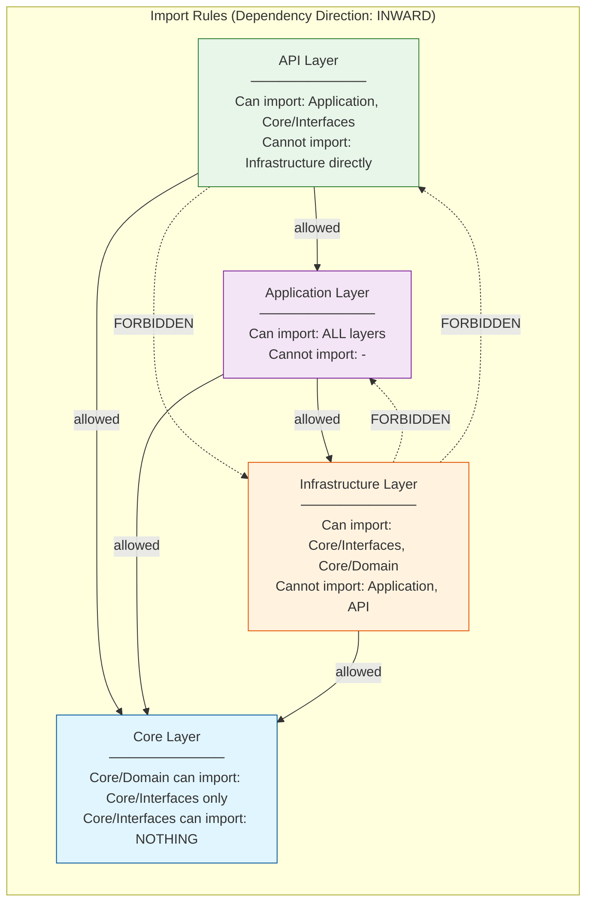
```mermaid
flowchart TB
    subgraph Rules["Import Rules (Dependency Direction: INWARD)"]
        direction TB

        API["API Layer<br/>────────────<br/>Can import: Application, Core/Interfaces<br/>Cannot import: Infrastructure directly"]

        APP["Application Layer<br/>────────────<br/>Can import: ALL layers<br/>Cannot import: -"]

        INFRA["Infrastructure Layer<br/>────────────<br/>Can import: Core/Interfaces, Core/Domain<br/>Cannot import: Application, API"]

        CORE["Core Layer<br/>────────────<br/>Core/Domain can import: Core/Interfaces only<br/>Core/Interfaces can import: NOTHING"]
    end

    API -->|"allowed"| APP
    API -->|"allowed"| CORE
    API -.->|"FORBIDDEN"| INFRA

    APP -->|"allowed"| INFRA
    APP -->|"allowed"| CORE

    INFRA -->|"allowed"| CORE
    INFRA -.->|"FORBIDDEN"| APP
    INFRA -.->|"FORBIDDEN"| API

    style API fill:#e8f5e9,stroke:#2e7d32
    style APP fill:#f3e5f5,stroke:#7b1fa2
    style INFRA fill:#fff3e0,stroke:#e65100
    style CORE fill:#e1f5fe,stroke:#01579b
```

---

## 11. Enterprise Security Architecture

Multi-Tenant-Sicherheitsarchitektur mit RBAC und Identity Management:

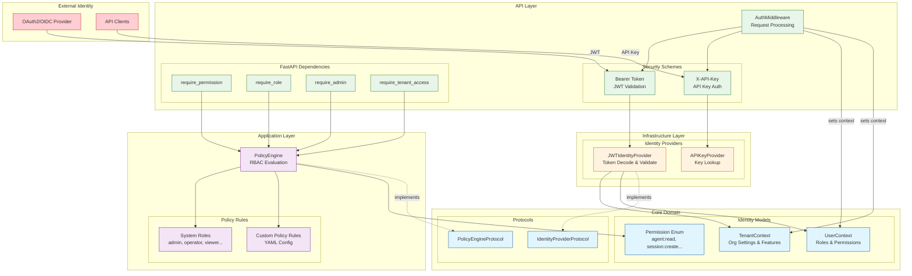
```mermaid
flowchart TB
    subgraph External["External Identity"]
        OIDC[OAuth2/OIDC Provider]
        APIClient[API Clients]
    end

    subgraph APILayer["API Layer"]
        AuthMW[AuthMiddleware<br/>Request Processing]

        subgraph Security["Security Schemes"]
            Bearer[Bearer Token<br/>JWT Validation]
            APIKey[X-API-Key<br/>API Key Auth]
        end

        subgraph Dependencies["FastAPI Dependencies"]
            ReqUser[require_permission]
            ReqRole[require_role]
            ReqAdmin[require_admin]
            ReqTenant[require_tenant_access]
        end
    end

    subgraph Application["Application Layer"]
        PolicyEngine[PolicyEngine<br/>RBAC Evaluation]

        subgraph Rules["Policy Rules"]
            SysRoles[System Roles<br/>admin, operator, viewer...]
            CustomRules[Custom Policy Rules<br/>YAML Config]
        end
    end

    subgraph Infrastructure["Infrastructure Layer"]
        subgraph Providers["Identity Providers"]
            JWTProvider[JWTIdentityProvider<br/>Token Decode & Validate]
            APIKeyProvider[APIKeyProvider<br/>Key Lookup]
        end
    end

    subgraph Core["Core Domain"]
        subgraph Identity["Identity Models"]
            TenantCtx[TenantContext<br/>Org Settings & Features]
            UserCtx[UserContext<br/>Roles & Permissions]
            Permission[Permission Enum<br/>agent:read, session:create...]
        end

        subgraph Protocols["Protocols"]
            IDP[IdentityProviderProtocol]
            PEP[PolicyEngineProtocol]
        end
    end

    %% Request flow
    OIDC -->|JWT| Bearer
    APIClient -->|API Key| APIKey

    AuthMW --> Bearer
    AuthMW --> APIKey
    Bearer --> JWTProvider
    APIKey --> APIKeyProvider

    JWTProvider --> TenantCtx
    JWTProvider --> UserCtx
    JWTProvider -.->|implements| IDP

    AuthMW -->|sets context| UserCtx
    AuthMW -->|sets context| TenantCtx

    ReqUser --> PolicyEngine
    ReqRole --> PolicyEngine
    ReqAdmin --> PolicyEngine
    ReqTenant --> PolicyEngine

    PolicyEngine --> SysRoles
    PolicyEngine --> CustomRules
    PolicyEngine --> Permission
    PolicyEngine -.->|implements| PEP

    classDef external fill:#ffcdd2,stroke:#c62828
    classDef api fill:#e8f5e9,stroke:#2e7d32
    classDef app fill:#f3e5f5,stroke:#7b1fa2
    classDef infra fill:#fff3e0,stroke:#e65100
    classDef core fill:#e1f5fe,stroke:#01579b

    class OIDC,APIClient external
    class AuthMW,Bearer,APIKey,ReqUser,ReqRole,ReqAdmin,ReqTenant api
    class PolicyEngine,SysRoles,CustomRules app
    class JWTProvider,APIKeyProvider infra
    class TenantCtx,UserCtx,Permission,IDP,PEP core
```

---

## 12. Evidence & Audit Trail

Nachvollziehbarkeit und Compliance durch Evidence Chain:

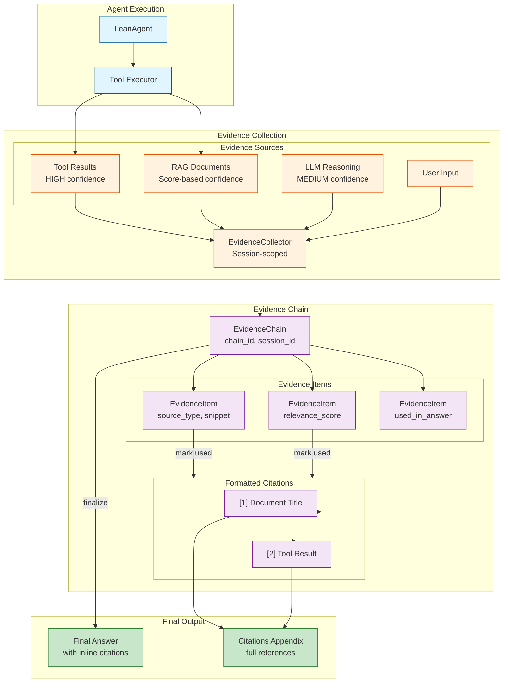
```mermaid
flowchart TB
    subgraph AgentExecution["Agent Execution"]
        LA[LeanAgent]
        ToolExec[Tool Executor]
    end

    subgraph Collection["Evidence Collection"]
        EC[EvidenceCollector<br/>Session-scoped]

        subgraph Sources["Evidence Sources"]
            ToolResult[Tool Results<br/>HIGH confidence]
            RAGDoc[RAG Documents<br/>Score-based confidence]
            LLMReason[LLM Reasoning<br/>MEDIUM confidence]
            UserInput[User Input]
        end
    end

    subgraph Chain["Evidence Chain"]
        EChain[EvidenceChain<br/>chain_id, session_id]

        subgraph Items["Evidence Items"]
            EI1[EvidenceItem<br/>source_type, snippet]
            EI2[EvidenceItem<br/>relevance_score]
            EI3[EvidenceItem<br/>used_in_answer]
        end

        subgraph Citations["Formatted Citations"]
            C1["[1] Document Title"]
            C2["[2] Tool Result"]
        end
    end

    subgraph Output["Final Output"]
        Answer[Final Answer<br/>with inline citations]
        Appendix[Citations Appendix<br/>full references]
    end

    LA --> ToolExec
    ToolExec --> ToolResult
    ToolExec --> RAGDoc

    ToolResult --> EC
    RAGDoc --> EC
    LLMReason --> EC
    UserInput --> EC

    EC --> EChain
    EChain --> EI1
    EChain --> EI2
    EChain --> EI3

    EI1 -->|mark used| Citations
    EI2 -->|mark used| Citations

    Citations --> C1
    Citations --> C2

    EChain -->|finalize| Answer
    C1 --> Appendix
    C2 --> Appendix

    classDef agent fill:#e1f5fe,stroke:#01579b
    classDef collection fill:#fff3e0,stroke:#e65100
    classDef chain fill:#f3e5f5,stroke:#7b1fa2
    classDef output fill:#c8e6c9,stroke:#2e7d32

    class LA,ToolExec agent
    class EC,ToolResult,RAGDoc,LLMReason,UserInput collection
    class EChain,EI1,EI2,EI3,C1,C2 chain
    class Answer,Appendix output
```

---

## 13. Memory Access Control (ACL)

Feingranulare Zugriffskontrolle für Memory-Objekte:

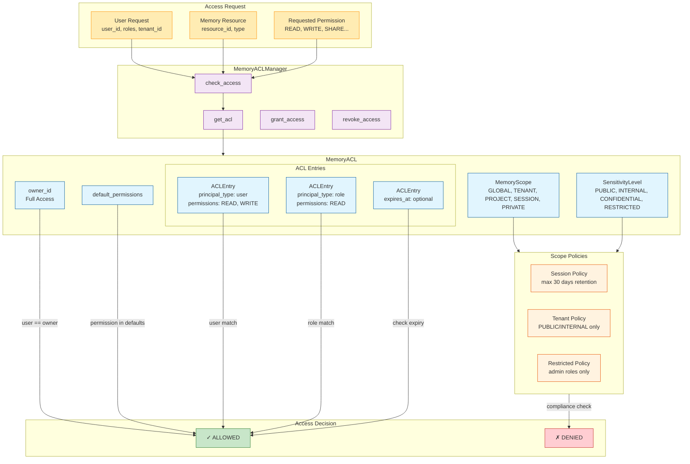
```mermaid
flowchart TB
    subgraph Request["Access Request"]
        User[User Request<br/>user_id, roles, tenant_id]
        Resource[Memory Resource<br/>resource_id, type]
        Action[Requested Permission<br/>READ, WRITE, SHARE...]
    end

    subgraph ACLManager["MemoryACLManager"]
        CheckAccess[check_access]
        GetACL[get_acl]
        Grant[grant_access]
        Revoke[revoke_access]
    end

    subgraph ACL["MemoryACL"]
        Owner[owner_id<br/>Full Access]
        Scope[MemoryScope<br/>GLOBAL, TENANT, PROJECT, SESSION, PRIVATE]
        Sensitivity[SensitivityLevel<br/>PUBLIC, INTERNAL, CONFIDENTIAL, RESTRICTED]
        DefaultPerms[default_permissions]

        subgraph Entries["ACL Entries"]
            E1[ACLEntry<br/>principal_type: user<br/>permissions: READ, WRITE]
            E2[ACLEntry<br/>principal_type: role<br/>permissions: READ]
            E3[ACLEntry<br/>expires_at: optional]
        end
    end

    subgraph Policy["Scope Policies"]
        SessionPolicy[Session Policy<br/>max 30 days retention]
        TenantPolicy[Tenant Policy<br/>PUBLIC/INTERNAL only]
        RestrictedPolicy[Restricted Policy<br/>admin roles only]
    end

    subgraph Decision["Access Decision"]
        Allow[✓ ALLOWED]
        Deny[✗ DENIED]
    end

    User --> CheckAccess
    Resource --> CheckAccess
    Action --> CheckAccess

    CheckAccess --> GetACL
    GetACL --> ACL

    %% ACL evaluation
    Owner -->|"user == owner"| Allow
    DefaultPerms -->|"permission in defaults"| Allow

    E1 -->|"user match"| Allow
    E2 -->|"role match"| Allow
    E3 -->|"check expiry"| Allow

    Scope --> Policy
    Sensitivity --> Policy
    Policy -->|"compliance check"| Deny

    classDef request fill:#ffecb3,stroke:#ff8f00
    classDef manager fill:#f3e5f5,stroke:#7b1fa2
    classDef acl fill:#e1f5fe,stroke:#01579b
    classDef policy fill:#fff3e0,stroke:#e65100
    classDef allow fill:#c8e6c9,stroke:#2e7d32
    classDef deny fill:#ffcdd2,stroke:#c62828

    class User,Resource,Action request
    class CheckAccess,GetACL,Grant,Revoke manager
    class Owner,Scope,Sensitivity,DefaultPerms,E1,E2,E3 acl
    class SessionPolicy,TenantPolicy,RestrictedPolicy policy
    class Allow allow
    class Deny deny
```

---

## 14. Reporting & Cost Management

Usage-Tracking und Billing-Integration:

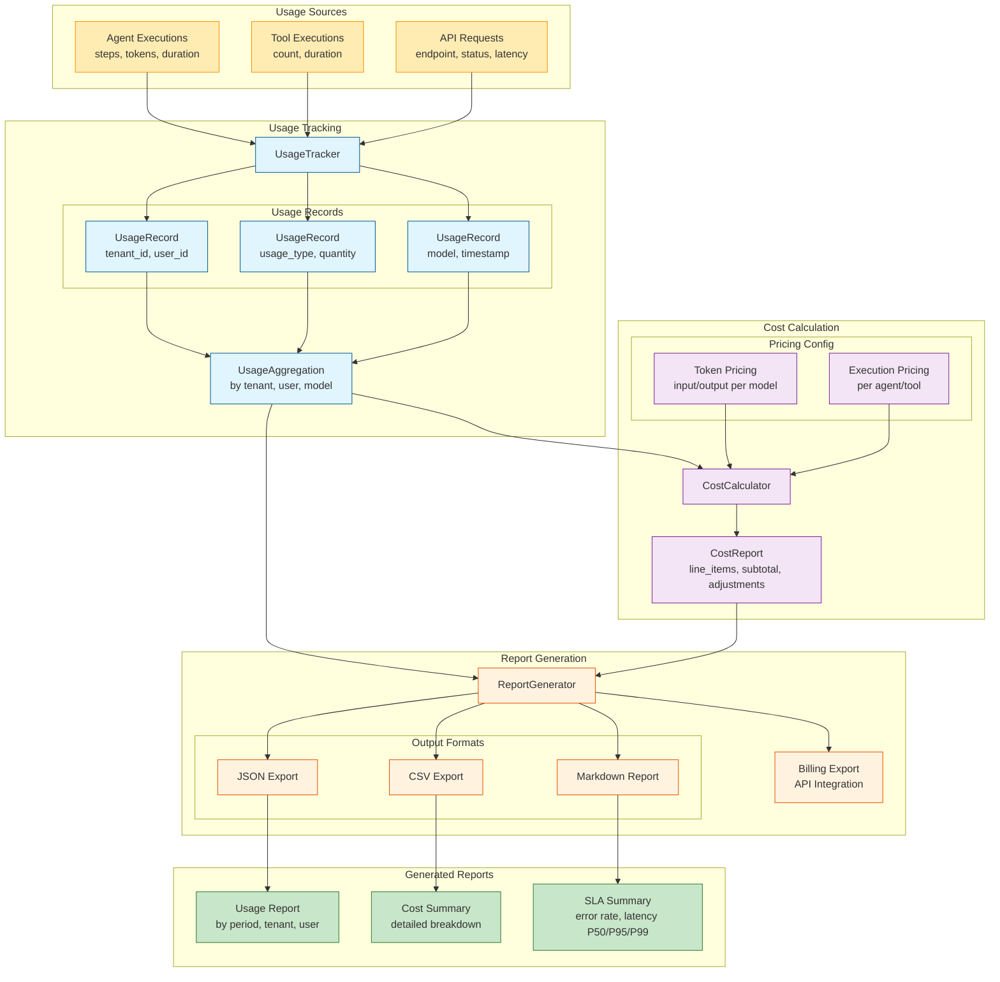
```mermaid
flowchart TB
    subgraph Sources["Usage Sources"]
        AgentExec[Agent Executions<br/>steps, tokens, duration]
        ToolExec[Tool Executions<br/>count, duration]
        APIReq[API Requests<br/>endpoint, status, latency]
    end

    subgraph Tracking["Usage Tracking"]
        UsageTracker[UsageTracker]

        subgraph Records["Usage Records"]
            R1[UsageRecord<br/>tenant_id, user_id]
            R2[UsageRecord<br/>usage_type, quantity]
            R3[UsageRecord<br/>model, timestamp]
        end

        Aggregation[UsageAggregation<br/>by tenant, user, model]
    end

    subgraph Cost["Cost Calculation"]
        CostCalc[CostCalculator]

        subgraph Pricing["Pricing Config"]
            TokenPrice[Token Pricing<br/>input/output per model]
            ExecPrice[Execution Pricing<br/>per agent/tool]
        end

        CostReport[CostReport<br/>line_items, subtotal, adjustments]
    end

    subgraph Reports["Report Generation"]
        ReportGen[ReportGenerator]

        subgraph Formats["Output Formats"]
            JSON[JSON Export]
            CSV[CSV Export]
            MD[Markdown Report]
        end

        BillingExport[Billing Export<br/>API Integration]
    end

    subgraph Output["Generated Reports"]
        UsageReport[Usage Report<br/>by period, tenant, user]
        CostSummary[Cost Summary<br/>detailed breakdown]
        SLASummary[SLA Summary<br/>error rate, latency P50/P95/P99]
    end

    AgentExec --> UsageTracker
    ToolExec --> UsageTracker
    APIReq --> UsageTracker

    UsageTracker --> R1
    UsageTracker --> R2
    UsageTracker --> R3

    R1 --> Aggregation
    R2 --> Aggregation
    R3 --> Aggregation

    Aggregation --> CostCalc
    TokenPrice --> CostCalc
    ExecPrice --> CostCalc
    CostCalc --> CostReport

    Aggregation --> ReportGen
    CostReport --> ReportGen

    ReportGen --> JSON
    ReportGen --> CSV
    ReportGen --> MD
    ReportGen --> BillingExport

    JSON --> UsageReport
    CSV --> CostSummary
    MD --> SLASummary

    classDef source fill:#ffecb3,stroke:#ff8f00
    classDef tracking fill:#e1f5fe,stroke:#01579b
    classDef cost fill:#f3e5f5,stroke:#7b1fa2
    classDef report fill:#fff3e0,stroke:#e65100
    classDef output fill:#c8e6c9,stroke:#2e7d32

    class AgentExec,ToolExec,APIReq source
    class UsageTracker,R1,R2,R3,Aggregation tracking
    class CostCalc,TokenPrice,ExecPrice,CostReport cost
    class ReportGen,JSON,CSV,MD,BillingExport report
    class UsageReport,CostSummary,SLASummary output
```

---

## 15. Approval Workflows

Enterprise Governance mit Genehmigungsprozessen:

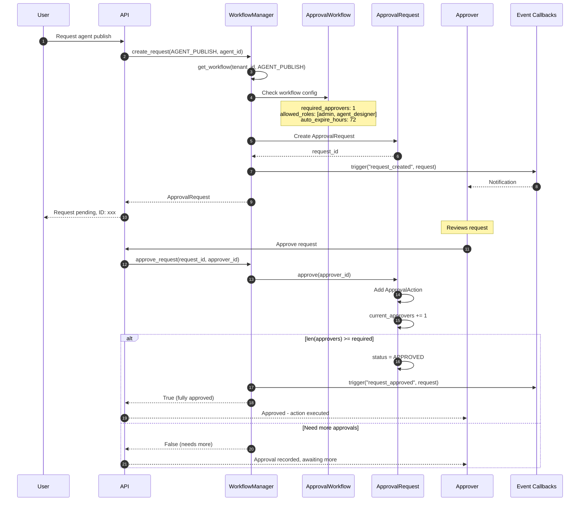
```mermaid
sequenceDiagram
    autonumber
    participant User
    participant API
    participant WFM as WorkflowManager
    participant Workflow as ApprovalWorkflow
    participant Request as ApprovalRequest
    participant Approver
    participant Callback as Event Callbacks

    User->>API: Request agent publish
    API->>WFM: create_request(AGENT_PUBLISH, agent_id)

    WFM->>WFM: get_workflow(tenant_id, AGENT_PUBLISH)
    WFM->>Workflow: Check workflow config

    Note over Workflow: required_approvers: 1<br/>allowed_roles: [admin, agent_designer]<br/>auto_expire_hours: 72

    WFM->>Request: Create ApprovalRequest
    Request-->>WFM: request_id

    WFM->>Callback: trigger("request_created", request)
    Callback-->>Approver: Notification

    WFM-->>API: ApprovalRequest
    API-->>User: Request pending, ID: xxx

    Note over Approver: Reviews request

    Approver->>API: Approve request
    API->>WFM: approve_request(request_id, approver_id)

    WFM->>Request: approve(approver_id)
    Request->>Request: Add ApprovalAction
    Request->>Request: current_approvers += 1

    alt len(approvers) >= required
        Request->>Request: status = APPROVED
        WFM->>Callback: trigger("request_approved", request)
        WFM-->>API: True (fully approved)
        API-->>Approver: Approved - action executed
    else Need more approvals
        WFM-->>API: False (needs more)
        API-->>Approver: Approval recorded, awaiting more
    end
```

---

## 16. Data Retention & GDPR Compliance

Datenaufbewahrung und Right-to-be-Forgotten:

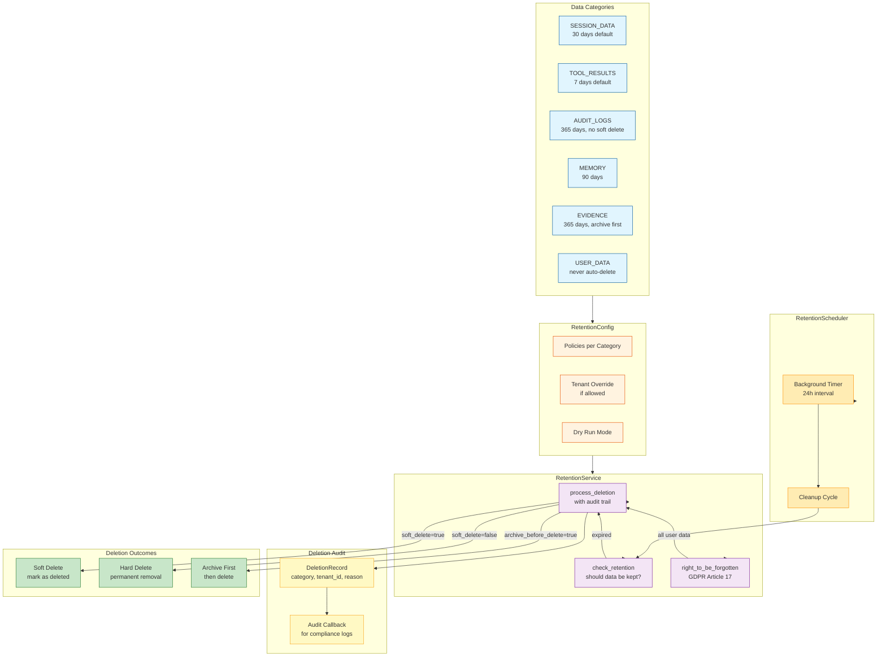
```mermaid
flowchart TB
    subgraph Categories["Data Categories"]
        SessionData[SESSION_DATA<br/>30 days default]
        ToolResults[TOOL_RESULTS<br/>7 days default]
        AuditLogs[AUDIT_LOGS<br/>365 days, no soft delete]
        Memory[MEMORY<br/>90 days]
        Evidence[EVIDENCE<br/>365 days, archive first]
        UserData[USER_DATA<br/>never auto-delete]
    end

    subgraph Config["RetentionConfig"]
        Policies[Policies per Category]
        TenantOverride[Tenant Override<br/>if allowed]
        DryRun[Dry Run Mode]
    end

    subgraph Service["RetentionService"]
        CheckRetention[check_retention<br/>should data be kept?]
        ProcessDeletion[process_deletion<br/>with audit trail]
        RTBF[right_to_be_forgotten<br/>GDPR Article 17]
    end

    subgraph Scheduler["RetentionScheduler"]
        Timer[Background Timer<br/>24h interval]
        Cleanup[Cleanup Cycle]
    end

    subgraph Audit["Deletion Audit"]
        DeletionRecord[DeletionRecord<br/>category, tenant_id, reason]
        AuditCallback[Audit Callback<br/>for compliance logs]
    end

    subgraph Outcomes["Deletion Outcomes"]
        SoftDelete[Soft Delete<br/>mark as deleted]
        HardDelete[Hard Delete<br/>permanent removal]
        Archive[Archive First<br/>then delete]
    end

    Categories --> Config
    Config --> Service

    Service --> CheckRetention
    Service --> ProcessDeletion
    Service --> RTBF

    Scheduler --> Timer
    Timer --> Cleanup
    Cleanup --> CheckRetention

    CheckRetention -->|expired| ProcessDeletion
    ProcessDeletion --> DeletionRecord
    DeletionRecord --> AuditCallback

    ProcessDeletion -->|soft_delete=true| SoftDelete
    ProcessDeletion -->|soft_delete=false| HardDelete
    ProcessDeletion -->|archive_before_delete=true| Archive

    RTBF -->|all user data| ProcessDeletion

    classDef category fill:#e1f5fe,stroke:#01579b
    classDef config fill:#fff3e0,stroke:#e65100
    classDef service fill:#f3e5f5,stroke:#7b1fa2
    classDef scheduler fill:#ffecb3,stroke:#ff8f00
    classDef audit fill:#fff9c4,stroke:#f9a825
    classDef outcome fill:#c8e6c9,stroke:#2e7d32

    class SessionData,ToolResults,AuditLogs,Memory,Evidence,UserData category
    class Policies,TenantOverride,DryRun config
    class CheckRetention,ProcessDeletion,RTBF service
    class Timer,Cleanup scheduler
    class DeletionRecord,AuditCallback audit
    class SoftDelete,HardDelete,Archive outcome
```

---

## 17. Encryption at Rest

Per-Tenant Verschlüsselung mit Key Rotation:

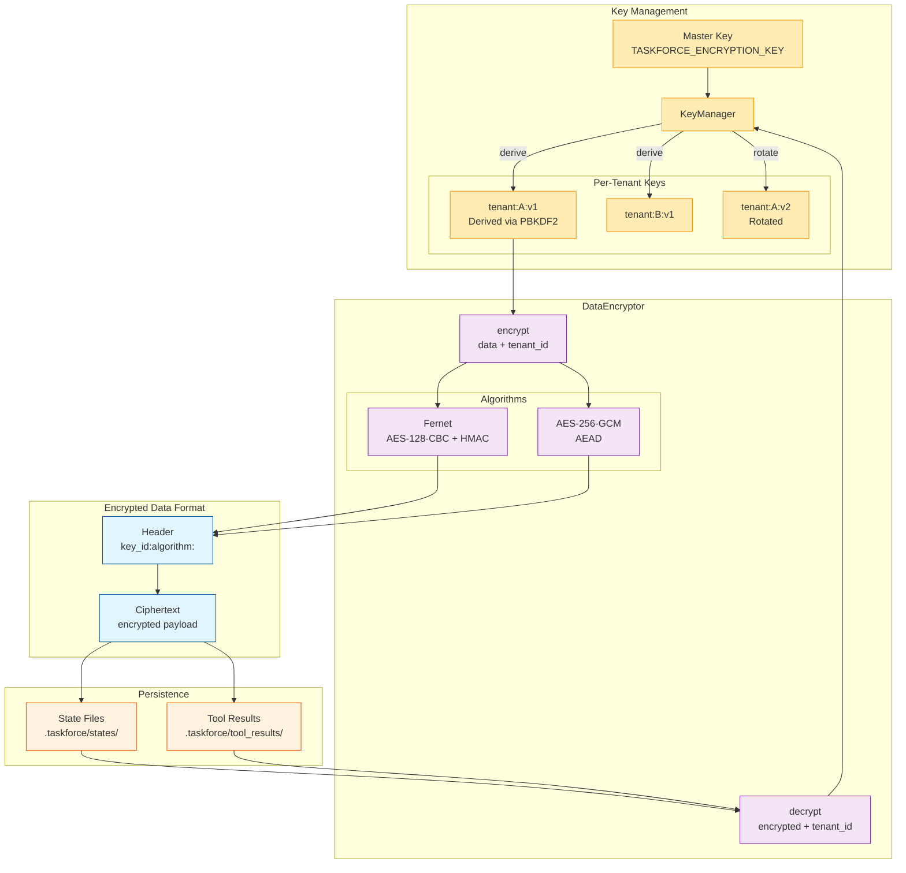
```mermaid
flowchart TB
    subgraph Keys["Key Management"]
        MasterKey[Master Key<br/>TASKFORCE_ENCRYPTION_KEY]
        KeyManager[KeyManager]

        subgraph TenantKeys["Per-Tenant Keys"]
            TK1["tenant:A:v1<br/>Derived via PBKDF2"]
            TK2["tenant:B:v1"]
            TK3["tenant:A:v2<br/>Rotated"]
        end
    end

    subgraph Encryption["DataEncryptor"]
        Encrypt[encrypt<br/>data + tenant_id]
        Decrypt[decrypt<br/>encrypted + tenant_id]

        subgraph Algorithms["Algorithms"]
            Fernet[Fernet<br/>AES-128-CBC + HMAC]
            AESGCM[AES-256-GCM<br/>AEAD]
        end
    end

    subgraph Format["Encrypted Data Format"]
        Header["Header<br/>key_id:algorithm:"]
        Ciphertext[Ciphertext<br/>encrypted payload]
    end

    subgraph Storage["Persistence"]
        StateFile[State Files<br/>.taskforce/states/]
        ToolResultStore[Tool Results<br/>.taskforce/tool_results/]
    end

    MasterKey --> KeyManager
    KeyManager -->|derive| TK1
    KeyManager -->|derive| TK2
    KeyManager -->|rotate| TK3

    TK1 --> Encrypt
    Encrypt --> Fernet
    Encrypt --> AESGCM

    Fernet --> Header
    AESGCM --> Header
    Header --> Ciphertext

    Ciphertext --> StateFile
    Ciphertext --> ToolResultStore

    StateFile --> Decrypt
    ToolResultStore --> Decrypt
    Decrypt --> KeyManager

    classDef key fill:#ffecb3,stroke:#ff8f00
    classDef encrypt fill:#f3e5f5,stroke:#7b1fa2
    classDef format fill:#e1f5fe,stroke:#01579b
    classDef storage fill:#fff3e0,stroke:#e65100

    class MasterKey,KeyManager,TK1,TK2,TK3 key
    class Encrypt,Decrypt,Fernet,AESGCM encrypt
    class Header,Ciphertext format
    class StateFile,ToolResultStore storage
```

---

## 18. Metrics & Observability

SLA-Monitoring und Prometheus-Integration:

```mermaid
flowchart TB
    subgraph Sources["Metric Sources"]
        HTTPReq[HTTP Requests<br/>endpoint, status, duration]
        AgentExec[Agent Execution<br/>success, steps, tokens]
        ToolExec[Tool Execution<br/>name, success, duration]
    end

    subgraph Collector["MetricsCollector"]
        Inc[inc<br/>Counter]
        Set[set<br/>Gauge]
        Observe[observe<br/>Histogram]
        Time[time<br/>Timer Context]
    end

    subgraph Storage["Metric Storage"]
        Counters["Counters<br/>taskforce_http_requests_total<br/>taskforce_agent_executions_total"]
        Gauges["Gauges<br/>taskforce_active_sessions"]
        Histograms["Histograms<br/>taskforce_http_request_duration_seconds<br/>taskforce_agent_execution_duration_seconds"]
    end

    subgraph Labels["Dimension Labels"]
        L1["endpoint, method, status"]
        L2["agent_id, tenant_id, success"]
        L3["tool, tenant_id"]
    end

    subgraph Export["Export Formats"]
        Prometheus["/metrics<br/>Prometheus Text"]
        JSON[get_all_metrics<br/>JSON API]
        SLA[get_sla_summary<br/>Error Rate, P50/P95/P99]
    end

    subgraph Buckets["Histogram Buckets"]
        B1["0.005, 0.01, 0.025, 0.05"]
        B2["0.1, 0.25, 0.5, 1.0"]
        B3["2.5, 5.0, 10.0, +Inf"]
    end

    HTTPReq --> Inc
    HTTPReq --> Observe
    AgentExec --> Inc
    AgentExec --> Observe
    ToolExec --> Inc
    ToolExec --> Observe

    Inc --> Counters
    Set --> Gauges
    Observe --> Histograms
    Time --> Histograms

    L1 --> Counters
    L2 --> Counters
    L3 --> Counters

    Histograms --> Buckets

    Counters --> Prometheus
    Gauges --> Prometheus
    Histograms --> Prometheus

    Counters --> JSON
    Gauges --> JSON

    Histograms --> SLA

    classDef source fill:#ffecb3,stroke:#ff8f00
    classDef collector fill:#f3e5f5,stroke:#7b1fa2
    classDef storage fill:#e1f5fe,stroke:#01579b
    classDef export fill:#c8e6c9,stroke:#2e7d32

    class HTTPReq,AgentExec,ToolExec source
    class Inc,Set,Observe,Time collector
    class Counters,Gauges,Histograms storage
    class Prometheus,JSON,SLA export
```

---

## Legende

| Farbe | Bedeutung |
|-------|-----------|
| Blau (#e1f5fe) | Core Domain Layer |
| Orange (#fff3e0) | Infrastructure Layer |
| Violett (#f3e5f5) | Application Layer |
| Grün (#e8f5e9) | API Layer |
| Gelb (#ffecb3) | Protocols/Interfaces, Inputs |
| Grau (#f5f5f5) | External Services |
| Hellgrün (#c8e6c9) | Outputs, Unified Components |
| Hellgelb (#fff9c4) | Enterprise Features |
| Rot (#ffcdd2) | External Systems, Denied |

---

## Changelog

### 2026-01-22: Enterprise Features Architecture

Added comprehensive enterprise architecture documentation:

**New Enterprise Components:**

| Component | Layer | Description |
|-----------|-------|-------------|
| `IdentityProviderProtocol` | Core/Interfaces | Protocol for JWT/API-Key authentication |
| `PolicyEngineProtocol` | Core/Interfaces | Protocol for RBAC policy evaluation |
| `Identity` (TenantContext, UserContext, Permission) | Core/Domain | Multi-tenant identity models |
| `Evidence` (EvidenceChain, EvidenceItem, Citation) | Core/Domain | Audit trail and source tracking |
| `MemoryACL` (ACLEntry, ScopePolicy) | Core/Domain | Fine-grained memory access control |
| `JWTIdentityProvider` | Infrastructure/Auth | JWT token validation |
| `APIKeyProvider` | Infrastructure/Auth | API key authentication |
| `DataEncryptor`, `KeyManager` | Infrastructure/Persistence | Per-tenant encryption at rest |
| `MetricsCollector` | Infrastructure/Metrics | Prometheus-compatible metrics |
| `AuthMiddleware` | API/Middleware | FastAPI authentication middleware |
| `Admin Routes` (users, roles, tenants) | API/Routes | Administrative endpoints |
| `PolicyEngine` | Application/Policy | RBAC evaluation with custom rules |
| `ReportGenerator` | Application/Reporting | Usage, cost, and compliance reports |
| `WorkflowManager` | Application/Workflows | Approval workflows for governance |
| `RetentionService` | Application | GDPR-compliant data retention |

**New Diagrams Added:**

| # | Diagram | Description |
|---|---------|-------------|
| 11 | Enterprise Security Architecture | Multi-tenant auth, RBAC, identity flow |
| 12 | Evidence & Audit Trail | Evidence collection and citation generation |
| 13 | Memory Access Control (ACL) | Fine-grained memory permissions |
| 14 | Reporting & Cost Management | Usage tracking and billing integration |
| 15 | Approval Workflows | Enterprise governance sequences |
| 16 | Data Retention & GDPR Compliance | Retention policies and right-to-be-forgotten |
| 17 | Encryption at Rest | Per-tenant key management |
| 18 | Metrics & Observability | SLA monitoring and Prometheus export |

---

### 2026-01-21: Unified Agent Architecture Refactoring

Added new components for unified agent definitions:

| New Component | Description |
|---------------|-------------|
| `AgentDefinition` | Unified model for all agent types (custom, profile, plugin, command) |
| `AgentRegistry` | Aggregates agents from all sources with unified CRUD API |
| `ToolResolver` | Resolves tool names to instances with dependency injection |
| `InfrastructureBuilder` | Builds state managers, LLM providers, and MCP tools |
| `ConfigSchema` | Pydantic validation for agent and profile configs |
| `ToolRegistry` (extended) | Added `shell` tool, `get_all_tool_names()`, `register_tool()`, `unregister_tool()` |

New diagrams added:
- 6a. Unified Agent Definition System
- 6b. Tool Resolution Flow
- 6c. Unified Config Schema

---

## 7. Communication Provider Architecture

```mermaid
flowchart TB
    subgraph "External Providers"
        TelegramAPI[Telegram Bot API]
        TeamsAPI[Teams Bot Framework]
    end

    subgraph "API Layer"
        Webhook[Webhook Receiver<br/>/api/v1/integrations/{provider}/messages]
    end

    subgraph "Application Layer"
        CommService[CommunicationService<br/>Session + History Orchestration]
    end

    subgraph "Infrastructure Layer"
        ProviderRegistry[Provider Registry<br/>build_provider_registry]
        TelegramProvider[TelegramProvider]
        TeamsProvider[TeamsProvider]
        Store[FileConversationStore<br/>.taskforce/conversations]
    end

    subgraph "Core Interfaces"
        ProviderProtocol[CommunicationProviderProtocol]
    end

    TelegramAPI --> Webhook
    TeamsAPI --> Webhook
    Webhook --> CommService
    CommService --> ProviderRegistry
    ProviderRegistry --> TelegramProvider
    ProviderRegistry --> TeamsProvider
    TelegramProvider -.implements.-> ProviderProtocol
    TeamsProvider -.implements.-> ProviderProtocol
    TelegramProvider --> Store
    TeamsProvider --> Store
    CommService --> TelegramProvider
    CommService --> TeamsProvider
    TelegramProvider --> TelegramAPI
    TeamsProvider --> TeamsAPI
```

---

*Erstellt am: 2026-01-21*
*Letzte Aktualisierung: 2026-02-01 (Communication Provider Architecture)*
*Basierend auf: Taskforce Codebase Analyse*
