# Taskforce Architecture Diagrams

Dieses Dokument enthält detaillierte Architekturdiagramme des Taskforce-Frameworks.

---

## 1. High-Level Layer Architecture

Das System folgt Clean Architecture mit vier strikten Schichten:

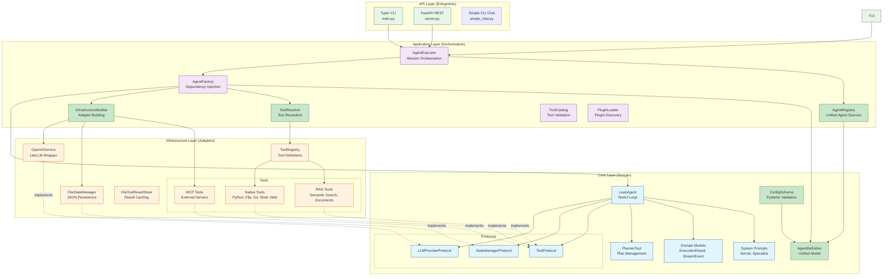

---

## 2. Component Dependency Diagram

Zeigt die Beziehungen zwischen den Hauptkomponenten:

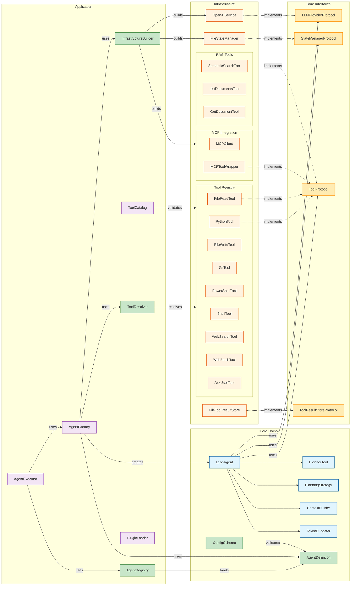

---

## 3. ReAct Loop Execution Flow

Der Hauptausführungszyklus des Agenten:

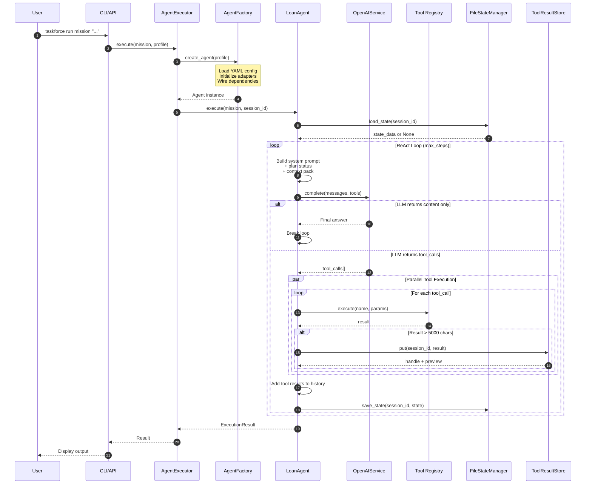

---

## 4. Tool Ecosystem

Übersicht aller Tool-Typen und deren Integration:

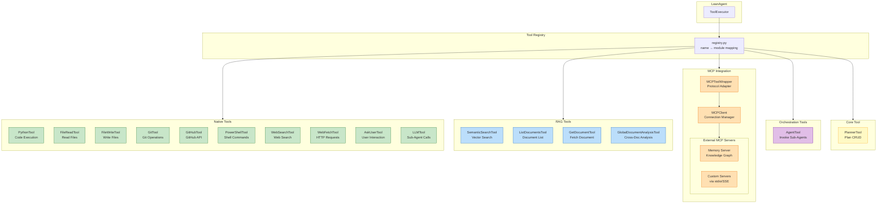

---

## 5. State Management & Persistence

Wie Session-State verwaltet wird:

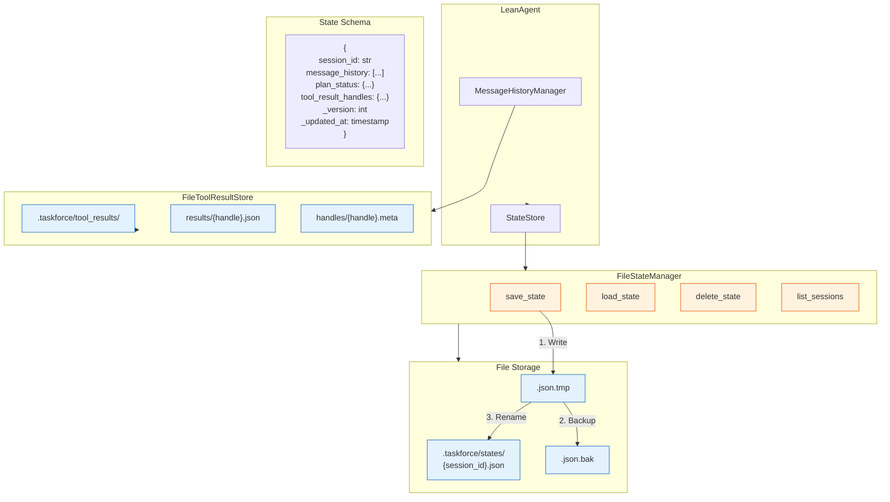

---

## 6. Configuration System

Profile-basierte Konfiguration:

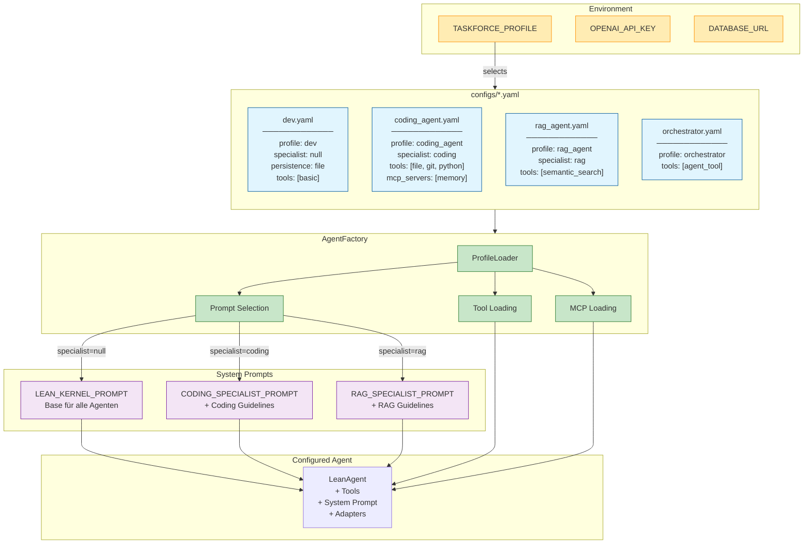

---

## 6a. Unified Agent Definition System (2026-01 Refactoring)

Das neue vereinheitlichte Agent-Definitions-System:

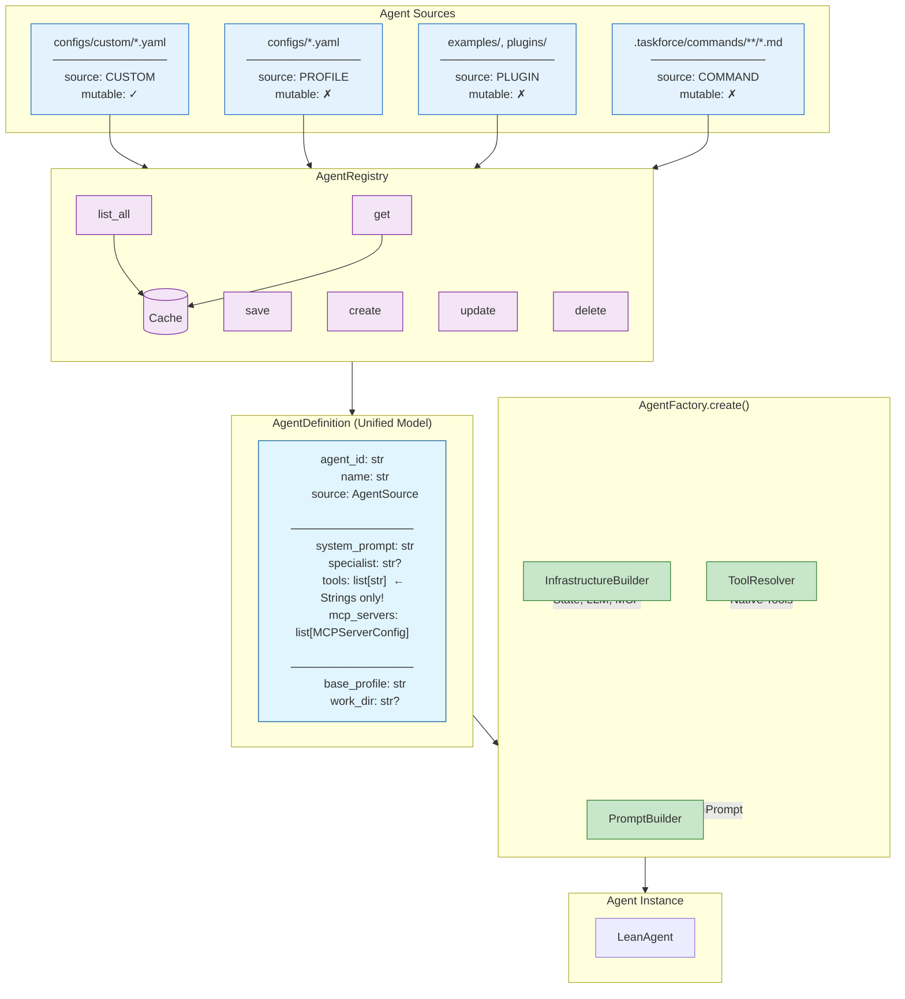

---

## 6b. Tool Resolution Flow

Wie Tools von Namen zu Instanzen aufgelöst werden:

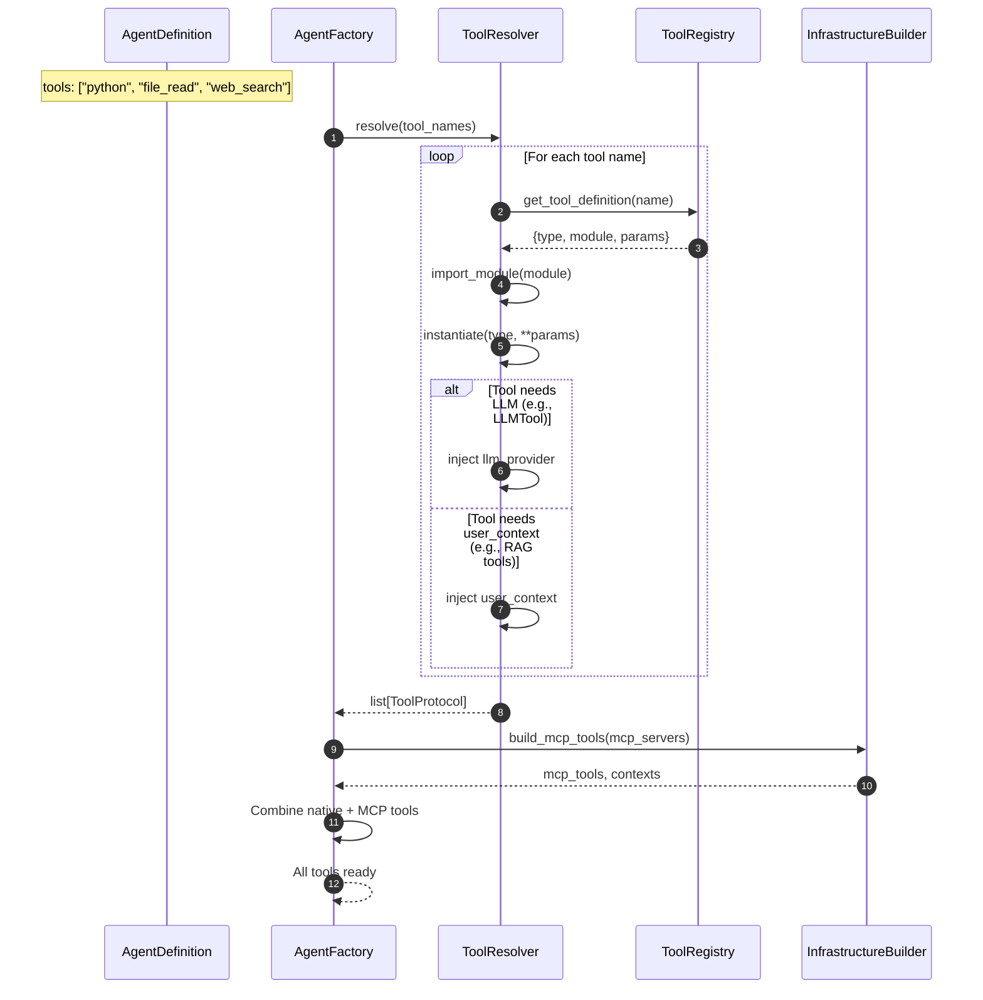

---

## 6c. Unified Config Schema

Pydantic-basierte Validierung:

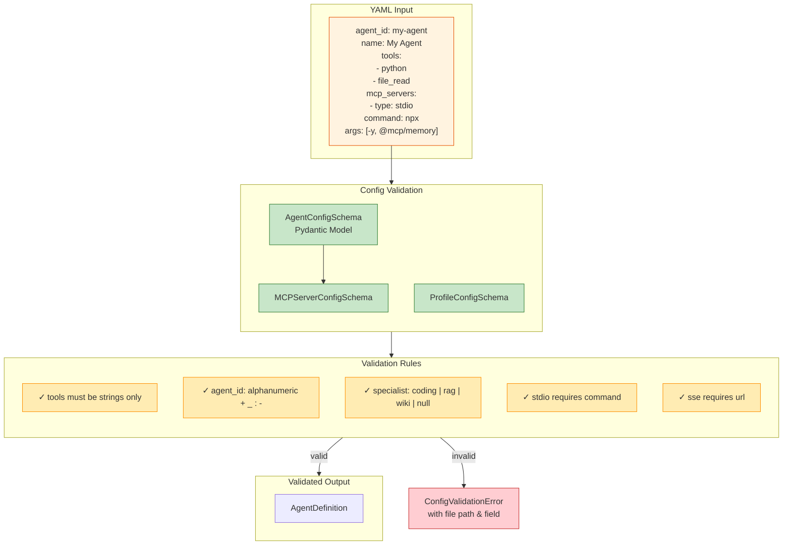

---

## 7. MCP Server Integration

Wie externe MCP-Server integriert werden:

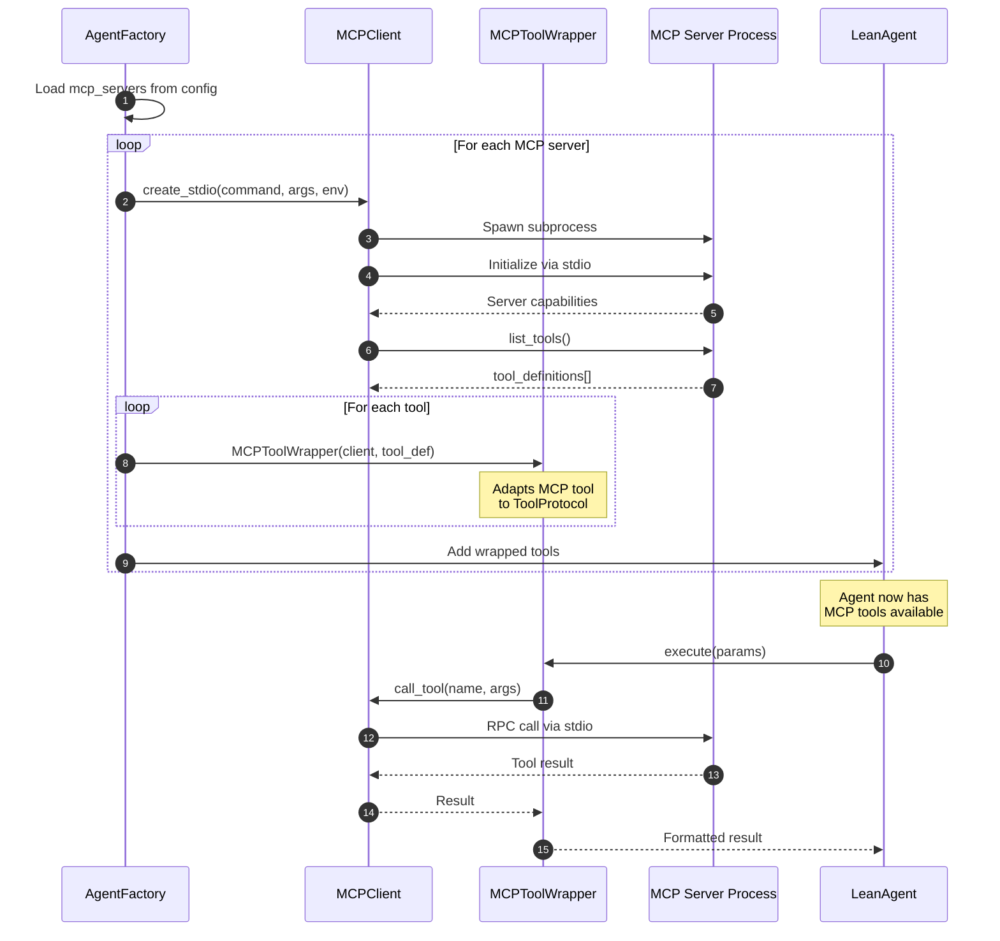

---

## 8. API Layer Architecture

REST und CLI Entrypoints:

```mermaid
flowchart TB
    subgraph External["External"]
        U1[User Terminal]
        U2[HTTP Client]
    end

    subgraph CLI["CLI Layer (Typer)"]
        direction TB
        MAIN[main.py<br/>Entry Point]

        subgraph Commands["Commands"]
            RUN[run.py<br/>taskforce run mission]
            CHAT[chat.py<br/>taskforce chat]
            TOOLS[tools.py<br/>taskforce tools]
            SESS[sessions.py<br/>taskforce sessions]
            CFG[config.py<br/>taskforce config]
        end

        OF[OutputFormatter<br/>Rich Formatting]
    end

    subgraph ChatConsole["Chat Console (REPL)"]
        direction TB
        SIMPLE[SimpleChatRunner<br/>simple_chat.py]
    end

    subgraph REST["REST Layer (FastAPI)"]
        direction TB
        SRV[server.py<br/>FastAPI App]

        subgraph Routes["Routes"]
            EX["/execute"]
            EXS["/execute/stream"]
            AG["/agents"]
            SE["/sessions"]
            TL["/tools"]
            HE["/health"]
        end

        SCH[Pydantic Schemas]
    end

    subgraph App["Application Layer"]
        AE[AgentExecutor]
    end

    U1 --> CLI
    U2 --> REST

    MAIN --> Commands
    Commands --> OF
    CHAT --> TUI

    RUN --> AE
    CHAT --> AE

    SRV --> Routes
    Routes --> SCH
    EX --> AE
    EXS --> AE

    classDef external fill:#ffcdd2,stroke:#c62828
    classDef cli fill:#c8e6c9,stroke:#2e7d32
    classDef tui fill:#bbdefb,stroke:#1565c0
    classDef rest fill:#ffe0b2,stroke:#ef6c00

    class U1,U2 external
    class MAIN,RUN,CHAT,TOOLS,SESS,CFG,OF cli
    class APP,CL,EP,PP,IB tui
    class SRV,EX,EXS,AG,SE,TL,HE,SCH rest
```

---

## 9. Complete System Overview

Vollständige Systemübersicht mit allen Komponenten:

```mermaid
graph TB
    subgraph Users["Users"]
        DEV[Developer]
        SVC[Service/API Client]
    end

    subgraph Entrypoints["API Layer"]
        CLI[CLI<br/>taskforce run/chat]
        REST[REST API<br/>POST /execute]
        TUI[Chat TUI<br/>Interactive]
    end

    subgraph Application["Application Layer"]
        EXEC[AgentExecutor]
        FACT[AgentFactory]
        REG[AgentRegistry]
        TRES[ToolResolver]
        IBLD[InfrastructureBuilder]
        CAT[ToolCatalog]
        PLUG[PluginLoader]
    end

    subgraph Domain["Core Domain Layer"]
        AGENT[LeanAgent<br/>ReAct Loop]
        PLAN[PlannerTool]
        STRAT[PlanningStrategy]
        CTX[ContextBuilder]
        TOK[TokenBudgeter]
        ADEF[AgentDefinition<br/>Unified Model]
        CSCH[ConfigSchema<br/>Validation]

        subgraph Protocols["Interfaces"]
            P1[LLMProviderProtocol]
            P2[StateManagerProtocol]
            P3[ToolProtocol]
            P4[ToolResultStoreProtocol]
        end
    end

    subgraph Infrastructure["Infrastructure Layer"]
        subgraph LLMAdapters["LLM"]
            OAI[OpenAIService]
        end

        subgraph Persistence["Persistence"]
            FSM[FileStateManager]
            FTR[FileToolResultStore]
        end

        subgraph ToolsInfra["Tools"]
            TREG[ToolRegistry]
            NT[Native Tools<br/>11 tools]
            RT[RAG Tools<br/>4 tools]
            MT[MCP Tools<br/>dynamic]
            OT[Orchestration<br/>AgentTool]
        end
    end

    subgraph External["External Services"]
        OPENAI[OpenAI API]
        AZURE[Azure OpenAI]
        MCPS[MCP Servers]
        FS[File System]
        GH[GitHub API]
    end

    %% User connections
    DEV --> CLI
    DEV --> TUI
    SVC --> REST

    %% API to Application
    CLI --> EXEC
    REST --> EXEC
    TUI --> EXEC

    %% Application wiring (new unified flow)
    EXEC --> FACT
    EXEC --> REG
    REG --> ADEF
    FACT --> ADEF
    FACT --> TRES
    FACT --> IBLD
    TRES --> TREG
    IBLD --> OAI
    IBLD --> FSM
    IBLD --> MT
    FACT --> AGENT
    FACT --> CAT
    PLUG --> REG
    CSCH --> ADEF

    %% Domain dependencies
    AGENT --> PLAN
    AGENT --> STRAT
    AGENT --> CTX
    AGENT --> TOK
    AGENT --> P1
    AGENT --> P2
    AGENT --> P3

    %% Protocol implementations
    OAI -.->|impl| P1
    FSM -.->|impl| P2
    FTR -.->|impl| P4
    NT -.->|impl| P3
    RT -.->|impl| P3
    MT -.->|impl| P3

    %% Tool registry
    TREG --> NT
    TREG --> RT

    %% External connections
    OAI --> OPENAI
    OAI --> AZURE
    MT --> MCPS
    FSM --> FS
    FTR --> FS
    NT --> GH
    NT --> FS

    classDef user fill:#ffcdd2,stroke:#c62828
    classDef api fill:#e8f5e9,stroke:#2e7d32
    classDef app fill:#f3e5f5,stroke:#7b1fa2
    classDef domain fill:#e1f5fe,stroke:#01579b
    classDef infra fill:#fff3e0,stroke:#e65100
    classDef external fill:#f5f5f5,stroke:#616161
    classDef new fill:#c8e6c9,stroke:#2e7d32

    class DEV,SVC user
    class CLI,REST,TUI api
    class EXEC,FACT,CAT,PLUG app
    class AGENT,PLAN,STRAT,CTX,TOK,P1,P2,P3,P4 domain
    class OAI,FSM,FTR,TREG,NT,RT,MT,OT infra
    class OPENAI,AZURE,MCPS,FS,GH external
    class REG,TRES,IBLD,ADEF,CSCH new
```

---

## 10. Import Rules & Layer Dependencies

Visualisierung der erlaubten Abhängigkeitsrichtungen:

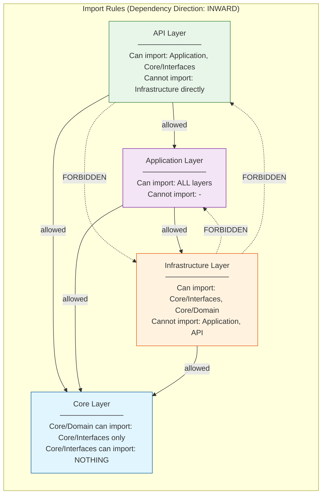

---

## Legende

| Farbe | Bedeutung |
|-------|-----------|
| Blau (#e1f5fe) | Core Domain Layer |
| Orange (#fff3e0) | Infrastructure Layer |
| Violett (#f3e5f5) | Application Layer |
| Grün (#e8f5e9) | API Layer |
| Gelb (#ffecb3) | Protocols/Interfaces |
| Grau (#f5f5f5) | External Services |
| Hellgrün (#c8e6c9) | New Unified Components (2026-01 Refactoring) |

---

## Changelog

### 2026-01-21: Unified Agent Architecture Refactoring

Added new components for unified agent definitions:

| New Component | Description |
|---------------|-------------|
| `AgentDefinition` | Unified model for all agent types (custom, profile, plugin, command) |
| `AgentRegistry` | Aggregates agents from all sources with unified CRUD API |
| `ToolResolver` | Resolves tool names to instances with dependency injection |
| `InfrastructureBuilder` | Builds state managers, LLM providers, and MCP tools |
| `ConfigSchema` | Pydantic validation for agent and profile configs |
| `ToolRegistry` (extended) | Added `shell` tool, `get_all_tool_names()`, `register_tool()`, `unregister_tool()` |

New diagrams added:
- 6a. Unified Agent Definition System
- 6b. Tool Resolution Flow
- 6c. Unified Config Schema

---

*Erstellt am: 2026-01-21*
*Letzte Aktualisierung: 2026-01-21 (Unified Agent Architecture)*
*Basierend auf: Taskforce Codebase Analyse*
