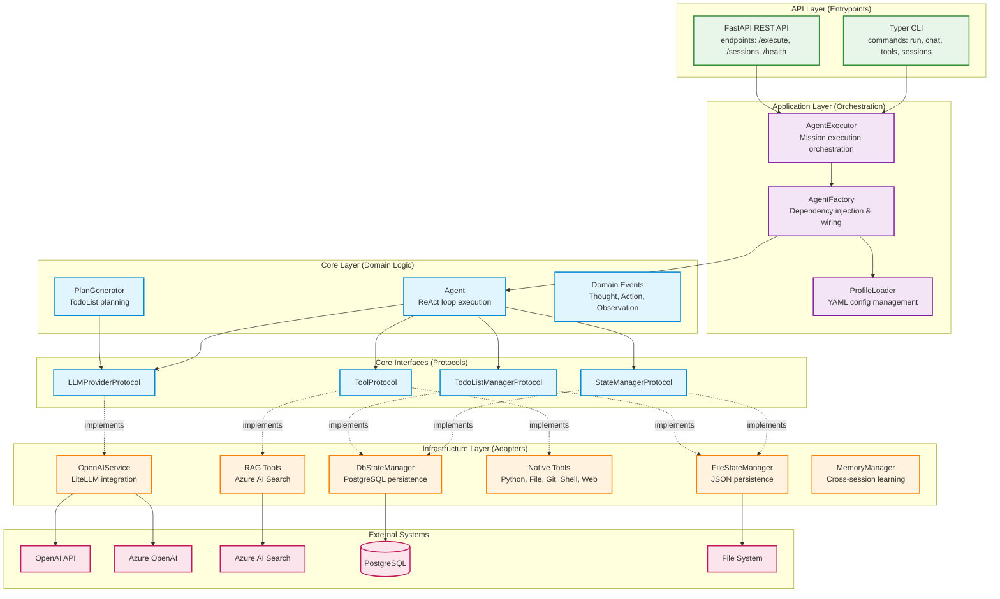

# Section 2: High Level Architecture

### **Technical Summary**

Taskforce is a **production-ready ReAct agent framework** implementing **Clean Architecture (Hexagonal Architecture)** principles with strict four-layer separation. The system enables autonomous AI agents to plan and execute complex tasks through LLM-driven reasoning (ReAct loop), TodoList decomposition, and extensible tool execution. The architecture supports **dual deployment modes**: local development via CLI with file-based persistence, and production microservice deployment via FastAPI REST API with PostgreSQL persistence. Core business logic (ReAct loop, planning algorithms) is isolated in the domain layer with zero infrastructure dependencies, enabling protocol-based testing and swappable adapters for persistence (file/database), LLM providers (OpenAI/Azure), and tool implementations. This architecture achieves PRD goals by: (G1) enforcing architectural boundaries via protocol-based interfaces, (G2) enabling adapter swapping through dependency injection, (G3) supporting stateless microservice deployment via FastAPI, (G4) maintaining CLI compatibility with Agent V2, (G5) improving testability through protocol mocking, and (G6) establishing clear extension points for new tools and providers.

---

### **High Level Overview**

**1. Architectural Style:** **Clean Architecture (Ports & Adapters / Hexagonal Architecture)** with strict four-layer separation:
   - **Core Layer** (domain logic): Pure Python business logic with zero external dependencies
   - **Infrastructure Layer** (adapters): I/O implementations (database, LLM, tools, file system)
   - **Application Layer** (use cases): Orchestration services and dependency injection
   - **API Layer** (entrypoints): User-facing interfaces (CLI, REST API)

**2. Repository Structure:** **Monorepo** at `taskforce/` root (from PRD decision)
   - Single Python package with four layer subdirectories
   - Managed by `uv` package manager
   - Tests mirror source structure (`tests/unit/`, `tests/integration/`)

**3. Service Architecture:** **Hybrid deployment model**
   - **Development Mode**: Standalone CLI application with file-based persistence (zero infrastructure dependencies)
   - **Production Mode**: Stateless FastAPI microservice with PostgreSQL persistence (horizontal scaling, health checks, observability)
   - **Shared Core**: Both modes use identical domain logic via dependency injection

**4. Primary Data Flow:**
   ```
   User Input (CLI/API) 
     → AgentExecutor (orchestration)
       → Agent.execute() (ReAct loop)
         → LLMProvider.complete() (thought generation)
         → Tool.execute() (action execution)
         → StateManager.save_state() (observation persistence)
       → TodoListManager (planning)
     → ExecutionResult (output)
   ```

**5. Key Architectural Decisions:**

   - **Protocol-Based Interfaces**: All cross-layer dependencies via Python protocols (PEP 544) rather than abstract base classes, enabling duck typing and easier testing
   
   - **Dependency Injection via Factory**: AgentFactory reads YAML configuration profiles (dev/staging/prod) and wires appropriate adapters at runtime
   
   - **Dual Persistence Strategy**: File-based (development) and PostgreSQL (production) implement same `StateManagerProtocol`, allowing seamless switching via configuration
   
   - **Code Reuse from Agent V2**: ≥75% of working logic relocated rather than rewritten, focusing architectural effort on layer boundaries and protocol definitions
   
   - **Async-First Design**: All I/O operations use async/await patterns (aiofiles, asyncpg, async SQLAlchemy) for performance and scalability

---

### **High Level Project Diagram**



---

### **Architectural and Design Patterns**

**Core Patterns:**

- **Clean Architecture (Hexagonal Architecture):** Four-layer separation with dependency inversion - domain logic at center, infrastructure at edges. _Rationale:_ Achieves PRD Goal G1 (strict architectural boundaries) and G5 (testability via protocol mocking). Enables independent evolution of business logic, persistence, and API layers.

- **Dependency Injection via Factory Pattern:** AgentFactory constructs agent instances by reading configuration profiles and wiring appropriate adapters. _Rationale:_ Achieves PRD Goal G2 (swappable persistence backends) and G6 (clear extension points). Centralized wiring makes dependency graph explicit and testable.

- **Protocol-Based Interfaces (Ports):** All layer boundaries defined by Python protocols (PEP 544) rather than abstract base classes. _Rationale:_ Enables structural subtyping (duck typing) without inheritance constraints. Simplifies testing via protocol-compatible mocks. More Pythonic than ABC-based inheritance.

- **Adapter Pattern:** Infrastructure layer provides multiple implementations of core protocols (FileStateManager vs DbStateManager, both implementing StateManagerProtocol). _Rationale:_ Achieves PRD Goal G2 (swappable backends). Dev environment uses file adapters, production uses database adapters, with zero domain logic changes.

- **Repository Pattern (for Persistence):** StateManager and TodoListManager abstract data access logic, isolating domain from persistence details. _Rationale:_ Enables database migration flexibility. Supports both file-based and relational persistence through same interface.

**Communication Patterns:**

- **ReAct Loop (Reason + Act):** Iterative cycle of Thought (LLM reasoning) → Action (tool execution) → Observation (result recording). _Rationale:_ Proven pattern from Agent V2. Enables autonomous task execution with explainable decision-making. Core to agent intelligence.

- **Synchronous Request-Response (REST API):** FastAPI endpoints for `/execute`, `/sessions` with JSON request/response. _Rationale:_ Standard microservice pattern. Enables programmatic access and future web UI integration. Supports observability (health checks, metrics).

- **Event-Driven (Internal):** Domain events (Thought, Action, Observation) flow through ReAct loop, enabling progress callbacks and streaming updates. _Rationale:_ Decouples execution logic from progress reporting. Enables both CLI (Rich progress bars) and API (Server-Sent Events) interfaces.

**Code Organization Patterns:**

- **Domain-Driven Design (Lite):** Core domain entities (Agent, TodoList, TodoItem) encapsulate business logic. _Rationale:_ Keeps planning algorithms and execution semantics close to domain concepts. Avoids anemic domain model anti-pattern.

- **Service Layer Pattern:** AgentExecutor coordinates ReAct loop execution with logging, error handling, state persistence. _Rationale:_ Shared orchestration logic between CLI and API entrypoints. Single source of truth for execution workflow.

- **Strategy Pattern (Tool Execution):** Each tool implements ToolProtocol with polymorphic `execute()` method. Agent selects and invokes tools dynamically based on action decisions. _Rationale:_ Extensibility - new tools added without modifying agent core. Supports 11+ native tools plus RAG tools.

**Data Patterns:**

- **JSONB for Flexibility (PostgreSQL):** State and TodoList data stored as JSONB columns with relational metadata. _Rationale:_ Preserves schema compatibility with file-based JSON format. Allows evolution of state structure without migrations. Enables JSON query operators.

- **Optimistic Locking (State Versioning):** State snapshots include version numbers for detecting concurrent modifications. _Rationale:_ Prevents lost updates in production environment with multiple agent instances. Inherited from Agent V2 design.

- **Immutable Domain Events:** Thought, Action, Observation events are immutable dataclasses. _Rationale:_ Simplifies reasoning about execution history. Enables event replay for debugging.

---

### **Rationale:**

**Trade-offs Made:**

1. **Four Layers vs. Three**: Chose separate Application and API layers (vs. merging them) to isolate orchestration logic (AgentExecutor) from entrypoint concerns (CLI/REST). Trade-off: More directories and layers to understand, but clearer separation enables independent testing and evolution.

2. **Protocol vs. Abstract Base Classes**: Protocols enable duck typing without inheritance, but class hierarchy is less explicit. Trade-off: Gained flexibility for testing (any object matching protocol works), lost explicit "implements" relationships in code.

3. **Dual Persistence Strategy**: Maintaining both file and database adapters doubles persistence code surface area. Trade-off: Development simplicity (no database required locally) vs. maintenance burden (two implementations to keep in sync).

4. **Code Reuse from Agent V2**: Aggressive ≥75% reuse goal may carry forward technical debt. Trade-off: Faster delivery and proven logic vs. potential architectural compromises inherited from PoC structure.

**Key Assumptions:**

- ReAct algorithm from Agent V2 is production-ready (validated: PRD states "proven implementation")
- Python 3.11 protocols are mature (validated: PEP 544 since Python 3.8)
- Team familiar with Clean Architecture concepts (needs validation: training may be required)
- Four-layer structure won't cause confusion (needs validation: may require architecture onboarding)

**Decisions Requiring Validation:**

- **Is four-layer complexity justified?** Could we merge Application + API into single "Service" layer?
- **Protocol testing strategy:** How do we verify implementations satisfy protocols at runtime?
- **Database schema evolution:** JSONB gives flexibility - do we need formal schema versioning?

🏗️ **Proceeding to Tech Stack...**

---

