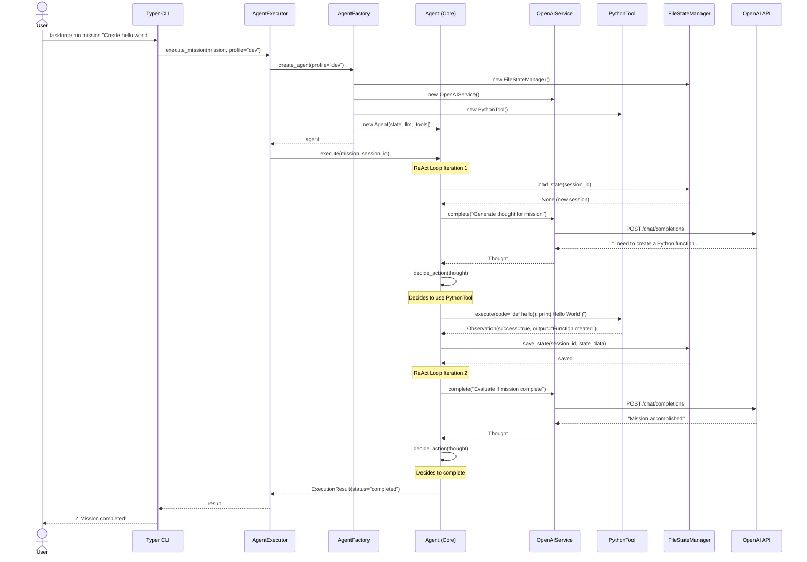
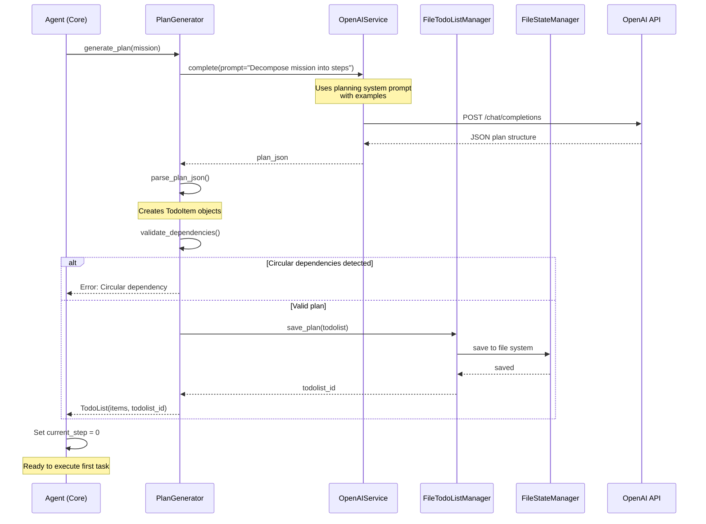
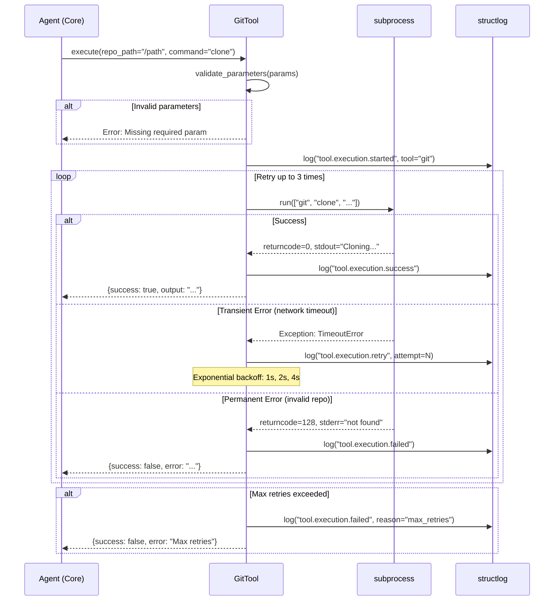
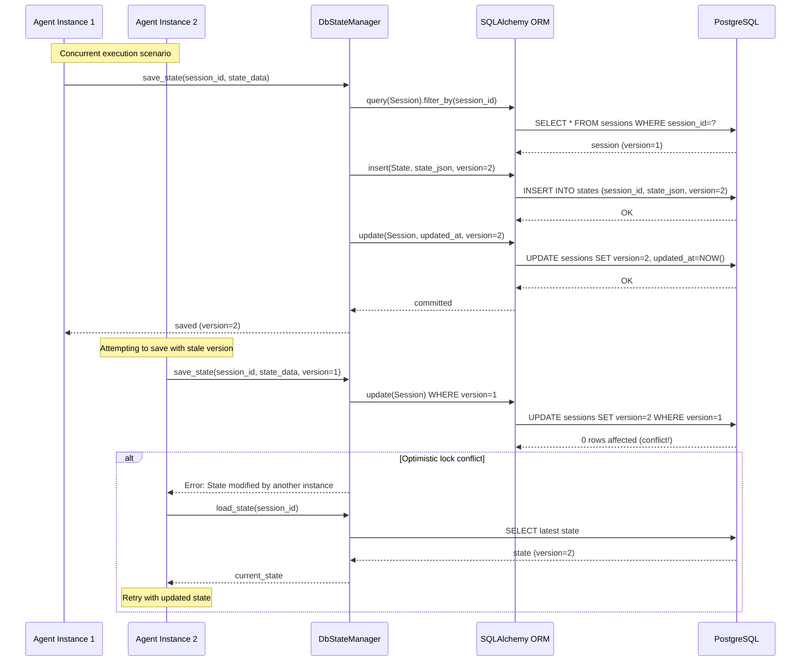
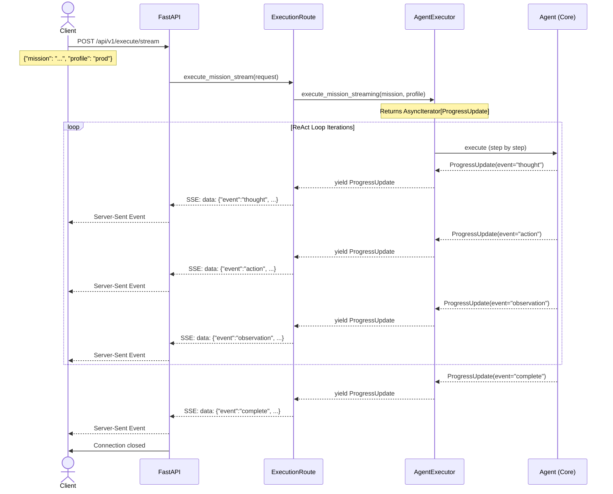
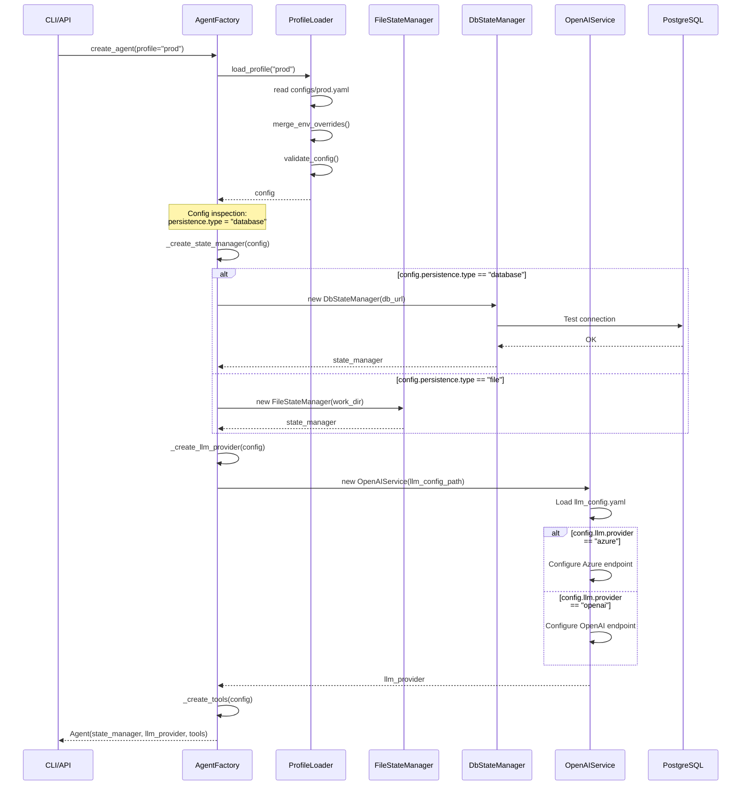

# Section 7: Core Workflows

Key system workflows illustrating component interactions and data flow:

---

### **Workflow 1: Mission Execution via CLI (ReAct Loop)**

This workflow shows a complete mission execution from CLI command to completion, illustrating the ReAct (Reason + Act) loop.

---

### **Workflow 2: TodoList Plan Generation**

This workflow shows how a mission is decomposed into a structured TodoList with dependencies.

---

### **Workflow 3: Tool Execution with Retry and Error Handling**

This workflow shows the tool execution pattern with retry logic and error recovery.

---

### **Workflow 4: State Persistence and Recovery (Database)**

This workflow shows database-backed state persistence with versioning and concurrent access handling.

---

### **Workflow 5: FastAPI REST API Execution with Streaming**

This workflow shows mission execution via REST API with Server-Sent Events for progress updates.

---

### **Workflow 6: Configuration Profile Loading and Adapter Selection**

This workflow shows how configuration profiles determine which infrastructure adapters are used.

---

### **Rationale:**

**Workflow Selection Decisions:**

1. **ReAct Loop as Primary Workflow**: Showcased complete thought → action → observation cycle. Rationale: This is the core algorithm - understanding this workflow is essential for all developers.

2. **State Persistence with Concurrency**: Included optimistic locking scenario. Rationale: Production environment may have multiple agent instances. Shows how conflicts are detected and resolved.

3. **Streaming API Workflow**: Demonstrated SSE pattern. Rationale: Long-running missions need progress updates. Shows how domain events translate to API events.

4. **Error Handling in Tool Execution**: Showed retry logic explicitly. Rationale: External tool calls fail frequently. Retry strategy is critical for reliability.

5. **Profile-Based Adapter Selection**: Illustrated dependency injection. Rationale: Shows how Clean Architecture enables runtime adapter swapping via configuration.

**Key Patterns Illustrated:**

- **Async throughout**: All I/O operations use async/await
- **Protocol-based boundaries**: Agent never calls concrete implementations directly
- **Event-driven progress**: Domain events enable real-time updates
- **Defensive error handling**: Every external call wrapped in try/catch with retry
- **Structured logging**: Every significant operation logged with context

**Trade-offs:**

- **Sequence diagram complexity**: Detailed diagrams vs. readability. Chose detail to show actual implementation patterns.
- **Workflow scope**: Full workflows vs. focused interactions. Chose full workflows to show end-to-end flow.

---

🏗️ **Proceeding to Security...**

---

