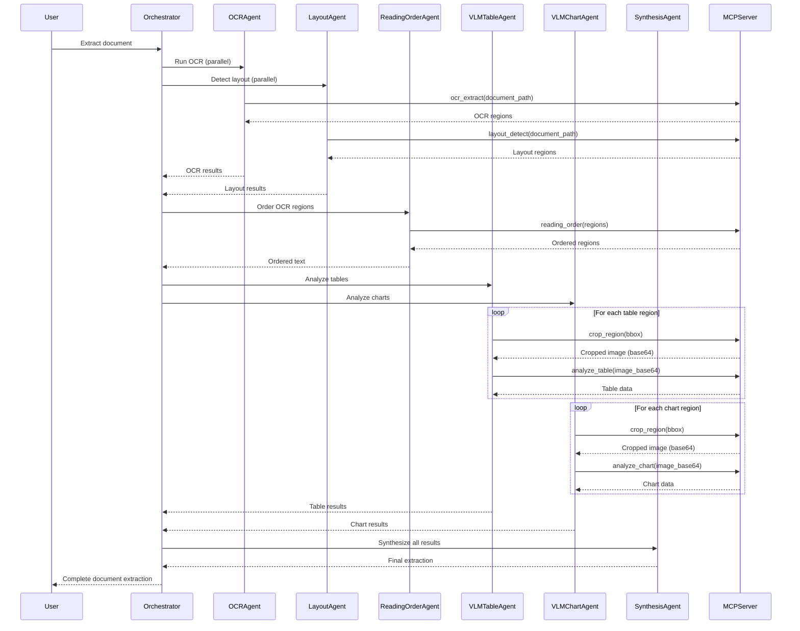

# Document Extraction Architecture

## Systemübersicht

Das Document Extraction System besteht aus zwei Hauptkomponenten:
1. **MCP Server** (`servers/document-extraction-mcp`) - Standalone Server mit ML-Tools
2. **Plugin** (`plugins/document_extraction_agent`) - Taskforce Plugin mit Multi-Agent Workflow

## Architektur-Diagramm

```mermaid
graph TB
    subgraph "Taskforce Framework"
        Orchestrator[Orchestrator Agent<br/>Koordinierung & Workflow]
        OCRAgent[OCR Agent<br/>Text-Extraktion]
        LayoutAgent[Layout Agent<br/>Region-Erkennung]
        ReadingOrderAgent[Reading Order Agent<br/>Lesereihenfolge]
        VLMTableAgent[VLM Table Agent<br/>Tabellen-Analyse]
        VLMChartAgent[VLM Chart Agent<br/>Chart-Analyse]
        SynthesisAgent[Synthesis Agent<br/>Ergebnis-Zusammenführung]
    end

    subgraph "Document Extraction Plugin"
        PluginTools[Tool Stubs<br/>document_extraction_tools.py]
        PluginConfig[Plugin Config<br/>document_extraction_agent.yaml]
        AgentConfigs[Agent Configs<br/>orchestrator.yaml<br/>ocr_agent.yaml<br/>layout_agent.yaml<br/>etc.]
    end

    subgraph "MCP Server - document-extraction-mcp"
        MCPServer[MCP Server<br/>server.py]
        
        subgraph "MCP Tools"
            OCRTool[ocr_extract<br/>PaddleOCR]
            LayoutTool[layout_detect<br/>PPStructure]
            ReadingOrderTool[reading_order<br/>LayoutLMv3]
            CropTool[crop_region<br/>Pillow]
            VLMTool[analyze_table<br/>analyze_chart<br/>GPT-4o-mini]
        end
        
        subgraph "Tool Implementations"
            OCRImpl[ocr.py<br/>PaddleOCR Engine]
            LayoutImpl[layout.py<br/>PPStructure Engine]
            ReadingOrderImpl[reading_order.py<br/>LayoutReader Model]
            CropImpl[crop.py<br/>Image Cropping]
            VLMImpl[vlm.py<br/>LiteLLM Client]
        end
        
        subgraph "Support Modules"
            PDFUtils[pdf_utils.py<br/>PDF → Image]
            Visualization[visualization.py<br/>BBox Visualization]
            StdioSilence[_stdio_silence.py<br/>Output Suppression]
        end
        
        subgraph "Prompts"
            TablePrompt[table_analysis.txt]
            ChartPrompt[chart_analysis.txt]
        end
    end

    subgraph "External Services"
        PaddleOCR[PaddleOCR<br/>OCR & Layout Detection]
        LayoutLMv3[LayoutLMv3<br/>Reading Order Model]
        OpenAI[OpenAI API<br/>GPT-4o-mini VLM]
    end

    subgraph "Data Flow"
        Document[Input Document<br/>PDF/Image]
        OCRResult[OCR Regions<br/>Text + BBox]
        LayoutResult[Layout Regions<br/>Type + BBox]
        OrderedText[Ordered Text<br/>Reading Sequence]
        CroppedRegions[Cropped Images<br/>Base64]
        TableData[Structured Table Data]
        ChartData[Chart Metadata]
        FinalResult[Final Extraction Result]
    end

    %% Agent to Plugin Tools
    OCRAgent --> PluginTools
    LayoutAgent --> PluginTools
    ReadingOrderAgent --> PluginTools
    VLMTableAgent --> PluginTools
    VLMChartAgent --> PluginTools

    %% Plugin Tools to MCP Server
    PluginTools -.MCP Protocol.-> MCPServer

    %% MCP Server to Tools
    MCPServer --> OCRTool
    MCPServer --> LayoutTool
    MCPServer --> ReadingOrderTool
    MCPServer --> CropTool
    MCPServer --> VLMTool

    %% Tools to Implementations
    OCRTool --> OCRImpl
    LayoutTool --> LayoutImpl
    ReadingOrderTool --> ReadingOrderImpl
    CropTool --> CropImpl
    VLMTool --> VLMImpl

    %% Implementations to External Services
    OCRImpl --> PaddleOCR
    LayoutImpl --> PaddleOCR
    ReadingOrderImpl --> LayoutLMv3
    VLMImpl --> OpenAI
    VLMImpl --> TablePrompt
    VLMImpl --> ChartPrompt

    %% Support Modules
    OCRImpl --> PDFUtils
    LayoutImpl --> PDFUtils
    CropImpl --> PDFUtils
    OCRImpl --> Visualization
    LayoutImpl --> Visualization
    ReadingOrderImpl --> Visualization
    OCRImpl --> StdioSilence
    LayoutImpl --> StdioSilence
    ReadingOrderImpl --> StdioSilence

    %% Orchestrator Workflow
    Orchestrator --> OCRAgent
    Orchestrator --> LayoutAgent
    OCRAgent --> ReadingOrderAgent
    LayoutAgent --> VLMTableAgent
    LayoutAgent --> VLMChartAgent
    ReadingOrderAgent --> SynthesisAgent
    VLMTableAgent --> SynthesisAgent
    VLMChartAgent --> SynthesisAgent
    SynthesisAgent --> FinalResult

    %% Data Flow
    Document --> OCRTool
    Document --> LayoutTool
    OCRResult --> ReadingOrderTool
    LayoutResult --> CropTool
    CroppedRegions --> VLMTool
    VLMTool --> TableData
    VLMTool --> ChartData

    %% Configuration
    PluginConfig --> AgentConfigs
    AgentConfigs --> Orchestrator
    AgentConfigs --> OCRAgent
    AgentConfigs --> LayoutAgent
    AgentConfigs --> ReadingOrderAgent
    AgentConfigs --> VLMTableAgent
    AgentConfigs --> VLMChartAgent
    AgentConfigs --> SynthesisAgent

    style Orchestrator fill:#e1f5ff
    style MCPServer fill:#fff4e1
    style PluginTools fill:#f0f0f0
    style PaddleOCR fill:#ffe1e1
    style LayoutLMv3 fill:#ffe1e1
    style OpenAI fill:#ffe1e1
    style FinalResult fill:#e1ffe1
```



## Komponenten-Details

### MCP Server (`servers/document-extraction-mcp`)

**Hauptkomponenten:**
- `server.py`: MCP Server Implementierung mit stdio-Protokoll
- **Tools**: 6 MCP-Tools für Dokumentenextraktion
- **Subprocess-Architektur**: Tools laufen in separaten Prozessen zur Vermeidung von Deadlocks

**Tools:**
1. `ocr_extract` - Text-Extraktion mit PaddleOCR
2. `layout_detect` - Layout-Erkennung mit PPStructure
3. `reading_order` - Lesereihenfolge mit LayoutLMv3
4. `crop_region` - Region-Cropping mit Pillow
5. `analyze_table` - Tabellen-Analyse mit VLM
6. `analyze_chart` - Chart-Analyse mit VLM

**Technologie-Stack:**
- PaddleOCR (OCR & Layout Detection)
- LayoutLMv3/Transformers (Reading Order)
- LiteLLM (VLM API Client)
- Pillow (Image Processing)

### Plugin (`plugins/document_extraction_agent`)

**Hauptkomponenten:**
- `document_extraction_tools.py`: Tool-Stubs die das `ToolProtocol` implementieren
- Agent-Konfigurationen für Multi-Agent Workflow
- Plugin-Config für MCP-Server Integration

**Agenten:**
1. **Orchestrator**: Koordiniert den gesamten Workflow
2. **OCR Agent**: Verwendet `ocr_extract` Tool
3. **Layout Agent**: Verwendet `layout_detect` Tool
4. **Reading Order Agent**: Verwendet `reading_order` Tool
5. **VLM Table Agent**: Verwendet `analyze_table` Tool
6. **VLM Chart Agent**: Verwendet `analyze_chart` Tool
7. **Synthesis Agent**: Fügt alle Ergebnisse zusammen

## Workflow



## Datenstrukturen

### OCR Result
```json
{
  "success": true,
  "region_count": 42,
  "image_width": 1200,
  "image_height": 1600,
  "regions": [
    {
      "index": 0,
      "text": "Invoice #12345",
      "confidence": 0.98,
      "bbox": [100, 50, 300, 80],
      "polygon": [[100, 50], [300, 50], [300, 80], [100, 80]]
    }
  ]
}
```

### Layout Result
```json
{
  "success": true,
  "region_count": 5,
  "type_summary": {"table": 1, "chart": 1, "text": 3},
  "regions": [
    {
      "region_id": 0,
      "region_type": "table",
      "confidence": 0.95,
      "bbox": [50, 200, 550, 400]
    }
  ]
}
```

### Reading Order Result
```json
{
  "success": true,
  "region_count": 42,
  "reading_order": [0, 1, 2, ...],
  "ordered_regions": [...],
  "ordered_text": ["Title", "Column 1", "Column 2", ...]
}
```

## Technische Besonderheiten

1. **Subprocess-Architektur**: MCP-Tools laufen in separaten Prozessen zur Vermeidung von Windows-Deadlocks bei langlaufenden ML-Prozessen
2. **Stdout-Suppression**: Verhindert MCP-Protokoll-Korruption durch ML-Library-Output
3. **Visualization Artifacts**: Tools generieren Visualisierungen der erkannten Regionen
4. **PDF-Unterstützung**: Automatische Konvertierung von PDF-Seiten zu Bildern
5. **Base64-Encoding**: Cropped Regions werden als Base64 für VLM-Analyse bereitgestellt
6. **Caching**: OCR- und Layout-Engines werden einmalig initialisiert und gecacht
