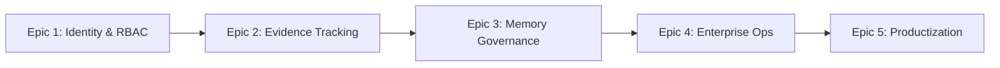

# Enterprise & Compliance Enablement - Epic Suite

**Projekt:** PyTaskforce Enterprise Transformation
**Erstellt:** 2026-01-22
**Status:** Draft - Awaiting Approval

---

## Übersicht

Diese Epic Suite transformiert PyTaskforce von einer technisch ausgereiften Agentenplattform zu einem **Enterprise- und Compliance-Ready Produkt**.

| Epic | Phase | Fokus | Priorität | Status |
|------|-------|-------|-----------|--------|
| [E1](epic-1-identity-tenancy-rbac.md) | 1 | Identity, Tenancy & RBAC | Critical | Draft |
| [E2](epic-2-evidence-source-tracking.md) | 2 | Evidence & Auditability | Critical | Draft |
| [E3](epic-3-secure-memory-governance.md) | 3 | Secure Memory Governance | High | Draft |
| [E4](epic-4-enterprise-operations.md) | 4 | Enterprise Operations | High | Draft |
| [E5](epic-5-productization.md) | 5 | Productization | Medium | Draft |

**Abhängigkeiten:** E1 → E2 → E3 → E4 → E5 (sequentiell)

---

## Dependency Graph



---

## Story Map

```
Epic 1: Identity & RBAC (Phase 1)
├── Story 1.1: Tenant/User Context Model
├── Story 1.2: Auth Middleware
└── Story 1.3: RBAC Policy Engine

Epic 2: Evidence Tracking (Phase 2)
├── Story 2.1: Evidence Model
├── Story 2.2: Tool Result Lineage
└── Story 2.3: RAG Citations

Epic 3: Memory Governance (Phase 3)
├── Story 3.1: Encryption
├── Story 3.2: Retention
└── Story 3.3: ACLs

Epic 4: Enterprise Ops (Phase 4)
├── Story 4.1: SLA Metrics
├── Story 4.2: Cost Reporting
└── Story 4.3: Compliance Export

Epic 5: Productization (Phase 5)
├── Story 5.1: Admin APIs
├── Story 5.2: Agent Catalog
└── Story 5.3: Approval Workflows
```

**Total: 15 Stories, 5 Epics**

---

## Architecture Principles

All epics follow the existing Clean Architecture (Hexagonal) with strict four-layer separation:

```
taskforce/
├── src/taskforce/
│   ├── core/              # LAYER 1: Pure Domain Logic
│   │   ├── domain/        # Agent, Identity, Evidence Models
│   │   └── interfaces/    # Protocols (Identity, Policy, etc.)
│   │
│   ├── infrastructure/    # LAYER 2: External Integrations
│   │   ├── persistence/   # Encrypted State Managers
│   │   ├── auth/          # JWT/OAuth2 Providers
│   │   └── metrics/       # Prometheus Exporters
│   │
│   ├── application/       # LAYER 3: Use Cases & Orchestration
│   │   ├── policy/        # RBAC Policy Engine
│   │   ├── reporting/     # Cost & Compliance Reports
│   │   └── workflows/     # Approval Workflows
│   │
│   └── api/               # LAYER 4: Entrypoints
│       ├── middleware/    # Auth Middleware
│       └── routes/admin/  # Admin APIs
```

### Import Rules (CRITICAL)

**Dependency Direction:** Inward only (API → Application → Infrastructure → Core)

- Core layer NEVER imports from Infrastructure
- Infrastructure implements Core Protocols
- Application orchestrates all layers
- API depends only on Application layer

---

## Validation Checklist

### Scope Validation

- [x] Jedes Epic kann in 3 Stories umgesetzt werden
- [x] Architekturerweiterungen folgen Ports & Adapters
- [x] Integration nutzt bestehende Patterns
- [x] Complexity ist pro Epic manageable

### Risk Assessment

- [x] Risiken pro Epic identifiziert
- [x] Rollback-Pläne definiert (Feature Flags)
- [x] Testing-Approach deckt Regression ab
- [x] Team-Wissen über Integration Points vorhanden

### Completeness Check

- [x] Epic Goals sind klar und erreichbar
- [x] Stories sind sinnvoll geschnitten
- [x] Success Criteria sind messbar
- [x] Dependencies zwischen Epics identifiziert

---

## Quick Links

- [Epic 1: Identity, Tenancy & RBAC](epic-1-identity-tenancy-rbac.md)
- [Epic 2: Evidence & Source Tracking](epic-2-evidence-source-tracking.md)
- [Epic 3: Secure Memory Governance](epic-3-secure-memory-governance.md)
- [Epic 4: Enterprise Operations](epic-4-enterprise-operations.md)
- [Epic 5: Productization](epic-5-productization.md)

---

## Handoff to Story Manager

**Story Manager Handoff:**

> Bitte entwickle detaillierte User Stories für diese Brownfield Epics. Key considerations:
>
> - Dies ist eine Erweiterung eines bestehenden Systems mit Python 3.11, FastAPI, Hexagonal Architecture
> - **Architekturprinzip:** Ports & Adapters strikt einhalten – keine Infrastructure-Imports im Core
> - **Integration Points:** API Layer, Application Layer, State Protocol, Tool Protocol
> - **Bestehende Patterns:** Protocol-based DI, Async/Await, structlog Logging
> - **Kritische Kompatibilität:** Backward Compatibility für alle API Endpoints
>
> Jede Story muss Verifikation enthalten, dass bestehende Funktionalität intakt bleibt.
>
> Die Epics sollen **Enterprise-, Compliance- und Audit-Ready** Capabilities liefern, ohne die Clean Architecture zu brechen.
