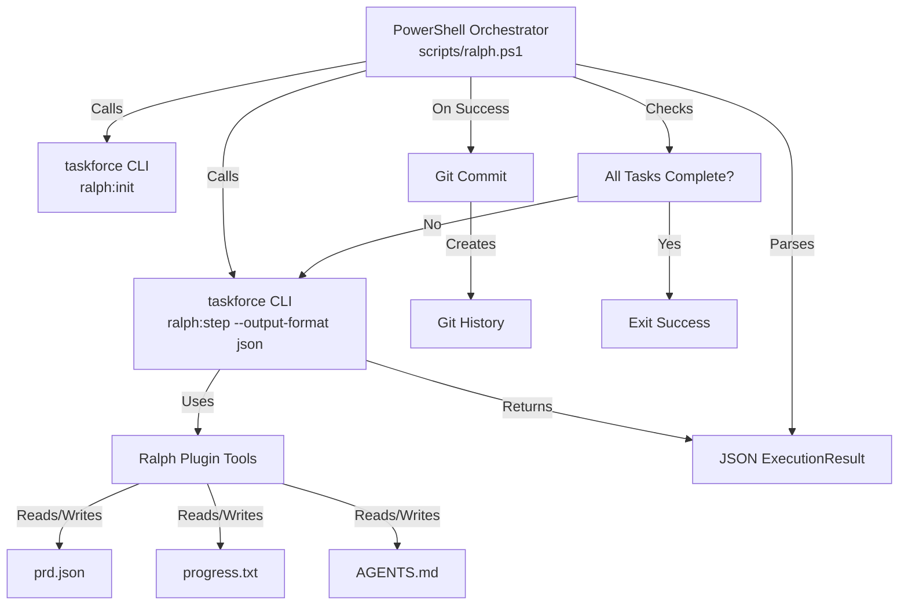

# Ralph Loop - Autonomous Development Pattern

The Ralph Loop is an autonomous development pattern that enables complex, multi-iteration development tasks by maintaining state and learnings across fresh LLM context windows. This technique is particularly powerful for breaking down large tasks into smaller, manageable stories that can be completed autonomously.

## What is a Ralph Loop?

The Ralph Loop implements the **"fresh context" philosophy**: each iteration starts with a clean LLM context window, but the agent maintains awareness of previous work through:

- **PRD (Product Requirements Document)**: A JSON file tracking user stories and their completion status
- **Git History**: Each successful iteration is committed, creating a persistent record
- **Learnings**: Lessons learned are recorded in `progress.txt` and guardrails in `AGENTS.md`

This approach allows the agent to work on complex tasks that would exceed a single context window, while avoiding the "amnesia" problem of long-running sessions.

## Architecture Overview



## Installation

### Prerequisites

- **Taskforce CLI**: Installed and available in PATH
- **PowerShell 7+**: Required for the orchestrator script
- **Git**: Initialized repository (run `git init` if needed)
- **Ralph Plugin**: Located in `examples/ralph_plugin/`

### Setup Steps

1. **Verify Taskforce Installation**
   ```powershell
   taskforce --version
   ```

2. **Initialize Git Repository** (if not already initialized)
   ```powershell
   git init
   ```

3. **Verify Plugin Location**
   The Ralph plugin should be at `examples/ralph_plugin/`. Verify it contains:
   - `ralph_plugin/tools/` (PRD and Learnings tools)
   - `configs/ralph_plugin.yaml` (plugin configuration)

4. **Verify Slash Commands**
   The Ralph commands should be available at `.taskforce/commands/ralph/`:
   - `init.md` - `/ralph:init` command
   - `step.md` - `/ralph:step` command

## Quick Start

### 1. Define Your Task

Create a task description file (e.g., `RALPH_TASK.md`) describing what you want to build:

```markdown
# Task: Implement a Calculator

Create a simple calculator application with:
- Basic arithmetic operations (add, subtract, multiply, divide)
- Unit tests for all operations
- Command-line interface
- Error handling for division by zero
```

### 2. Initialize the PRD

Run the initialization command with your task description:

```powershell
taskforce run command ralph:init "Create a simple calculator application with basic arithmetic operations, unit tests, CLI, and error handling for division by zero"
```

This creates `prd.json` with user stories broken down from your task description.

### 3. Run the Loop

Execute the orchestrator script:

```powershell
.\scripts\ralph.ps1
```

The script will:
- Check environment (taskforce in PATH, git initialized)
- Initialize workspace if needed (or skip if PRD exists)
- Run iterations calling `ralph:step` until all tasks are complete
- Commit each successful iteration to git
- Exit when all PRD tasks pass or max iterations reached

### 4. Monitor Progress

Watch the console output for:
- **Iteration count**: Current iteration number
- **Current task**: Which story is being worked on
- **Git hash**: Commit hash after each successful iteration
- **Status**: Execution status (completed, failed, etc.)

## Core Concepts

### PRD (Product Requirements Document)

The `prd.json` file tracks user stories and their completion status:

```json
{
  "stories": [
    {
      "id": 1,
      "title": "Implement basic arithmetic operations",
      "passes": false,
      "success_criteria": [
        "Add function works correctly",
        "Subtract function works correctly",
        "Multiply function works correctly",
        "Divide function works correctly"
      ]
    },
    {
      "id": 2,
      "title": "Add unit tests",
      "passes": false,
      "success_criteria": [
        "All arithmetic operations have tests",
        "Tests pass successfully"
      ]
    }
  ]
}
```

**Key Fields:**
- `id`: Unique story identifier
- `title`: Descriptive story title
- `passes`: Completion status (`true` when complete, `false` when pending)
- `success_criteria`: Testable criteria that must be met

### Context Rotation

Each iteration is a **fresh process call** to `taskforce`, which means:
- The LLM starts with a clean context window
- No memory of previous iterations within the same execution
- State is maintained through files (PRD, progress.txt, AGENTS.md, git history)

This is the core of the "fresh context" philosophy - the agent doesn't rely on conversation history, but on persistent files.

### Iteration

One iteration = one execution of `ralph:step`, which:
1. Reads context (AGENTS.md, progress.txt, prd.json)
2. Gets the next pending story from PRD
3. Implements the story completely
4. Marks it complete in PRD
5. Records learnings

The orchestrator manages multiple iterations in a loop until all tasks are complete.

### Gutter Detection

The orchestrator prevents infinite loops through:

- **Max Iterations**: Default 20 iterations (configurable in script)
- **Same Task Failure**: Exits if the same task fails 3 times consecutively
- **PRD Completion Check**: Verifies all stories have `passes: true`

## File Structure

During a Ralph Loop execution, these files are created/modified:

```
project-root/
├── prd.json              # PRD tracking user stories
├── progress.txt          # Lessons learned (appended)
├── AGENTS.md             # Self-maintaining documentation (updated)
├── RALPH_TASK.md         # Your original task description (optional)
└── [your source files]   # Code created by the agent
```

### prd.json

Tracks user stories and completion status. Created by `ralph:init`, updated by `ralph:step`.

### progress.txt

Appended with lessons learned after each iteration. Format:

```
=== Iteration 1 ===
- Learned: Always check for division by zero before dividing
- Pattern: Use pytest fixtures for test setup

=== Iteration 2 ===
- Learned: CLI argument parsing requires careful validation
```

### AGENTS.md

Self-maintaining documentation updated with guardrails and signs. The agent reads this at the start of each iteration to avoid repeating mistakes.

Example guardrails:

```markdown
## Guardrails

- Always check for division by zero before dividing
- Use type hints for all function parameters
- Write tests before implementing features (TDD approach)

## Signs

- If tests fail, check imports first
- If CLI doesn't work, verify argument parsing
```

## Configuration

The orchestrator script (`scripts/ralph.ps1`) has configurable parameters at the top:

```powershell
# Maximum number of iterations before giving up
$max_iterations = 20

# Path to prd.json (default: current directory)
$prd_path = "prd.json"

# Profile to use for taskforce (default: ralph_plugin)
$taskforceProfile = "ralph_plugin"
```

Adjust these as needed for your use case.

## Troubleshooting

### "taskforce command not found"

**Problem**: The orchestrator can't find the `taskforce` command.

**Solution**: 
- Ensure Taskforce is installed: `pip install taskforce` or `uv pip install taskforce`
- Verify it's in PATH: `taskforce --version`
- If using a virtual environment, activate it before running the script

### "Git repository not initialized"

**Problem**: The script requires a git repository for commits.

**Solution**:
```powershell
git init
git config user.name "Your Name"
git config user.email "your.email@example.com"
```

### "Failed to initialize Ralph workspace"

**Problem**: `ralph:init` requires a task description argument.

**Solution**: 
- Run manually: `taskforce run command ralph:init "Your task description here"`
- Or ensure the script is called with proper arguments

### "Same task failed 3 times consecutively"

**Problem**: The agent is stuck on a particular story.

**Solutions**:
- **Check the story**: The task might be too complex or ambiguous. Break it down further.
- **Review learnings**: Check `progress.txt` and `AGENTS.md` for clues about what's going wrong.
- **Manual intervention**: Manually mark the story as complete if it's actually done, or adjust the PRD.
- **Adjust max_iterations**: Increase the limit if you need more attempts.

### "Maximum iterations reached"

**Problem**: The loop hit the iteration limit before completing all tasks.

**Solutions**:
- **Check progress**: Review `prd.json` to see which stories are complete
- **Increase limit**: Adjust `$max_iterations` in the script
- **Break down tasks**: Some stories might be too large - split them in the PRD
- **Manual completion**: Complete remaining tasks manually and mark them in PRD

### "Failed to parse JSON output"

**Problem**: The CLI output isn't valid JSON.

**Solutions**:
- **Check taskforce version**: Ensure you're using a version that supports `--output-format json`
- **Verify command**: Ensure `ralph:step` command exists and works
- **Check plugin**: Verify the Ralph plugin is properly loaded
- **Review output**: The script logs raw output - check for errors

### Git Commit Failures

**Problem**: Git commits are failing but script continues.

**Solutions**:
- **Check git config**: Ensure user.name and user.email are set
- **Review changes**: Use `git status` to see what would be committed
- **Manual commit**: If needed, commit manually: `git add . && git commit -m "Manual commit"`

### Agent Repeats Mistakes

**Problem**: The agent keeps making the same errors.

**Solutions**:
- **Update AGENTS.md**: Add guardrails about the specific mistake
- **Update progress.txt**: Document what went wrong and how to avoid it
- **Review PRD**: Ensure success criteria are clear and testable

## Best Practices

### Task Definition

- **Be Specific**: Clear, actionable task descriptions work best
- **Break Down**: Large tasks should be broken into smaller stories
- **Success Criteria**: Each story should have testable success criteria
- **Dependencies**: Order stories logically (dependencies first)

### PRD Management

- **Review Regularly**: Check `prd.json` to understand progress
- **Adjust as Needed**: Don't hesitate to modify stories if requirements change
- **Keep Stories Focused**: One story = one completable task

### Learnings Management

- **Be Proactive**: Update `progress.txt` and `AGENTS.md` when you notice patterns
- **Be Specific**: Vague learnings aren't helpful - be concrete
- **Review Before Starting**: Always read learnings before starting a new loop

### Monitoring

- **Watch Console Output**: The orchestrator provides detailed logging
- **Check Git History**: Review commits to see what changed each iteration
- **Review Files**: Check source files periodically to ensure quality

## Advanced Usage

### Custom Profiles

You can use a different profile by modifying `$taskforceProfile` in the script:

```powershell
$taskforceProfile = "custom_profile"
```

Ensure your profile has access to the Ralph plugin tools.

### Multiple PRDs

To work on multiple tasks simultaneously, use different PRD paths:

```powershell
# In script or as parameter
$prd_path = "prd-feature-a.json"
```

Run separate orchestrator instances for each PRD.

### Integration with CI/CD

The orchestrator can be integrated into CI/CD pipelines:

```yaml
# Example GitHub Actions
- name: Run Ralph Loop
  run: |
    git config user.name "CI Bot"
    git config user.email "ci@example.com"
    pwsh scripts/ralph.ps1
```

## Terminology Reference

- **PRD**: Product Requirements Document - JSON file tracking user stories
- **Iteration**: One execution of `ralph:step` - completes one user story
- **Context Rotation**: Fresh process call that clears LLM context window
- **Gutter**: Failure condition - when agent gets stuck or fails repeatedly
- **Story**: One user story in the PRD - a single completable task
- **Guardrails**: Rules in AGENTS.md that prevent repeating mistakes
- **Signs**: Indicators in AGENTS.md that help identify common issues

## Related Documentation

- **[Plugin Development Guide](plugins.md)**: Creating custom plugins
- **[CLI Guide](cli.md)**: Taskforce CLI reference
- **[Slash Commands](slash-commands.md)**: Custom command system
- **[Examples](../examples/ralph_plugin/README.md)**: Golden example and quick start

## Example

See `examples/ralph_plugin/` for a complete working example including:
- Sample `RALPH_TASK.md`
- Example `prd.json`
- Quick-start guide
