# Accounting Agent - Technische Dokumentation

**Version:** 1.0
**Datum:** 2026-01-27
**Status:** Production-Ready

---

## Inhaltsverzeichnis

1. [Überblick](#1-überblick)
2. [Architektur](#2-architektur)
3. [Domain-Modelle](#3-domain-modelle)
4. [Workflow & Zustandsmaschine](#4-workflow--zustandsmaschine)
5. [Tools im Detail](#5-tools-im-detail)
6. [Infrastruktur-Komponenten](#6-infrastruktur-komponenten)
7. [Konfiguration](#7-konfiguration)
8. [Confidence-Bewertung & Hard Gates](#8-confidence-bewertung--hard-gates)
9. [Regel-Lernmechanismus](#9-regel-lernmechanismus)
10. [GoBD-Compliance](#10-gobd-compliance)
11. [Integration mit Taskforce](#11-integration-mit-taskforce)
12. [Deployment & Betrieb](#12-deployment--betrieb)

---

## 1. Überblick

### 1.1 Einführung und Motivation

Der **Accounting Agent** ist ein spezialisierter KI-Agent, der für die automatisierte Verarbeitung von Eingangsrechnungen und die Vorkontierung nach deutschem Steuerrecht entwickelt wurde. Er adressiert ein zentrales Problem in der Buchhaltung: Die manuelle Kontierung von Rechnungen ist zeitaufwändig, fehleranfällig und erfordert Fachwissen über Steuerrecht und Kontenrahmen.

Der Agent verfolgt einen **hybriden Ansatz**, der deterministische Regelverarbeitung mit semantischer Analyse und Machine Learning kombiniert. Dieser Ansatz bietet mehrere Vorteile:

- **Nachvollziehbarkeit**: Regelbasierte Entscheidungen sind transparent und auditierbar
- **Lernfähigkeit**: Das System verbessert sich durch Benutzer-Feedback kontinuierlich
- **Compliance**: Alle Aktionen werden GoBD-konform protokolliert
- **Sicherheit**: Unsichere Entscheidungen werden an Menschen eskaliert (Human-in-the-Loop)

### 1.2 Kernfunktionen im Detail

| Funktion | Beschreibung | Technische Umsetzung |
|----------|--------------|---------------------|
| **Rechnungsextraktion** | Wandelt PDF-Dokumente und Bilder in strukturierte Daten um. Unterstützt verschiedene Rechnungsformate und -layouts. | Docling für OCR/PDF-Parsing, LLM für semantische Strukturierung |
| **Compliance-Prüfung** | Validiert Rechnungen gegen die gesetzlichen Anforderungen des §14 UStG. Prüft alle Pflichtangaben und berechnet, ob Kleinbetragsregelungen anwendbar sind. | Regelbasierte Validierung mit konfigurierbaren Feldprüfungen |
| **Kontierung** | Ordnet Rechnungspositionen automatisch den korrekten Sachkonten zu. Berücksichtigt Lieferant, Positionsbeschreibung und historische Buchungen. | Dreistufiges Matching: Vendor-Only → Vendor+Item (Semantic) → RAG Fallback |
| **Confidence-Bewertung** | Berechnet eine Konfidenz für jeden Buchungsvorschlag basierend auf fünf gewichteten Signalen. Identifiziert Szenarien, die menschliche Prüfung erfordern. | Gewichtete Signalberechnung mit Hard Gates |
| **HITL-Workflow** | Präsentiert unsichere Buchungsvorschläge dem Benutzer zur Bestätigung, Korrektur oder Ablehnung. | Strukturierte Review-Prompts mit Entscheidungsoptionen |
| **Regel-Lernen** | Generiert automatisch neue Kontierungsregeln aus bestätigten Buchungen und Benutzer-Korrekturen. | Versionierte Regeln mit Konfliktauflösung |
| **Audit-Trail** | Protokolliert alle Aktionen unveränderlich für die 10-jährige Aufbewahrungspflicht. | Append-Only JSONL mit SHA-256 Checksummen |

### 1.3 Systemkontext und Externe Abhängigkeiten

Das folgende Diagramm zeigt die Einbettung des Accounting Agents in seine Systemumgebung. Der Agent interagiert mit mehreren externen Systemen, die jeweils spezifische Funktionen bereitstellen.

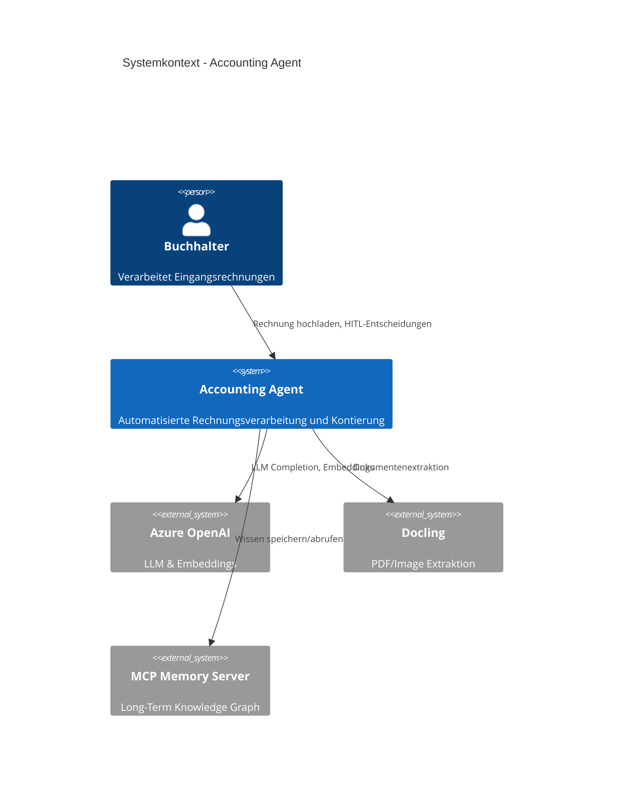

**Erläuterung der Systembeziehungen:**

- **Buchhalter ↔ Agent**: Der Benutzer initiiert die Rechnungsverarbeitung durch Hochladen von Dokumenten. Bei unsicheren Buchungsvorschlägen wird der Benutzer zur Entscheidung aufgefordert (HITL). Seine Korrekturen fließen in das Regellernen ein.

- **Agent → Azure OpenAI**: Der Agent nutzt Azure OpenAI für zwei Zwecke: (1) LLM Completions für die Rechnungsextraktion und RAG-Fallback-Vorschläge, (2) Embeddings für die semantische Ähnlichkeitssuche bei Vendor+Item Regeln.

- **Agent → Docling**: Docling ist ein externes Tool zur Dokumentenextraktion. Es konvertiert PDF-Dateien und Bilder in Markdown-Text, der anschließend vom LLM strukturiert wird.

- **Agent ↔ MCP Memory**: Der MCP (Model Context Protocol) Memory Server speichert langfristiges Wissen über Lieferanten, Muster und Benutzer-Präferenzen in einem Knowledge Graph. Dieses Wissen bleibt über Sessions hinweg erhalten.

### 1.4 Technologie-Stack

Der Accounting Agent basiert auf modernen Python-Technologien und folgt Clean-Architecture-Prinzipien:

| Komponente | Technologie | Begründung |
|------------|-------------|------------|
| **Sprache** | Python 3.11 | Moderne Features (Dataclasses, Type Hints), breites ML-Ökosystem |
| **Framework** | Taskforce | Eigenes Multi-Agent-Framework mit Clean Architecture |
| **LLM Provider** | Azure OpenAI / OpenAI | Enterprise-Grade, DSGVO-konform (Azure EU Region) |
| **Embeddings** | text-embedding-ada-002 | 1536-dimensionale Vektoren, gute Balance aus Qualität und Kosten |
| **Dokumentenextraktion** | Docling | Open-Source, unterstützt komplexe Layouts |
| **Persistenz** | YAML + JSONL | Menschenlesbar, Git-versionierbar, Append-Only für Audit |
| **Memory** | MCP Server | Standardisiertes Protokoll für Agent-Memory |

---

## 2. Architektur

### 2.1 Clean Architecture - Grundprinzipien

Der Accounting Agent folgt strikt der **Clean Architecture** (auch Hexagonal Architecture oder Ports-and-Adapters genannt). Diese Architektur wurde gewählt, um folgende Ziele zu erreichen:

1. **Unabhängigkeit von Frameworks**: Die Geschäftslogik ist nicht an spezifische Bibliotheken gebunden
2. **Testbarkeit**: Jede Schicht kann isoliert getestet werden
3. **Austauschbarkeit**: Externe Systeme (DB, LLM, etc.) können ersetzt werden
4. **Langlebigkeit**: Die Domain-Logik bleibt stabil, auch wenn sich Infrastruktur ändert

Die Architektur besteht aus vier konzentrischen Schichten, wobei Abhängigkeiten **nur nach innen** zeigen dürfen:

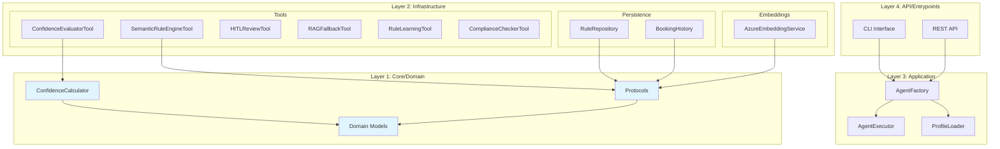

**Detaillierte Schichtenbeschreibung:**

#### Layer 1: Core/Domain (Blau markiert)
Die innerste Schicht enthält die **reine Geschäftslogik** ohne externe Abhängigkeiten:

- **Domain Models** (`models.py`): Dataclasses wie `Invoice`, `BookingProposal`, `AccountingRule`, die das Fachvokabular der Buchhaltung abbilden. Diese Modelle sind immutable und enthalten keine I/O-Operationen.

- **Protocols** (`protocols.py`): Python Protocols (PEP 544) definieren Schnittstellen für externe Systeme. Beispiel: `EmbeddingProviderProtocol` definiert, welche Methoden ein Embedding-Service implementieren muss, ohne eine konkrete Implementierung vorzuschreiben.

- **ConfidenceCalculator** (`confidence.py`): Enthält die Logik zur Berechnung der Buchungs-Konfidenz. Diese Klasse ist ein reiner Algorithmus ohne Seiteneffekte.

#### Layer 2: Infrastructure
Diese Schicht enthält **Implementierungen für externe Systeme**:

- **Persistence**: Konkrete Implementierungen für Datenspeicherung (YAML-Dateien, JSONL-Logs)
- **Embeddings**: Azure OpenAI Service für Vektor-Embeddings
- **Tools**: Die Agent-Tools, die als Brücke zwischen Domain und externen APIs fungieren

#### Layer 3: Application
Die **Orchestrierungsschicht** verbindet alle Komponenten:

- **AgentFactory**: Dependency Injection - erstellt und verdrahtet alle Komponenten basierend auf Konfiguration
- **AgentExecutor**: Führt den ReAct-Loop aus und koordiniert Tool-Aufrufe
- **ProfileLoader**: Lädt YAML-Konfigurationen und validiert sie

#### Layer 4: API/Entrypoints
Die **äußerste Schicht** für Benutzerinteraktion:

- **CLI Interface**: Typer-basierte Kommandozeile für lokale Nutzung
- **REST API**: FastAPI-Server für Microservice-Deployment

### 2.2 Verzeichnisstruktur im Detail

Die Verzeichnisstruktur spiegelt die Schichtenarchitektur wider:

```
examples/accounting_agent/
├── accounting_agent/
│   ├── domain/                    # Layer 1: Pure Domain Logic
│   │   ├── models.py              # 15+ Dataclasses (Invoice, Rule, etc.)
│   │   ├── confidence.py          # ConfidenceCalculator Algorithmus
│   │   ├── protocols.py           # 4 PEP 544 Protocol-Definitionen
│   │   └── errors.py              # Domain-spezifische Exceptions
│   │
│   ├── infrastructure/            # Layer 2: External Integrations
│   │   ├── embeddings/
│   │   │   └── azure_embeddings.py  # Azure OpenAI Embedding-Client
│   │   └── persistence/
│   │       ├── rule_repository.py   # YAML + JSONL Regel-Storage
│   │       └── booking_history.py   # Append-Only Buchungshistorie
│   │
│   └── tools/                     # Layer 3: Application Boundary
│       ├── semantic_rule_engine_tool.py    # Hauptklassifikation
│       ├── confidence_evaluator_tool.py    # Konfidenz-Berechnung
│       ├── rule_learning_tool.py           # Auto-Regellernen
│       ├── hitl_review_tool.py             # Human-in-the-Loop
│       ├── rag_fallback_tool.py            # LLM-Fallback
│       ├── compliance_checker_tool.py      # §14 UStG Prüfung
│       ├── docling_tool.py                 # PDF/Image Extraktion
│       ├── invoice_extraction_tool.py      # LLM-Strukturierung
│       ├── tax_calculator_tool.py          # USt/AfA Berechnung
│       └── audit_log_tool.py               # GoBD-Protokollierung
│
├── configs/
│   ├── accounting_agent.yaml      # Haupt-Agentenprofil mit System-Prompt
│   └── accounting/rules/
│       ├── kontierung_rules.yaml  # Vendor + Semantic Rules
│       └── compliance_rules.yaml  # §14 UStG Pflichtfelder
│
└── tests/
    ├── test_semantic_rule_engine.py
    ├── test_confidence_calculator.py
    └── test_domain_models.py
```

**Wichtige Konventionen:**

- **Domain-Layer** enthält keine `import` von Infrastructure-Modulen
- **Tools** nutzen nur Protocols, nicht konkrete Implementierungen
- **Konfiguration** ist strikt von Code getrennt (in `configs/`)
- **Tests** spiegeln die Quellstruktur

### 2.3 Dependency Injection und Protokolle

Der Agent verwendet **Protocol-Based Dependency Injection**, um die Kopplung zwischen Schichten zu minimieren. Anstatt konkrete Klassen zu erwarten, definiert die Domain-Schicht abstrakte Protocols, die von der Infrastructure implementiert werden.

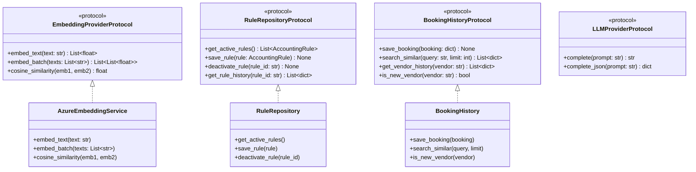

**Protokoll-Beschreibungen:**

| Protocol | Zweck | Wichtigste Methoden |
|----------|-------|---------------------|
| **EmbeddingProviderProtocol** | Abstraktion für Vektor-Embedding-Services. Ermöglicht den Austausch von Azure gegen OpenAI, lokale Modelle oder Mock-Implementierungen für Tests. | `embed_text()` für einzelne Texte, `embed_batch()` für Effizienz, `cosine_similarity()` für Vergleiche |
| **RuleRepositoryProtocol** | Abstraktion für Regel-Persistenz. Könnte durch eine Datenbank-Implementierung ersetzt werden. | `get_active_rules()` liefert priorisierte Regeln, `save_rule()` mit Versionierung, `get_rule_history()` für Audit |
| **BookingHistoryProtocol** | Abstraktion für die Buchungshistorie. Unterstützt sowohl einfache Speicherung als auch semantische Suche. | `save_booking()` ist append-only, `search_similar()` für RAG-Kontext, `is_new_vendor()` für Hard Gates |
| **LLMProviderProtocol** | Abstraktion für LLM-Aufrufe. Kompatibel mit dem Taskforce-Framework. | `complete()` für Text, `complete_json()` für strukturierte Ausgaben |

**Vorteile dieses Ansatzes:**

1. **Testbarkeit**: In Unit-Tests können Mock-Implementierungen injiziert werden
2. **Flexibilität**: Wechsel von Azure zu OpenAI erfordert nur neue Implementierung
3. **Typsicherheit**: Python Type Checker (mypy) validiert Protocol-Konformität
4. **Dokumentation**: Protocols sind selbstdokumentierend

---

## 3. Domain-Modelle

### 3.1 Überblick über das Domain-Modell

Die Domain-Modelle bilden das **Fachvokabular der Buchhaltung** ab. Sie sind als Python Dataclasses implementiert, was Immutabilität, automatische `__eq__` und `__hash__` Methoden sowie Type Hints bietet.

Das folgende Diagramm zeigt die Beziehungen zwischen den Hauptmodellen:

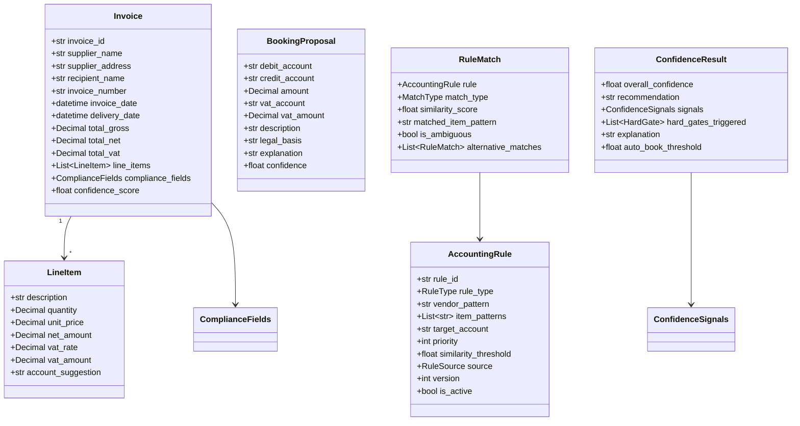

**Detaillierte Modellbeschreibungen:**

#### Invoice (Rechnung)
Das zentrale Modell repräsentiert eine vollständig extrahierte Eingangsrechnung:

| Feld | Typ | Beschreibung |
|------|-----|--------------|
| `invoice_id` | str | Eindeutige ID (UUID), vom System generiert |
| `supplier_name` | str | Vollständiger Name des Rechnungsstellers (§14 Abs. 4 Nr. 1 UStG) |
| `supplier_address` | str | Vollständige Anschrift inkl. PLZ/Ort |
| `recipient_name` | str | Name des Leistungsempfängers |
| `invoice_number` | str | Fortlaufende Rechnungsnummer des Lieferanten |
| `invoice_date` | datetime | Ausstellungsdatum der Rechnung |
| `delivery_date` | datetime | Liefer- oder Leistungsdatum (kann vom Rechnungsdatum abweichen) |
| `total_gross` | Decimal | Bruttobetrag inkl. MwSt |
| `total_net` | Decimal | Nettobetrag ohne MwSt |
| `total_vat` | Decimal | Summe der Umsatzsteuer |
| `line_items` | List[LineItem] | Einzelne Rechnungspositionen |
| `compliance_fields` | ComplianceFields | Tracking welche Pflichtfelder vorhanden sind |
| `confidence_score` | float | Qualität der OCR-Extraktion (0.0-1.0) |

#### LineItem (Rechnungsposition)
Repräsentiert eine einzelne Position auf der Rechnung:

| Feld | Beschreibung |
|------|--------------|
| `description` | Leistungsbeschreibung, wichtig für semantisches Matching |
| `quantity` | Menge (Stück, Stunden, etc.) |
| `unit_price` | Einzelpreis netto |
| `net_amount` | Nettobetrag der Position |
| `vat_rate` | Steuersatz (19%, 7%, 0%) |
| `vat_amount` | USt-Betrag der Position |
| `account_suggestion` | Vom System vorgeschlagenes Sachkonto |

#### BookingProposal (Buchungsvorschlag)
Das Ergebnis der Kontierung - ein doppelter Buchungssatz:

| Feld | Beschreibung |
|------|--------------|
| `debit_account` | Sollkonto (z.B. "4930" für Bürobedarf) |
| `credit_account` | Habenkonto (z.B. "1600" für Verbindlichkeiten) |
| `amount` | Buchungsbetrag (netto) |
| `vat_account` | Vorsteuerkonto (z.B. "1576" für 19% VSt) |
| `vat_amount` | Vorsteuerbetrag |
| `description` | Buchungstext |
| `legal_basis` | Rechtliche Grundlage (z.B. "§4 Abs. 4 EStG") |
| `explanation` | Menschenlesbare Erklärung der Kontierung |
| `confidence` | Konfidenz dieses Vorschlags (0.0-1.0) |

#### AccountingRule (Kontierungsregel)
Definiert eine Regel zur Konto-Zuordnung:

| Feld | Beschreibung |
|------|--------------|
| `rule_id` | Eindeutige ID (z.B. "VR-AWS" für Vendor-Rule AWS) |
| `rule_type` | VENDOR_ONLY oder VENDOR_ITEM |
| `vendor_pattern` | Regex-Pattern für Lieferantennamen |
| `item_patterns` | Liste von Keywords/Patterns für Positionen |
| `target_account` | Zielkonto bei Match |
| `priority` | Priorität (0-100), höher = wird zuerst geprüft |
| `similarity_threshold` | Mindest-Ähnlichkeit für Semantic Match (0.0-1.0) |
| `source` | MANUAL, AUTO_HIGH_CONFIDENCE oder HITL_CORRECTION |
| `version` | Versionnummer für Audit-Trail |
| `is_active` | Ob die Regel aktiv ist (Soft Delete) |

### 3.2 Regel-Typen und ihre Funktionsweise

Der Agent unterstützt drei verschiedene Regeltypen, die in einer definierten Prioritätsreihenfolge angewendet werden:

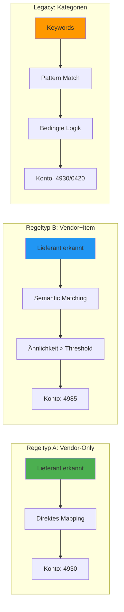

**Regeltyp A: Vendor-Only (Grün, Priority 100)**

Diese Regeln ordnen einen Lieferanten direkt einem Konto zu, unabhängig von der Positionsbeschreibung. Sie sind ideal für Lieferanten, die immer die gleiche Art von Leistung erbringen.

*Beispiel:* "Amazon Web Services" → immer Konto 6805 (EDV-Kosten Cloud)

*Anwendungsfall:* Ein Cloud-Provider liefert ausschließlich IT-Dienstleistungen. Egal ob die Rechnung "EC2 Instances", "S3 Storage" oder "Lambda Functions" enthält - es ist immer das gleiche Konto.

*Funktionsweise:*
1. Lieferantenname wird normalisiert (Kleinschreibung, Sonderzeichen entfernt)
2. Exakter String-Match gegen `vendor_pattern`
3. Bei Match: Zielkonto wird sofort zurückgegeben

**Regeltyp B: Vendor+Item (Blau, Priority 50)**

Diese Regeln berücksichtigen sowohl den Lieferanten als auch die Positionsbeschreibung. Die Positionsbeschreibung wird semantisch analysiert - ähnliche Begriffe werden erkannt, auch wenn sie nicht identisch sind.

*Beispiel:* Beliebiger Lieferant + Position enthält "Laptop" oder "Notebook" → Konto 4985 (GWG)

*Anwendungsfall:* Ein Büroausstatter liefert verschiedene Produkte - Büromaterial (4930), IT-Equipment (4985), Möbel (4980). Die Regel unterscheidet anhand der Positionsbeschreibung.

*Funktionsweise:*
1. Lieferantenname wird gegen `vendor_pattern` geprüft (Regex oder exakt)
2. Für jede Position: Beschreibung wird embedded (Vektor erstellt)
3. Embedding wird gegen alle `item_patterns` verglichen (Cosine Similarity)
4. Bei Ähnlichkeit > `similarity_threshold`: Match

**Legacy: Kategorien (Orange, Priority 10)**

Aus Kompatibilitätsgründen unterstützt der Agent auch einfache Keyword-basierte Kategorien mit bedingter Logik (z.B. GWG-Schwelle).

*Beispiel:* Position enthält "Software" UND Betrag < 800€ → Konto 4985, SONST → Konto 0420

### 3.3 Workflow-Zustände und Übergänge

Der Agent durchläuft während der Verarbeitung einer Rechnung verschiedene Zustände. Diese Zustandsmaschine ist in `domain/models.py` als `WorkflowState` Enum definiert:

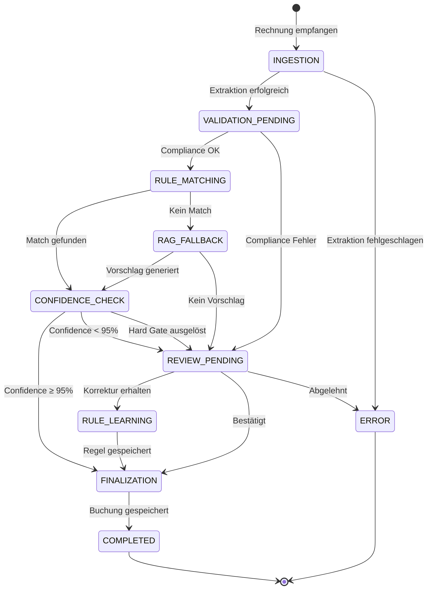

**Zustandsbeschreibungen:**

| Zustand | Beschreibung | Typische Dauer | Nächste Zustände |
|---------|--------------|----------------|------------------|
| **INGESTION** | Rechnung wird empfangen und durch Docling/LLM extrahiert | 2-5 Sekunden | VALIDATION_PENDING, ERROR |
| **VALIDATION_PENDING** | §14 UStG Compliance wird geprüft | < 1 Sekunde | RULE_MATCHING, REVIEW_PENDING |
| **RULE_MATCHING** | Semantic Rule Engine sucht passende Regeln | 1-3 Sekunden | CONFIDENCE_CHECK, RAG_FALLBACK |
| **RAG_FALLBACK** | LLM generiert Vorschlag basierend auf Historie | 2-4 Sekunden | CONFIDENCE_CHECK, REVIEW_PENDING |
| **CONFIDENCE_CHECK** | Konfidenz und Hard Gates werden evaluiert | < 1 Sekunde | FINALIZATION, REVIEW_PENDING |
| **REVIEW_PENDING** | Wartet auf menschliche Entscheidung | Benutzerabhängig | RULE_LEARNING, FINALIZATION, ERROR |
| **RULE_LEARNING** | Neue Regel wird aus Korrektur generiert | < 1 Sekunde | FINALIZATION |
| **FINALIZATION** | Buchung und Audit-Log werden gespeichert | < 1 Sekunde | COMPLETED |
| **COMPLETED** | Erfolgreich abgeschlossen | - | (Ende) |
| **ERROR** | Fehler aufgetreten | - | (Ende) |

**Kritische Übergänge:**

- **VALIDATION_PENDING → REVIEW_PENDING**: Tritt auf, wenn Pflichtfelder fehlen (z.B. Steuernummer). Der Benutzer muss die Daten ergänzen.
- **CONFIDENCE_CHECK → REVIEW_PENDING**: Tritt auf bei Confidence < 95% ODER wenn ein Hard Gate ausgelöst wird. Dies ist der normale HITL-Pfad.
- **REVIEW_PENDING → ERROR**: Benutzer lehnt Buchung ab. Der Vorgang wird protokolliert aber nicht abgeschlossen.

---

## 4. Workflow & Zustandsmaschine

### 4.1 Hauptverarbeitungs-Workflow im Detail

Der folgende Workflow zeigt den vollständigen Ablauf von Rechnungsempfang bis zur Buchung. Jeder Schritt ist einem Tool zugeordnet, das die entsprechende Funktion ausführt.

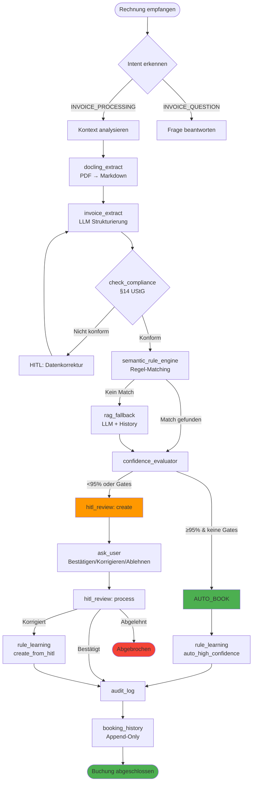

**Detaillierte Phasenbeschreibung:**

#### Phase 1: Intent-Erkennung
Der Agent analysiert zuerst, was der Benutzer möchte:
- **INVOICE_PROCESSING**: "Verarbeite diese Rechnung" → Vollständiger Workflow
- **INVOICE_QUESTION**: "Was bedeutet §13b UStG?" → Nur Frage beantworten

#### Phase 2: Kontext-Analyse
Bei INVOICE_PROCESSING wird der Rechnungskontext ermittelt:
- **Inland**: Deutsche Rechnung → Standard-USt-Regeln
- **EU**: Innergemeinschaftlicher Erwerb → Reverse Charge prüfen
- **Drittland**: Import → Einfuhrumsatzsteuer

#### Phase 3: Extraktion (docling_extract → invoice_extract)
1. **docling_extract**: Konvertiert PDF/Bild in Markdown-Text
   - Nutzt OCR für gescannte Dokumente
   - Erkennt Tabellenstrukturen
   - Liefert Rohtext mit Layout-Informationen

2. **invoice_extract**: LLM strukturiert den Markdown-Text
   - Identifiziert Felder (Lieferant, Datum, Beträge)
   - Extrahiert Positionen mit Mengen und Preisen
   - Berechnet Summen und prüft Konsistenz

#### Phase 4: Compliance-Prüfung (check_compliance)
Prüft alle Pflichtangaben nach §14 UStG:
- Bei fehlenden kritischen Feldern: → HITL für Datenergänzung
- Bei Warnungen (z.B. fehlendes Lieferdatum): Notiz, aber weiter
- Bei Kleinbetragsrechnung (< 250€): Reduzierte Anforderungen

#### Phase 5: Klassifikation (semantic_rule_engine ODER rag_fallback)
**Semantic Rule Engine** versucht regelbasierte Zuordnung:
1. Vendor-Only Regeln (Priority 100)
2. Vendor+Item Regeln mit Embedding-Matching (Priority 50)
3. Legacy-Kategorien (Priority 10)

Falls keine Regel greift: **RAG Fallback**
1. Sucht ähnliche historische Buchungen
2. LLM generiert Vorschlag basierend auf Kontext
3. Konfidenz wird konservativ eingeschätzt

#### Phase 6: Confidence-Bewertung (confidence_evaluator)
Berechnet gewichtete Konfidenz und prüft Hard Gates:
- **Confidence ≥ 95% UND keine Hard Gates**: AUTO_BOOK
- **Sonst**: HITL_REVIEW

#### Phase 7: Auto-Booking ODER HITL
**AUTO_BOOK Pfad (Grün):**
1. Buchung wird sofort durchgeführt
2. rule_learning erstellt Auto-Regel (Priority 75)
3. Audit-Log wird geschrieben

**HITL_REVIEW Pfad (Orange):**
1. Review wird erstellt mit allen Informationen
2. Benutzer sieht: Rechnungsdaten, Vorschlag, Konfidenz, Grund für HITL
3. Benutzer wählt: Bestätigen / Korrigieren / Ablehnen
4. Bei Korrektur: rule_learning erstellt HITL-Regel (Priority 90)

#### Phase 8: Finalisierung (audit_log → booking_history)
1. **audit_log**: GoBD-konformer Eintrag mit SHA-256 Checksum
2. **booking_history**: Append-Only Speicherung mit Embedding für zukünftige Suchen

### 4.2 Semantic Rule Matching - Algorithmus im Detail

Der Kern der Klassifikation ist die Semantic Rule Engine. Sie implementiert einen mehrstufigen Matching-Algorithmus:

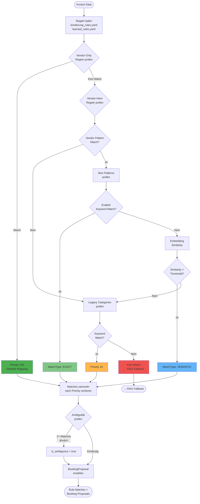

**Algorithmus-Beschreibung Schritt für Schritt:**

**Schritt 1: Regeln Laden**
```python
# Aus zwei Quellen werden Regeln geladen:
manual_rules = load_yaml("kontierung_rules.yaml")  # Manuell gepflegt
learned_rules = load_yaml("learned_rules.yaml")     # Automatisch generiert
all_rules = sorted(manual_rules + learned_rules, key=lambda r: r.priority, reverse=True)
```

**Schritt 2: Vendor-Only Matching (Schnellster Pfad)**
```python
for rule in vendor_only_rules:
    normalized_supplier = normalize(invoice.supplier_name)  # Kleinbuchstaben, trim
    if rule.vendor_pattern in normalized_supplier:
        return RuleMatch(rule, match_type="vendor_only", similarity=1.0)
```
*Beispiel:* "Amazon Web Services EMEA SARL" enthält "amazon web services" → Match

**Schritt 3: Vendor+Item Matching (Semantisch)**
```python
for rule in vendor_item_rules:
    # Erst Vendor prüfen
    if not regex_match(rule.vendor_pattern, invoice.supplier_name):
        continue

    for item in invoice.line_items:
        # Exakter Match als Shortcut
        if any(pattern.lower() in item.description.lower()
               for pattern in rule.item_patterns):
            return RuleMatch(rule, match_type="exact", similarity=1.0)

        # Semantischer Match via Embeddings
        item_embedding = embed(item.description)
        for pattern in rule.item_patterns:
            pattern_embedding = embed(pattern)  # Cached
            similarity = cosine_similarity(item_embedding, pattern_embedding)
            if similarity >= rule.similarity_threshold:
                return RuleMatch(rule, match_type="semantic", similarity=similarity)
```
*Beispiel:* "MacBook Pro 16 Zoll" hat hohe Ähnlichkeit zu "Laptop" (0.87) → Match

**Schritt 4: Legacy Categories (Fallback)**
```python
for category in expense_categories:
    if any(keyword in item.description for keyword in category.keywords):
        # Bedingte Logik (z.B. GWG-Schwelle)
        if category.has_threshold and item.amount > category.threshold:
            return RuleMatch(category.high_value_account)
        return RuleMatch(category.default_account)
```

**Schritt 5: Ambiguitätsprüfung**
```python
if len(matches) >= 2:
    best = matches[0]
    second = matches[1]
    if abs(best.similarity - second.similarity) < 0.05:
        # Zwei Regeln sind zu ähnlich → Unsicherheit
        best.is_ambiguous = True
        best.alternative_matches = [second]
```
*Beispiel:* "Schreibtischlampe" hat Ähnlichkeit 0.82 zu "Bürobedarf" und 0.79 zu "Beleuchtung" → Ambig

### 4.3 HITL-Workflow - Interaktionsdetails

Der Human-in-the-Loop Workflow ist der zentrale Mechanismus zur Qualitätssicherung. Er wird aktiviert, wenn:
1. Die Konfidenz unter 95% liegt
2. Ein Hard Gate ausgelöst wird
3. Eine Ambiguität erkannt wird

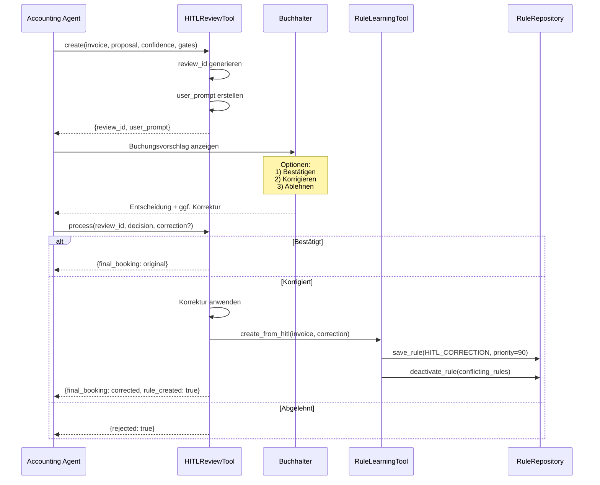

**Ablauf im Detail:**

**1. Review-Erstellung (create)**

Der Agent ruft `hitl_review` mit Action "create" auf:

```python
result = hitl_review.execute(
    action="create",
    invoice_data=invoice,
    booking_proposal=proposal,
    confidence=0.87,
    hard_gates=[{"gate_type": "new_vendor", "triggered": True}],
    review_reasons=["Confidence below 95%", "New vendor detected"]
)
```

Das Tool generiert einen strukturierten Prompt für den Benutzer:

```markdown
## Buchungsvorschlag zur Prüfung
**Review-ID:** a1b2c3d4

### Rechnungsdaten
- **Lieferant:** TechSupply GmbH
- **Rechnungsnummer:** RE-2026-0042
- **Bruttobetrag:** 595,00 EUR
- **Positionen:** 2

### Vorgeschlagene Buchung
- **Sollkonto:** 4930 (Bürobedarf)
- **Habenkonto:** 1600 (Verbindlichkeiten)
- **Vorsteuerkonto:** 1576 (19%)
- **Konfidenz:** 87%

### Prüfungsgründe
- Konfidenz unter 95% (87%)
- Neuer Lieferant (erstmalige Rechnung)

### Ihre Optionen
1. **Bestätigen** - Vorschlag übernehmen
2. **Korrigieren** - Anderes Konto angeben (z.B. "4985 GWG")
3. **Ablehnen** - Buchung abbrechen
```

**2. Benutzerentscheidung**

Der Benutzer antwortet über das CLI oder API:
- "1" oder "bestätigen" → Confirm
- "4985" oder "korrigieren 4985" → Correct mit neuem Konto
- "3" oder "ablehnen" → Reject

**3. Review-Verarbeitung (process)**

```python
result = hitl_review.execute(
    action="process",
    review_id="a1b2c3d4",
    user_decision="correct",
    correction={"target_account": "4985", "target_account_name": "GWG"}
)
```

Bei Korrektur:
1. `final_booking` wird mit neuem Konto aktualisiert
2. `rule_learning.create_from_hitl()` wird aufgerufen
3. Neue Regel mit Priority 90 wird erstellt
4. Konfliktende Regeln werden deaktiviert

---

## 5. Tools im Detail

### 5.1 Tool-Architektur und Zusammenspiel

Die Tools bilden die Schnittstelle zwischen dem Agent und den Domain-Funktionen. Jedes Tool ist eine eigenständige Klasse, die ein definiertes Interface implementiert und vom AgentExecutor aufgerufen wird.

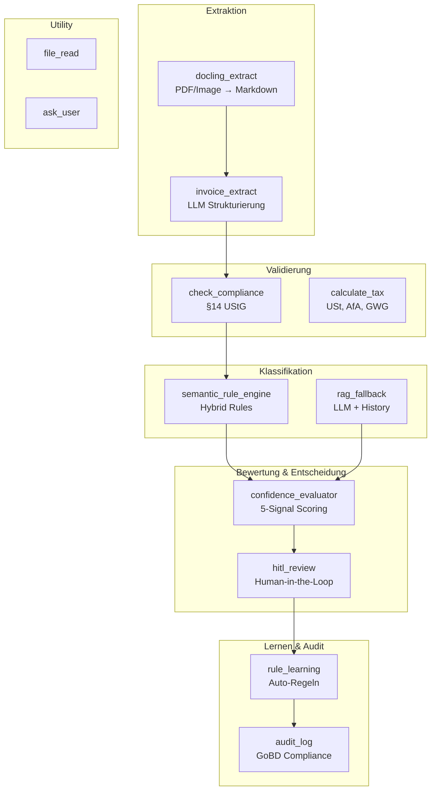

**Tool-Kategorien und ihre Verantwortlichkeiten:**

| Kategorie | Tools | Verantwortung |
|-----------|-------|---------------|
| **Extraktion** | docling_extract, invoice_extract | Konvertieren von Dokumenten in strukturierte Daten |
| **Validierung** | check_compliance, calculate_tax | Prüfen auf gesetzliche Anforderungen und Berechnungen |
| **Klassifikation** | semantic_rule_engine, rag_fallback | Zuordnung zu Sachkonten |
| **Bewertung** | confidence_evaluator, hitl_review | Qualitätssicherung und Benutzerinteraktion |
| **Lernen & Audit** | rule_learning, audit_log | Kontinuierliche Verbesserung und Compliance |
| **Utility** | file_read, ask_user | Hilfsfunktionen |

### 5.2 Semantic Rule Engine Tool - Technische Details

Das `semantic_rule_engine` Tool ist die zentrale Klassifikationskomponente. Es implementiert den im Abschnitt 4.2 beschriebenen Algorithmus.

**Zweck:** Hybride Regel-Matching-Engine, die deterministische Regeln mit semantischer Analyse kombiniert.

**Konfigurationsparameter:**

| Parameter | Typ | Default | Beschreibung |
|-----------|-----|---------|--------------|
| `rules_path` | str | - | Pfad zur YAML-Regeldatei |
| `learned_rules_path` | str | - | Pfad zu gelernten Regeln |
| `similarity_threshold` | float | 0.8 | Mindest-Ähnlichkeit für Semantic Match |
| `ambiguity_threshold` | float | 0.05 | Max. Differenz für Ambiguität |

**Beispiel-Input:**
```python
{
    "invoice_data": {
        "supplier_name": "Amazon Web Services EMEA SARL",
        "line_items": [
            {
                "description": "AWS Cloud Services - EC2 Compute",
                "net_amount": 500.00,
                "vat_rate": 19,
                "vat_amount": 95.00
            }
        ]
    }
}
```

**Beispiel-Output:**
```python
{
    "success": True,
    "rule_matches": [
        {
            "line_item_index": 0,
            "rule_id": "VR-AWS",
            "rule_type": "vendor_only",
            "match_type": "exact",
            "similarity_score": 1.0,
            "matched_pattern": "amazon web services"
        }
    ],
    "booking_proposals": [
        {
            "type": "debit",
            "debit_account": "6805",
            "debit_account_name": "EDV-Kosten (Cloud)",
            "amount": 500.00,
            "vat_account": "1576",
            "vat_amount": 95.00,
            "description": "AWS Cloud Services - EC2 Compute",
            "legal_basis": "§4 Abs. 4 EStG",
            "similarity_score": 1.0,
            "confidence": 0.95
        }
    ],
    "unmatched_items": [],
    "ambiguous_items": [],
    "rules_applied": 1
}
```

**Matching-Prioritäten erklärt:**

| Priorität | Regeltyp | Quelle | Wann verwendet |
|-----------|----------|--------|----------------|
| **100** | Vendor-Only | Manuell | Lieferanten mit eindeutigem Leistungsspektrum |
| **90** | Vendor+Item | HITL | Vom Benutzer korrigierte Zuordnungen |
| **75** | Vendor+Item | Auto | Automatisch aus High-Confidence Bookings |
| **50** | Vendor+Item | Manuell | Allgemeine Kategorisierungsregeln |
| **10** | Legacy | Manuell | Keyword-basierte Fallback-Kategorien |

### 5.3 Confidence Evaluator Tool

Das `confidence_evaluator` Tool berechnet eine gewichtete Konfidenz basierend auf fünf Signalen und prüft Hard Gates.

**Signalgewichte visualisiert:**

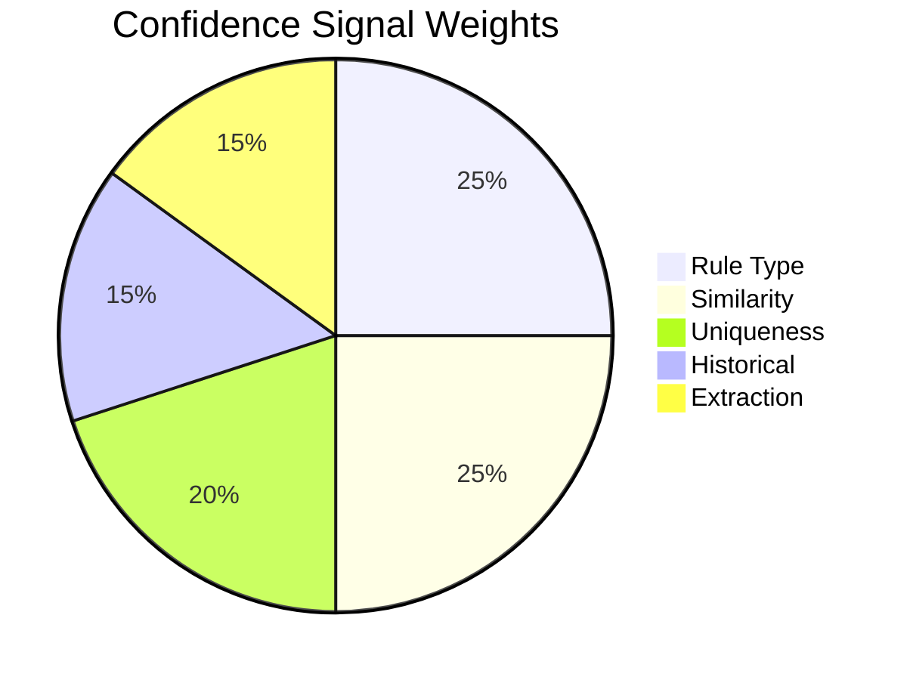

**Detaillierte Signalbeschreibung:**

| Signal | Gewicht | Berechnung | Wertebereich |
|--------|---------|------------|--------------|
| **Rule Type** | 25% | Basiert auf Regeltyp: Vendor-Only=1.0, Vendor+Item=0.8, RAG=0.5, Kein Match=0.0 | 0.0 - 1.0 |
| **Similarity** | 25% | Cosine Similarity bei Semantic Match, 1.0 bei Exact Match | 0.0 - 1.0 |
| **Uniqueness** | 20% | 1.0 wenn eindeutig, 0.7 wenn ambiguous (2+ ähnliche Matches) | 0.7 - 1.0 |
| **Historical** | 15% | Erfolgsrate der Regel (wie oft wurde sie nicht korrigiert) | 0.0 - 1.0 |
| **Extraction** | 15% | Qualität der OCR/LLM-Extraktion (von invoice_extract) | 0.0 - 1.0 |

**Formel:**
```
overall_confidence =
    0.25 * rule_type_score +
    0.25 * similarity_score +
    0.20 * uniqueness_score +
    0.15 * historical_score +
    0.15 * extraction_score
```

**Hard Gates - Detaillierte Erklärung:**

Hard Gates sind Bedingungen, die unabhängig von der Konfidenz eine menschliche Prüfung erzwingen:

| Gate | Trigger-Bedingung | Begründung | Konfigurierbar |
|------|-------------------|------------|----------------|
| **new_vendor** | `booking_history.is_new_vendor(supplier)` ist True | Erste Rechnung von Lieferant birgt Risiko falscher Kontierung | Ja (an/aus) |
| **high_amount** | `invoice.total_gross > threshold` | Hohe Beträge haben größere Auswirkungen bei Fehlern | Ja (Schwellwert) |
| **critical_account** | `target_account in critical_accounts` | Bestimmte Konten erfordern immer menschliche Prüfung | Ja (Kontenliste) |

**Beispiel-Konfiguration:**
```yaml
workflow:
  hard_gates:
    new_vendor: true
    high_amount_threshold: 5000.0
    critical_accounts: ["1800", "2100"]  # Bank, Eigenkapital
```

### 5.4 RAG Fallback Tool

Das `rag_fallback` Tool wird aktiviert, wenn keine regelbasierte Zuordnung möglich ist. Es nutzt Retrieval-Augmented Generation:

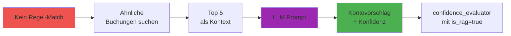

**Ablauf im Detail:**

**1. Ähnliche Buchungen Suchen**
```python
similar = await booking_history.search_similar(
    query=f"{invoice.supplier_name} {item.description}",
    vendor_name=invoice.supplier_name,  # Optional Filter
    limit=5
)
```

Die Suche nutzt Embedding-Similarity auf dem `search_text` Feld historischer Buchungen.

**2. Kontext Aufbauen**
```python
context = "Ähnliche historische Buchungen:\n"
for booking in similar:
    context += f"- {booking.supplier}: {booking.description} → Konto {booking.account}\n"
```

**3. LLM Prompt**
```
System: Du bist ein Buchhaltungs-Experte für deutsches Steuerrecht (SKR03).
        Schlage ein passendes Sachkonto vor. Sei ehrlich bei der Konfidenz.

User: Rechnung von "TechSupply GmbH" mit Position "Spezialsoftware für CAD"
      Betrag: 1.200 EUR netto, 19% USt

      Ähnliche historische Buchungen:
      - SoftwareCorp: CAD-Software → Konto 4964
      - TechPro: Fachsoftware → Konto 4964
      - OfficePlus: Bürosoftware → Konto 4964

      Antworte im JSON-Format.
```

**4. LLM Response Parsing**
```json
{
    "suggested_account": "4964",
    "account_name": "Softwarelizenzen",
    "confidence": 0.75,
    "reasoning": "Basierend auf drei ähnlichen Buchungen für Softwareprodukte",
    "legal_basis": "§4 Abs. 4 EStG",
    "alternative_accounts": [
        {"account": "4985", "name": "GWG", "reason": "Falls Anschaffungskosten < 800€"}
    ]
}
```

**Wichtig:** RAG-Vorschläge erhalten im Confidence Evaluator den niedrigeren `rule_type_score` von 0.5, was die Gesamtkonfidenz reduziert und oft HITL auslöst.

### 5.5 Rule Learning Tool

Das `rule_learning` Tool generiert automatisch neue Kontierungsregeln aus zwei Quellen:

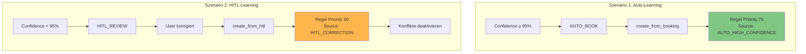

**Szenario 1: Lernen aus High-Confidence Bookings**

Wenn eine Buchung mit Confidence ≥ 95% automatisch durchgeführt wird, ist dies ein starkes Signal für die Korrektheit der Zuordnung. Das System lernt daraus:

```python
rule = AccountingRule(
    rule_id=f"AUTO-{timestamp}",
    rule_type=RuleType.VENDOR_ONLY if single_account_for_vendor else RuleType.VENDOR_ITEM,
    vendor_pattern=escape_regex(invoice.supplier_name),
    item_patterns=[item.description for item in invoice.line_items],
    target_account=booking.debit_account,
    priority=75,  # Zwischen manuell (100) und legacy (10)
    source=RuleSource.AUTO_HIGH_CONFIDENCE,
    similarity_threshold=0.85,
    version=1
)
```

**Szenario 2: Lernen aus HITL-Korrekturen**

Wenn ein Benutzer eine Korrektur vornimmt, ist dies wertvolles Feedback:

```python
rule = AccountingRule(
    rule_id=f"HITL-{timestamp}",
    rule_type=RuleType.VENDOR_ITEM,  # Meist spezifischer
    vendor_pattern=escape_regex(invoice.supplier_name),
    item_patterns=[corrected_item.description],
    target_account=correction.target_account,
    priority=90,  # Höher als Auto-Regeln
    source=RuleSource.HITL_CORRECTION,
    similarity_threshold=0.8
)

# Konfliktauflösung
for existing_rule in find_conflicting_rules(rule):
    rule_repository.deactivate_rule(existing_rule.rule_id)
```

**Konfliktauflösung erklärt:**

Ein Konflikt besteht, wenn eine neue Regel und eine existierende Regel:
1. Den gleichen `vendor_pattern` haben UND
2. Überlappende `item_patterns` haben UND
3. Unterschiedliche `target_accounts` haben

Bei HITL-Korrekturen wird angenommen, dass die neue Zuordnung korrekt ist. Die alte Regel wird deaktiviert (nicht gelöscht, für Audit-Trail).

### 5.6 Compliance Checker Tool

Das `check_compliance` Tool validiert Rechnungen gegen die gesetzlichen Anforderungen des §14 UStG.

**Pflichtfelder nach §14 Abs. 4 UStG:**

| Nr | Feld | Vollständige Rechnung | Kleinbetrag* | Prüflogik |
|----|------|----------------------|--------------|-----------|
| 1 | Name Leistender | Pflicht | Pflicht | `supplier_name` nicht leer |
| 2 | Anschrift Leistender | Pflicht | Pflicht | `supplier_address` nicht leer |
| 3 | Steuernr. oder USt-IdNr. | Pflicht | Nicht erforderlich | `vat_id` oder `tax_number` vorhanden |
| 4 | Name Empfänger | Pflicht | Nicht erforderlich | `recipient_name` nicht leer |
| 5 | Rechnungsnummer | Pflicht | Pflicht | `invoice_number` nicht leer |
| 6 | Rechnungsdatum | Pflicht | Pflicht | `invoice_date` gültiges Datum |
| 7 | Liefer-/Leistungsdatum | Pflicht (Warnung) | Nicht erforderlich | `delivery_date` vorhanden |
| 8 | Menge und Art | Pflicht | Pflicht | Jeder `LineItem` hat `description` |
| 9 | Nettobetrag | Pflicht | Nicht erforderlich | `total_net` > 0 |
| 10 | Steuersatz | Pflicht | Pflicht | Jeder `LineItem` hat `vat_rate` |
| 11 | Steuerbetrag | Pflicht | Nicht erforderlich | `total_vat` berechnet und plausibel |
| 12 | Bruttobetrag | Pflicht | Pflicht | `total_gross` = `total_net` + `total_vat` |

*Kleinbetragsrechnung gem. §33 UStDV (Bruttobetrag < 250 €)

**Validierungslogik:**

```python
def check_compliance(invoice: Invoice) -> ComplianceResult:
    is_small_invoice = invoice.total_gross < Decimal("250.00")

    errors = []
    warnings = []

    # Pflichtfelder prüfen
    if not invoice.supplier_name:
        errors.append(ComplianceError(
            field="supplier_name",
            message="Vollständiger Name des Leistenden fehlt",
            legal_reference="§14 Abs. 4 Nr. 1 UStG"
        ))

    # USt-Konsistenzprüfung
    calculated_vat = sum(item.vat_amount for item in invoice.line_items)
    if abs(calculated_vat - invoice.total_vat) > Decimal("0.02"):
        warnings.append(ComplianceWarning(
            field="total_vat",
            message=f"USt-Summe weicht ab: berechnet {calculated_vat}, angegeben {invoice.total_vat}",
            legal_reference="§14 Abs. 4 Nr. 8 UStG"
        ))

    return ComplianceResult(
        is_compliant=len(errors) == 0,
        errors=errors,
        warnings=warnings,
        is_small_invoice=is_small_invoice,
        legal_basis="§33 UStDV" if is_small_invoice else "§14 Abs. 4 UStG"
    )
```

---

## 6. Infrastruktur-Komponenten

### 6.1 Azure Embedding Service - Architektur und Caching

Der `AzureEmbeddingService` ist verantwortlich für die Generierung von Vektor-Embeddings, die für semantisches Matching verwendet werden.

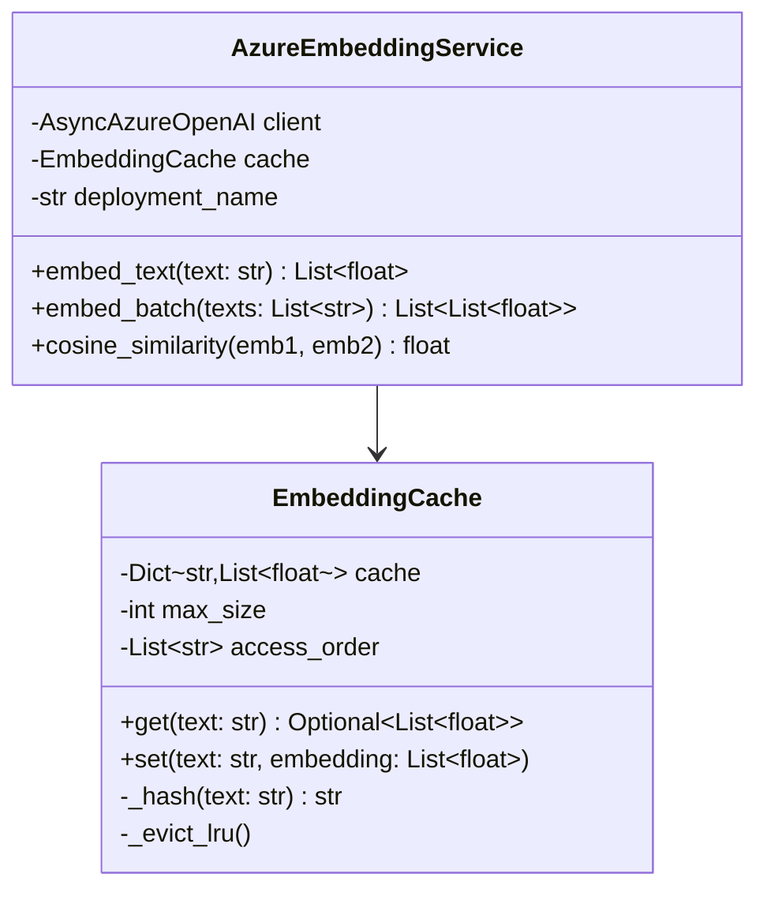

**Komponenten-Beschreibung:**

**AzureEmbeddingService**

Diese Klasse kapselt die Kommunikation mit der Azure OpenAI API:

- **Async Client**: Nutzt `AsyncAzureOpenAI` für non-blocking I/O
- **Batching**: `embed_batch()` sendet bis zu 16 Texte pro API-Call (Azure-Limit)
- **Normalisierung**: Texte werden vor dem Embedding normalisiert (Kleinbuchstaben, Whitespace)

**EmbeddingCache**

Ein LRU-Cache reduziert API-Aufrufe und Latenz:

- **SHA-256 Hashing**: Texte werden gehasht als Cache-Key
- **Max Size**: Konfigurierbar (Default: 1000 Einträge)
- **LRU Eviction**: Älteste Einträge werden entfernt bei Überlauf
- **Persistenz**: In-Memory (nicht persistiert über Neustarts)

**Konfiguration:**

```bash
# Environment Variables
AZURE_OPENAI_API_KEY=<key>
AZURE_OPENAI_ENDPOINT=https://<resource>.openai.azure.com/
AZURE_OPENAI_EMBEDDING_DEPLOYMENT=text-embedding-ada-002
AZURE_OPENAI_API_VERSION=2024-02-01
```

**Cosine Similarity Berechnung:**

```python
def cosine_similarity(self, emb1: List[float], emb2: List[float]) -> float:
    """Berechnet Cosine Similarity zwischen zwei Vektoren."""
    dot_product = sum(a * b for a, b in zip(emb1, emb2))
    norm1 = math.sqrt(sum(a * a for a in emb1))
    norm2 = math.sqrt(sum(b * b for b in emb2))
    return dot_product / (norm1 * norm2)
```

### 6.2 Rule Repository - Versionierung und Audit

Das `RuleRepository` verwaltet Kontierungsregeln mit vollständiger Versionierung für Audit-Zwecke.

**Speicherstruktur:**

```
.taskforce_accounting/
├── kontierung_rules.yaml      # Manuelle Regeln (vom Administrator)
├── learned_rules.yaml         # Automatisch gelernte Regeln
└── rules_history.jsonl        # Append-Only Änderungshistorie
```

**kontierung_rules.yaml - Struktur:**

```yaml
vendor_rules:
  - rule_id: VR-AWS
    vendor_pattern: "amazon web services"
    target_account: "6805"
    target_account_name: "EDV-Kosten (Cloud)"
    priority: 100
    legal_basis: "§4 Abs. 4 EStG"
    created_at: "2026-01-01T00:00:00Z"
    is_active: true

semantic_rules:
  - rule_id: SR-OFFICE
    vendor_pattern: ".*"  # Beliebiger Lieferant
    item_patterns:
      - "Bürobedarf"
      - "Schreibwaren"
      - "Papier"
      - "Druckerpatronen"
      - "Toner"
    target_account: "4930"
    target_account_name: "Bürobedarf"
    similarity_threshold: 0.8
    priority: 50
    legal_basis: "§4 Abs. 4 EStG"
```

**learned_rules.yaml - Automatisch generiert:**

```yaml
learned_rules:
  - rule_id: AUTO-20260127103045
    rule_type: vendor_item
    vendor_pattern: "techsupply gmbh"
    item_patterns:
      - "Laptop"
      - "MacBook Pro"
    target_account: "4985"
    target_account_name: "GWG"
    priority: 75
    source: auto_high_confidence
    similarity_threshold: 0.85
    version: 1
    created_at: "2026-01-27T10:30:45Z"
    is_active: true
```

**rules_history.jsonl - Audit-Trail:**

Jede Änderung wird als JSON-Zeile protokolliert:

```json
{"timestamp":"2026-01-27T10:30:45Z","action":"CREATE","rule_id":"AUTO-20260127103045","rule_data":{...},"actor":"system"}
{"timestamp":"2026-01-27T11:45:23Z","action":"UPDATE","rule_id":"AUTO-20260127103045","changes":{"priority":{"old":75,"new":90}},"actor":"user"}
{"timestamp":"2026-01-27T12:00:00Z","action":"DEACTIVATE","rule_id":"SR-OLD-001","reason":"Konflikt mit HITL-20260127114523","actor":"system"}
```

### 6.3 Booking History - GoBD-konforme Speicherung

Die `BookingHistory` speichert alle Buchungen unveränderlich (Append-Only) gemäß GoBD-Anforderungen.

**JSONL-Record-Struktur:**

```json
{
    "booking_id": "550e8400-e29b-41d4-a716-446655440000",
    "timestamp": "2026-01-27T10:30:00.123Z",
    "invoice_data": {
        "invoice_id": "INV-2026-0042",
        "supplier_name": "Office Supplies GmbH",
        "supplier_address": "Musterstraße 1, 10115 Berlin",
        "invoice_number": "RE-2026-0042",
        "invoice_date": "2026-01-25",
        "total_gross": 595.00,
        "total_net": 500.00,
        "total_vat": 95.00,
        "line_items": [
            {
                "description": "Büromaterial Sortiment",
                "quantity": 1,
                "net_amount": 500.00,
                "vat_rate": 19,
                "vat_amount": 95.00
            }
        ]
    },
    "booking_proposal": {
        "debit_account": "4930",
        "debit_account_name": "Bürobedarf",
        "credit_account": "1600",
        "amount": 500.00,
        "vat_account": "1576",
        "vat_amount": 95.00,
        "description": "Büromaterial Sortiment - Office Supplies GmbH",
        "legal_basis": "§4 Abs. 4 EStG"
    },
    "confidence": 0.96,
    "rule_id": "VR-OFFICE",
    "rule_type": "vendor_only",
    "is_hitl_correction": false,
    "decision": "auto_book",
    "search_text": "Office Supplies GmbH Büromaterial Sortiment 4930",
    "embedding": [0.123, -0.456, 0.789, ...]
}
```

**Semantic Search Implementierung:**

```python
async def search_similar(
    self,
    query: str,
    vendor_name: Optional[str] = None,
    limit: int = 5
) -> List[Dict]:
    """Sucht ähnliche historische Buchungen mittels Embedding-Similarity."""

    query_embedding = await self.embedding_service.embed_text(query)

    results = []
    for record in self._index:
        # Optional: Vendor-Filter
        if vendor_name and vendor_name.lower() not in record["supplier"].lower():
            continue

        similarity = self.embedding_service.cosine_similarity(
            query_embedding,
            record["embedding"]
        )
        results.append((similarity, record))

    # Top N nach Similarity
    results.sort(key=lambda x: x[0], reverse=True)
    return [r[1] for r in results[:limit]]
```

---

## 7. Konfiguration

### 7.1 Agent-Profil - Vollständige Referenz

Das Agent-Profil `accounting_agent.yaml` definiert das gesamte Verhalten des Agents. Hier eine kommentierte Vollversion:

```yaml
# Profil-Identifikation
profile: accounting_agent
version: "1.0"
description: "Spezialisierter Agent für Rechnungsverarbeitung nach deutschem Steuerrecht"

# System-Prompt (gekürzt - vollständig in der Datei)
system_prompt: |
  Du bist ein Buchhaltungs-Assistent für deutsches Steuerrecht.

  ## Intent-Erkennung
  - INVOICE_PROCESSING: Wenn der User eine Rechnung verarbeiten möchte
  - INVOICE_QUESTION: Wenn der User eine Frage zur Buchhaltung hat

  ## Workflow bei INVOICE_PROCESSING
  1. Kontext-Check: Inland/EU/Drittland
  2. Extraktion: docling_extract → invoice_extract
  3. Compliance: check_compliance
  4. Kontierung: semantic_rule_engine
  5. Bewertung: confidence_evaluator
  6. Bei Bedarf: hitl_review
  7. Lernen: rule_learning
  8. Audit: audit_log
  ...

# Agenten-Verhalten
agent:
  max_steps: 50                    # Max. Tool-Aufrufe pro Session
  planning_strategy: plan_and_execute  # ReAct mit Planung
  max_step_iterations: 4           # Max. Wiederholungen bei Fehlern
  max_plan_steps: 12               # Max. Schritte im Plan

# Persistenz-Konfiguration
persistence:
  type: file                       # file oder database
  work_dir: .taskforce_accounting  # Arbeitsverzeichnis

# Workflow-Konfiguration
workflow:
  # Schwellwerte
  auto_book_threshold: 0.95        # Min. Confidence für Auto-Booking

  # Hard Gates
  hard_gates:
    new_vendor: true               # HITL bei neuem Lieferanten
    high_amount_threshold: 5000.0  # HITL bei Betrag > X EUR
    critical_accounts:             # HITL bei diesen Konten
      - "1800"                     # Bank
      - "2100"                     # Eigenkapital

  # Regellernen
  auto_rule_learning: true                 # Automatisches Lernen aktiviert
  min_confidence_for_rule_learning: 0.95   # Min. Confidence für Auto-Regeln
  learn_from_hitl: true                    # Aus Korrekturen lernen

# Embedding-Konfiguration
embeddings:
  provider: azure                          # azure oder openai
  deployment_name: text-embedding-ada-002
  api_version: "2024-02-01"
  cache_enabled: true
  cache_max_size: 1000

# Tool-Konfiguration
tools:
  # Extraktion
  - name: docling_extract
    enabled: true

  - name: invoice_extract
    enabled: true
    config:
      temperature: 0.1             # Niedrig für Konsistenz

  # Validierung
  - name: check_compliance
    config:
      rules_path: "configs/accounting/rules/compliance_rules.yaml"
      strict_mode: false           # Warnungen statt Fehler bei optionalen Feldern

  # Klassifikation
  - name: semantic_rule_engine
    config:
      rules_path: "configs/accounting/rules/kontierung_rules.yaml"
      learned_rules_path: ".taskforce_accounting/learned_rules.yaml"
      default_similarity_threshold: 0.8

  - name: rag_fallback
    enabled: true
    config:
      max_similar_bookings: 5
      llm_temperature: 0.3

  # Bewertung
  - name: confidence_evaluator
    enabled: true

  - name: hitl_review
    enabled: true

  # Lernen & Audit
  - name: rule_learning
    enabled: true

  - name: audit_log
    enabled: true
    config:
      retention_years: 10

  # Utility
  - name: calculate_tax
    enabled: true

  - name: file_read
    enabled: true

  - name: ask_user
    enabled: true

# Long-Term Memory (MCP)
mcp_servers:
  - type: stdio
    command: npx
    args: ["-y", "@modelcontextprotocol/server-memory"]
    env:
      MEMORY_FILE_PATH: ".taskforce_accounting/.memory/knowledge_graph.jsonl"
    description: "Langzeit-Gedächtnis für Lieferanten und Muster"
```

### 7.2 Kontierung-Regeln - Vollständige Struktur

Die Datei `kontierung_rules.yaml` enthält alle Kontierungsregeln:

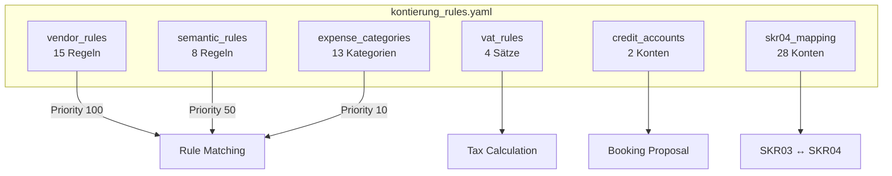

**Sektions-Beschreibungen:**

| Sektion | Anzahl | Beschreibung |
|---------|--------|--------------|
| **vendor_rules** | 15 | Direkte Lieferant→Konto Zuordnungen (AWS→6805, Microsoft→4964, etc.) |
| **semantic_rules** | 8 | Kategorien mit Item-Patterns (Bürobedarf, IT-Equipment, Software, etc.) |
| **expense_categories** | 13 | Legacy Keyword-basierte Kategorien mit bedingter Logik |
| **vat_rules** | 4 | Umsatzsteuer-Sätze (19%, 7%, Reverse Charge, 0%) |
| **credit_accounts** | 2 | Standard-Habenkonten (Verbindlichkeiten, Bank) |
| **skr04_mapping** | 28 | Umrechnungstabelle SKR03 ↔ SKR04 |

---

## 8. Confidence-Bewertung & Hard Gates

### 8.1 Signalberechnung - Mathematisches Modell

Die Konfidenz-Berechnung basiert auf einem gewichteten Durchschnitt von fünf Signalen:

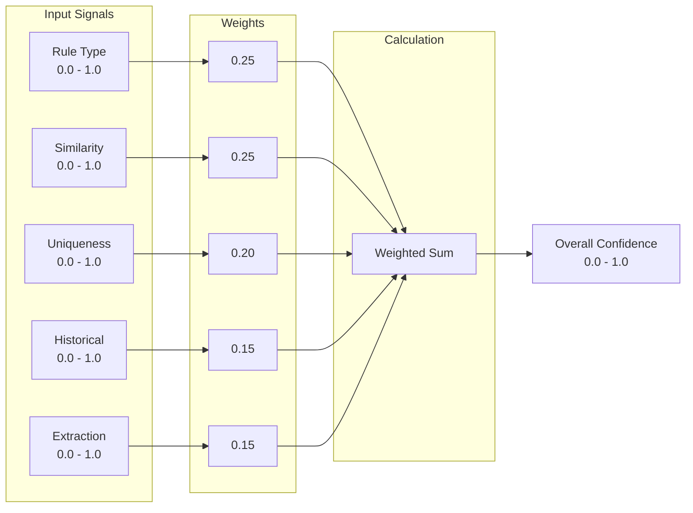

**Signalberechnungs-Details:**

**1. Rule Type Score (Gewicht: 25%)**

| Regeltyp | Score | Begründung |
|----------|-------|------------|
| VENDOR_ONLY | 1.0 | Höchste Zuverlässigkeit - direkte Zuordnung |
| VENDOR_ITEM (Exact) | 0.9 | Hohe Zuverlässigkeit - exakter Keyword-Match |
| VENDOR_ITEM (Semantic) | 0.8 | Gute Zuverlässigkeit - semantischer Match |
| RAG Fallback | 0.5 | Moderate Zuverlässigkeit - LLM-Schätzung |
| Kein Match | 0.0 | Keine Grundlage für Zuordnung |

**2. Similarity Score (Gewicht: 25%)**

Bei semantischem Matching: Cosine Similarity (0.0-1.0)
Bei exaktem Match: 1.0
Bei Vendor-Only: 1.0

**3. Uniqueness Score (Gewicht: 20%)**

| Situation | Score | Begründung |
|-----------|-------|------------|
| Eindeutiger Match | 1.0 | Nur eine Regel passt klar |
| Ambiguos (Differenz < 0.05) | 0.7 | Zwei ähnlich gute Matches |
| Stark ambiguos (3+ Matches) | 0.5 | Zu viele Kandidaten |

**4. Historical Score (Gewicht: 15%)**

```python
historical_score = successful_uses / total_uses
# successful_uses = Anzahl Buchungen ohne HITL-Korrektur
# total_uses = Gesamtanzahl Anwendungen der Regel
```

Neue Regeln starten mit 0.5 (neutral).

**5. Extraction Score (Gewicht: 15%)**

Wird von `invoice_extract` geliefert basierend auf:
- OCR-Qualität
- Strukturerkennung
- Konsistenzprüfungen

### 8.2 Entscheidungsmatrix - Visualisiert

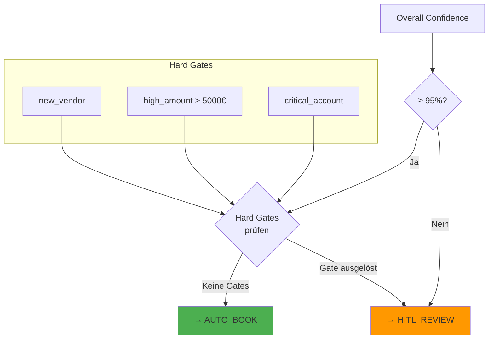

**Entscheidungslogik in Pseudocode:**

```python
def decide(confidence: float, hard_gates: List[HardGate]) -> str:
    # Schritt 1: Confidence-Schwelle
    if confidence < 0.95:
        return "hitl_review"  # Zu unsicher

    # Schritt 2: Hard Gates
    triggered_gates = [g for g in hard_gates if g.triggered]
    if triggered_gates:
        return "hitl_review"  # Gate ausgelöst

    # Schritt 3: Alles ok
    return "auto_book"
```

### 8.3 Beispielberechnung - Vollständig durchgerechnet

**Szenario:** Bekannter Lieferant "Amazon Web Services", Position "EC2 Compute Services"

**Eingangsdaten:**
- Vendor-Only Regel greift (VR-AWS)
- Lieferant hat 47 vorherige Buchungen, davon 45 ohne Korrektur
- Extraction Score: 0.95 (gute PDF-Qualität)

**Berechnung:**

| Signal | Rohwert | Berechnung | Gewicht | Beitrag |
|--------|---------|------------|---------|---------|
| Rule Type | 1.0 | VENDOR_ONLY = 1.0 | 0.25 | 0.250 |
| Similarity | 1.0 | Exakt-Match = 1.0 | 0.25 | 0.250 |
| Uniqueness | 1.0 | Eindeutig = 1.0 | 0.20 | 0.200 |
| Historical | 0.957 | 45/47 = 0.957 | 0.15 | 0.144 |
| Extraction | 0.95 | Von Tool geliefert | 0.15 | 0.143 |
| **Gesamt** | | | | **0.987** |

**Hard Gate Check:**
- new_vendor: False (47 vorherige Buchungen)
- high_amount: False (angenommen < 5000€)
- critical_account: False (6805 nicht in Liste)

**Ergebnis:** `recommendation: "auto_book"` (98.7% ≥ 95%, keine Hard Gates)

---

## 9. Regel-Lernmechanismus

### 9.1 Lern-Pipeline - Vollständiger Ablauf

Das Regellernen ist ein geschlossener Kreislauf, der das System kontinuierlich verbessert:

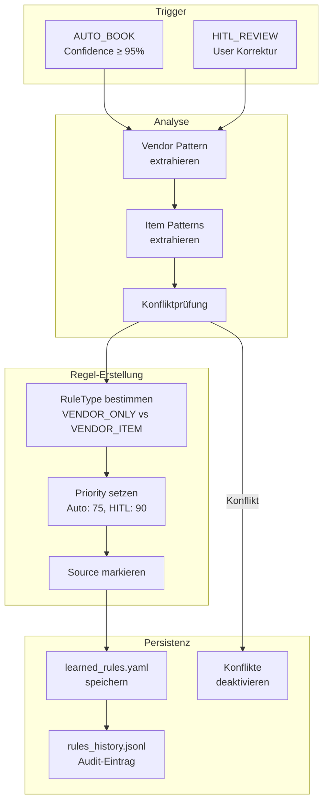

**Detaillierter Ablauf:**

**1. Trigger-Erkennung**

Das Lernen wird in zwei Szenarien ausgelöst:

*Szenario A: High-Confidence Auto-Booking*
```python
if booking_result.decision == "auto_book" and confidence >= 0.95:
    rule_learning.create_from_booking(invoice, booking_proposal)
```

*Szenario B: HITL-Korrektur*
```python
if hitl_result.user_decision == "correct":
    rule_learning.create_from_hitl(invoice, hitl_result.correction)
```

**2. Vendor Pattern Extraktion**

```python
def extract_vendor_pattern(supplier_name: str) -> str:
    """Extrahiert ein sicheres Regex-Pattern aus dem Lieferantennamen."""
    # Normalisierung
    normalized = supplier_name.lower().strip()

    # Sonderzeichen escapen für Regex
    escaped = re.escape(normalized)

    # Optional: Varianten berücksichtigen
    # "Amazon Web Services EMEA SARL" → "amazon web services"

    return escaped
```

**3. Item Patterns Extraktion**

```python
def extract_item_patterns(line_items: List[LineItem]) -> List[str]:
    """Extrahiert relevante Schlüsselwörter aus Positionen."""
    patterns = []
    for item in line_items:
        # Beschreibung bereinigen
        cleaned = remove_stopwords(item.description)

        # Wichtige Begriffe extrahieren
        keywords = extract_keywords(cleaned)
        patterns.extend(keywords)

    return list(set(patterns))  # Deduplizieren
```

**4. Regeltyp-Bestimmung**

```python
def determine_rule_type(
    invoice: Invoice,
    booking_history: BookingHistory
) -> RuleType:
    """Bestimmt ob VENDOR_ONLY oder VENDOR_ITEM passend ist."""

    # Prüfe historische Buchungen für diesen Lieferanten
    history = booking_history.get_vendor_history(invoice.supplier_name)

    if len(history) < 3:
        return RuleType.VENDOR_ITEM  # Zu wenig Daten

    # Prüfe ob immer gleiches Konto
    accounts = set(b.debit_account for b in history)
    if len(accounts) == 1:
        return RuleType.VENDOR_ONLY  # Lieferant = immer gleiches Konto

    return RuleType.VENDOR_ITEM  # Unterschiedliche Konten
```

### 9.2 Regel-ID Generierung

```
Format: {SOURCE}-{TIMESTAMP}

Beispiele:
AUTO-20260127103045  → Auto-Learning am 27.01.2026 um 10:30:45
HITL-20260127114523  → HITL-Korrektur am 27.01.2026 um 11:45:23
VR-AWS              → Manuelle Vendor-Rule für AWS
SR-OFFICE           → Manuelle Semantic-Rule für Bürobedarf
```

### 9.3 Konfliktauflösung - Algorithmus

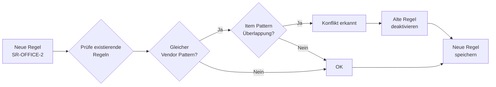

**Konflikt-Definition:**

Zwei Regeln konfligieren, wenn:
1. `new_rule.vendor_pattern` und `existing_rule.vendor_pattern` überlappen
2. Mindestens ein `item_pattern` in beiden vorkommt
3. `target_account` unterschiedlich ist

**Auflösungs-Strategie:**

Bei HITL-Korrekturen gilt: Der Benutzer hat Recht. Die alte Regel wird deaktiviert:

```python
def resolve_conflicts(new_rule: AccountingRule) -> List[str]:
    """Deaktiviert konfligierende Regeln."""
    conflicts = find_conflicting_rules(new_rule)

    for conflict in conflicts:
        rule_repository.deactivate_rule(
            conflict.rule_id,
            reason=f"Konflikt mit {new_rule.rule_id}"
        )

    return [c.rule_id for c in conflicts]
```

---

## 10. GoBD-Compliance

### 10.1 Anforderungen und Umsetzung

Die **Grundsätze zur ordnungsmäßigen Führung und Aufbewahrung von Büchern, Aufzeichnungen und Unterlagen in elektronischer Form sowie zum Datenzugriff (GoBD)** stellen spezifische Anforderungen an digitale Buchhaltungssysteme:

| GoBD-Anforderung | Beschreibung | Umsetzung im Accounting Agent |
|------------------|--------------|-------------------------------|
| **Nachvollziehbarkeit** | Jede Buchung muss nachvollziehbar sein | Vollständiger Audit-Trail mit Timestamps, Rule-IDs und Entscheidungsgründen |
| **Unveränderlichkeit** | Gebuchte Daten dürfen nicht verändert werden | Append-Only JSONL-Speicherung, keine UPDATE/DELETE Operationen |
| **Nachprüfbarkeit** | Prüfer muss alle Vorgänge verstehen können | Menschenlesbare JSON-Formate, Erklärungen zu jeder Buchung |
| **Ordnung** | Systematische Ablage | Strukturierte IDs, chronologische Sortierung |
| **Vollständigkeit** | Keine Buchung darf fehlen | Lückenlose Session-IDs, Integritätsprüfungen |
| **Richtigkeit** | Buchungen müssen korrekt sein | HITL bei Unsicherheit, Confidence-Bewertung |
| **Zeitgerechtheit** | Zeitnahe Erfassung | Timestamps bei Verarbeitung |
| **Aufbewahrung** | 10 Jahre Aufbewahrungspflicht | Keine automatische Löschung, archivierungsfreundliches Format |

### 10.2 Audit-Log Struktur im Detail

Jede Aktion wird im Audit-Log protokolliert:

```json
{
    "audit_id": "AUD-20260127-001",
    "timestamp": "2026-01-27T10:30:45.123Z",
    "action": "BOOKING_CREATED",
    "actor": "accounting_agent",
    "session_id": "sess-abc123",
    "details": {
        "invoice_id": "INV-2026-0042",
        "supplier": "Office Supplies GmbH",
        "amount": 595.00,
        "account": "4930",
        "confidence": 0.96,
        "rule_id": "VR-OFFICE",
        "decision": "auto_book"
    },
    "checksum": "sha256:abc123..."
}
```

**Feld-Beschreibungen:**

| Feld | Typ | Beschreibung |
|------|-----|--------------|
| `audit_id` | str | Eindeutige, fortlaufende ID (AUD-{DATUM}-{NR}) |
| `timestamp` | str | ISO 8601 UTC Zeitstempel mit Millisekunden |
| `action` | str | Aktionstyp (BOOKING_CREATED, RULE_CREATED, HITL_DECISION, etc.) |
| `actor` | str | Wer hat die Aktion ausgelöst (system, user, agent) |
| `session_id` | str | Zugehörige Agent-Session für Zusammenhang |
| `details` | object | Aktionsspezifische Details |
| `checksum` | str | SHA-256 Hash über den Eintrag für Integrität |

**Aktionstypen:**

| Action | Beschreibung |
|--------|--------------|
| `INVOICE_RECEIVED` | Rechnung wurde empfangen |
| `EXTRACTION_COMPLETED` | Extraktion abgeschlossen |
| `COMPLIANCE_CHECKED` | Compliance-Prüfung durchgeführt |
| `RULE_MATCHED` | Regel hat gematcht |
| `CONFIDENCE_EVALUATED` | Konfidenz berechnet |
| `HITL_REQUESTED` | HITL wurde angefordert |
| `HITL_DECISION` | Benutzer hat entschieden |
| `BOOKING_CREATED` | Buchung wurde erstellt |
| `RULE_CREATED` | Neue Regel gelernt |
| `RULE_DEACTIVATED` | Regel wurde deaktiviert |

### 10.3 Datenfluss-Integrität

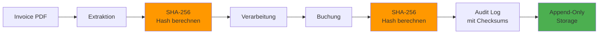

**Integritätssicherung:**

1. **Input-Hash**: Beim Empfang wird ein Hash des Original-PDFs erstellt
2. **Processing-Hash**: Nach jeder Verarbeitungsstufe wird ein Hash des Zwischenstands erstellt
3. **Output-Hash**: Der finale Buchungseintrag erhält einen Hash
4. **Chain-Hash**: Jeder Audit-Eintrag referenziert den Hash des vorherigen Eintrags (optional für höchste Sicherheit)

**Prüfung der Integrität:**

```python
def verify_audit_integrity(audit_log_path: str) -> bool:
    """Prüft die Integrität des Audit-Logs."""
    with open(audit_log_path) as f:
        for line in f:
            entry = json.loads(line)
            stored_checksum = entry.pop("checksum")
            computed_checksum = sha256(json.dumps(entry, sort_keys=True))
            if stored_checksum != computed_checksum:
                return False
    return True
```

---

## 11. Integration mit Taskforce

### 11.1 Framework-Anbindung

Der Accounting Agent ist als Example-Implementierung in das Taskforce-Framework integriert:

```mermaid
graph TB
    subgraph "Taskforce Framework"
        FACTORY[AgentFactory]
        EXECUTOR[AgentExecutor]
        PROFILES[ProfileLoader]
        LLM[LiteLLM Service]
    end

    subgraph "Accounting Agent"
        CONFIG[accounting_agent.yaml]
        TOOLS[Custom Tools]
        DOMAIN[Domain Layer]
        INFRA[Infrastructure]
    end

    CONFIG --> PROFILES
    PROFILES --> FACTORY
    FACTORY --> EXECUTOR
    FACTORY --> LLM
    FACTORY --> TOOLS
    TOOLS --> DOMAIN
    TOOLS --> INFRA
    EXECUTOR --> TOOLS
```

**Integrationspunkte:**

| Komponente | Taskforce-Schnittstelle | Accounting Agent Implementierung |
|------------|------------------------|----------------------------------|
| Konfiguration | ProfileLoader | `accounting_agent.yaml` wird als Profil geladen |
| Tools | ToolProtocol | Alle Tools implementieren das Taskforce ToolProtocol |
| LLM | LLMProviderProtocol | Nutzt LiteLLM Service für OpenAI/Azure |
| Persistenz | StateManagerProtocol | File-basierte Implementierung in `.taskforce_accounting/` |

### 11.2 ReAct-Loop Integration

Der Agent nutzt den ReAct (Reason + Act) Loop des Taskforce-Frameworks:

```mermaid
sequenceDiagram
    participant E as AgentExecutor
    participant A as Agent (ReAct)
    participant T as Tool

    E->>A: execute(mission)

    loop ReAct Loop
        A->>A: THOUGHT: Analyse
        A->>T: ACTION: semantic_rule_engine
        T-->>A: OBSERVATION: RuleMatch
        A->>A: THOUGHT: Confidence prüfen
        A->>T: ACTION: confidence_evaluator
        T-->>A: OBSERVATION: auto_book
        A->>A: THOUGHT: Abschließen
    end

    A-->>E: Result
```

**ReAct-Schritte erklärt:**

1. **THOUGHT**: Der Agent analysiert die aktuelle Situation und plant den nächsten Schritt
2. **ACTION**: Der Agent wählt ein Tool und übergibt Parameter
3. **OBSERVATION**: Das Tool liefert ein Ergebnis zurück
4. **Wiederholung**: Der Zyklus wiederholt sich bis das Ziel erreicht ist

**Beispiel-Trace:**

```
THOUGHT: Ich habe eine Rechnung von "Office Supplies GmbH" erhalten.
         Ich muss sie zuerst extrahieren.
ACTION: docling_extract(file_path="invoice.pdf")
OBSERVATION: {"markdown": "## Rechnung\nLieferant: Office Supplies GmbH..."}

THOUGHT: Die Extraktion war erfolgreich. Jetzt strukturiere ich die Daten.
ACTION: invoice_extract(markdown_text="...")
OBSERVATION: {"invoice": {"supplier_name": "Office Supplies GmbH", ...}}

THOUGHT: Ich habe strukturierte Daten. Jetzt prüfe ich die Compliance.
ACTION: check_compliance(invoice_data={...})
OBSERVATION: {"is_compliant": true, "warnings": []}

THOUGHT: Die Rechnung ist konform. Jetzt suche ich eine passende Kontierung.
ACTION: semantic_rule_engine(invoice_data={...})
OBSERVATION: {"rule_matches": [{"rule_id": "VR-OFFICE", ...}], "booking_proposals": [...]}

THOUGHT: Eine Vendor-Only Regel hat gematcht. Ich bewerte die Konfidenz.
ACTION: confidence_evaluator(booking_proposal={...}, ...)
OBSERVATION: {"overall_confidence": 0.97, "recommendation": "auto_book"}

THOUGHT: Die Konfidenz ist hoch genug für Auto-Booking. Ich schließe ab.
ACTION: audit_log(action="BOOKING_CREATED", details={...})
OBSERVATION: {"audit_id": "AUD-20260127-001"}

THOUGHT: Buchung erfolgreich. Mission abgeschlossen.
RESULT: Rechnung erfolgreich verarbeitet und auf Konto 4930 gebucht.
```

---

## 12. Deployment & Betrieb

### 12.1 Voraussetzungen

**Software-Anforderungen:**

| Software | Version | Zweck |
|----------|---------|-------|
| Python | 3.11+ | Runtime |
| uv | Latest | Package Manager (nicht pip!) |
| Node.js | 18+ | MCP Memory Server |
| npm | 9+ | MCP Server Installation |

**API-Zugänge:**

| Service | Erforderlich | Beschreibung |
|---------|--------------|--------------|
| Azure OpenAI | Ja* | LLM + Embeddings |
| OpenAI | Alternativ* | Fallback zu Azure |
| Docling | Optional | Kann lokal installiert werden |

*Mindestens einer erforderlich

### 12.2 Installation

```bash
# 1. Repository klonen
git clone <repository-url>
cd pytaskforce

# 2. Dependencies installieren (MUSS uv sein, nicht pip!)
uv sync

# 3. Virtuelle Umgebung aktivieren
source .venv/bin/activate  # Linux/Mac
# oder
.\.venv\Scripts\Activate.ps1  # Windows

# 4. Environment konfigurieren
cp .env.example .env
# Bearbeiten: AZURE_OPENAI_API_KEY, AZURE_OPENAI_ENDPOINT, etc.

# 5. Agent starten
taskforce run --profile accounting_agent "Verarbeite Rechnung invoice.pdf"
```

### 12.3 Monitoring und Logging

```mermaid
graph LR
    subgraph "Metriken"
        M1[Durchsatz<br/>Rechnungen/h]
        M2[Auto-Book Rate<br/>%]
        M3[HITL Rate<br/>%]
        M4[Regel-Trefferquote]
        M5[Durchschnittliche<br/>Confidence]
    end

    subgraph "Logs"
        L1[Application Logs]
        L2[Audit Logs]
        L3[Error Logs]
    end

    subgraph "Alerts"
        A1[HITL Rate > 20%]
        A2[Error Rate > 5%]
        A3[Confidence < 70%]
    end

    M1 --> L1
    M2 --> A1
    M3 --> A1
    L2 --> A2
    M5 --> A3
```

**Wichtige Metriken:**

| Metrik | Berechnung | Zielwert | Alert-Schwelle |
|--------|------------|----------|----------------|
| Auto-Book Rate | auto_books / total_bookings | > 80% | < 70% |
| HITL Rate | hitl_reviews / total_bookings | < 20% | > 30% |
| Avg Confidence | mean(all_confidences) | > 90% | < 75% |
| Rule Hit Rate | rule_matches / total_items | > 85% | < 70% |
| Error Rate | errors / total_requests | < 2% | > 5% |

### 12.4 Typische Konfigurationsanpassungen

| Szenario | Konfigurationsänderung | Auswirkung |
|----------|----------------------|------------|
| Höhere Automatisierung gewünscht | `auto_book_threshold: 0.90` | Mehr Auto-Bookings, weniger HITL |
| Konservativer Ansatz | `high_amount_threshold: 1000.0` | Mehr HITL bei größeren Beträgen |
| Neue Lieferanten automatisch | `hard_gates.new_vendor: false` | Kein HITL bei erstmaligem Lieferanten |
| Mehr Regeln lernen | `min_confidence_for_rule_learning: 0.90` | Mehr Auto-Regeln werden erstellt |
| Strengere Compliance | `strict_mode: true` | Fehler statt Warnungen bei optionalen Feldern |

---

## Anhang

### A. Kontenrahmen (SKR03 Auszug)

| Konto | Bezeichnung | Kategorie | Typische Verwendung |
|-------|-------------|-----------|---------------------|
| 1571 | Abziehbare Vorsteuer 7% | USt | Buchung der Vorsteuer (ermäßigt) |
| 1576 | Abziehbare Vorsteuer 19% | USt | Buchung der Vorsteuer (Regelsatz) |
| 1600 | Verbindlichkeiten | Passiv | Gegenkonto bei Rechnungseingang |
| 1800 | Bank | Aktiv | Zahlung |
| 4930 | Bürobedarf | Aufwand | Schreibwaren, Papier, Toner |
| 4940 | Zeitschriften, Bücher | Aufwand | Fachliteratur, Abonnements |
| 4920 | Telefon | Aufwand | Telekommunikation |
| 4950 | Rechts- und Beratungskosten | Aufwand | Anwälte, Steuerberater |
| 4985 | GWG bis 800€ | Aufwand | Geringwertige Wirtschaftsgüter |
| 6805 | EDV-Kosten | Aufwand | IT-Dienstleistungen, Cloud |
| 4964 | Software-Lizenzen | Aufwand | Softwarekauf |

### B. Rechtliche Grundlagen

| Gesetz/Verordnung | Relevante Paragraphen | Bedeutung für den Agent |
|-------------------|----------------------|-------------------------|
| **§14 UStG** | Abs. 4 Nr. 1-10 | Pflichtangaben auf Rechnungen |
| **§14a UStG** | Abs. 1-5 | Zusätzliche Pflichten (innergemeinschaftlich) |
| **§33 UStDV** | - | Kleinbetragsrechnungen < 250€ |
| **GoBD** | Rz. 1-180 | Digitale Buchhaltung, Aufbewahrung |
| **§4 Abs. 4 EStG** | - | Betriebsausgaben |
| **§13b UStG** | - | Reverse Charge Verfahren |

### C. Fehlerbehandlung und Troubleshooting

| Fehler | Ursache | Lösung |
|--------|---------|--------|
| `InvoiceParseError` | Docling konnte PDF nicht lesen | Dokumentqualität prüfen, OCR verbessern |
| `ComplianceValidationError` | Pflichtfelder fehlen | HITL für Datenergänzung nutzen |
| `RuleEngineError` | Keine Regel passt | RAG Fallback wird automatisch aktiviert |
| `EmbeddingError` | Azure API nicht erreichbar | API-Key prüfen, Endpoint prüfen |
| `ConfidenceError` | Bewertung fehlgeschlagen | Logs prüfen, manuell kontieren |
| `AuditLogError` | Schreibfehler im Audit-Log | Berechtigungen prüfen, Speicherplatz prüfen |

### D. Glossar

| Begriff | Definition |
|---------|------------|
| **Kontierung** | Zuordnung eines Geschäftsvorfalls zu Sachkonten |
| **Vorkontierung** | Vorläufige Kontierung vor finaler Buchung |
| **SKR03/SKR04** | Standardkontenrahmen für deutsche Buchhaltung |
| **GoBD** | Grundsätze ordnungsgemäßer digitaler Buchführung |
| **USt/MwSt** | Umsatzsteuer / Mehrwertsteuer |
| **Vorsteuer** | Abziehbare Umsatzsteuer aus Eingangsrechnungen |
| **HITL** | Human-in-the-Loop - menschliche Prüfung |
| **RAG** | Retrieval-Augmented Generation |
| **Embedding** | Vektordarstellung von Text für Ähnlichkeitssuche |

---

*Dokumentation generiert am 2026-01-27*
*Version 1.0 - Vollständige technische Dokumentation*
