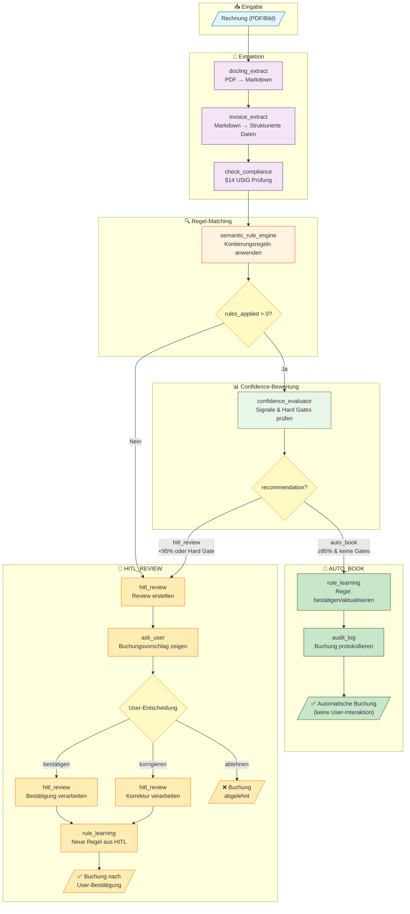

# Buchungsworkflow - Accounting Agent

Dieses Dokument beschreibt den automatischen Buchungsworkflow des Accounting Agents.

## Workflow-Diagramm



## Workflow-Phasen

### 1. Extraktion

| Tool | Beschreibung |
|------|--------------|
| `docling_extract` | Konvertiert PDF/Bild zu Markdown |
| `invoice_extract` | Extrahiert strukturierte Rechnungsdaten (Lieferant, Positionen, Beträge) |
| `check_compliance` | Prüft §14 UStG Pflichtangaben |

### 2. Regel-Matching

Der `semantic_rule_engine` sucht passende Kontierungsregeln:

**Regeltypen (nach Priorität):**
1. **Learned Rules** (Priorität 75-90) - Aus HITL-Bestätigungen gelernt
2. **Vendor-Only Rules** (Priorität 100) - Lieferant → Konto
3. **Vendor+Item Rules** (Priorität 50) - Lieferant + Artikel → Konto
4. **Legacy Rules** (Priorität 10) - Keyword-basiert

**Matching-Logik:**
- Exakter String-Match (mit Quote-Normalisierung)
- Fallback: Stripped-Match (ohne Anführungszeichen)
- Semantisches Matching via Embeddings (wenn konfiguriert)

### 3. Confidence-Bewertung

Der `confidence_evaluator` berechnet einen Confidence-Score:

**Signale (gewichtet):**

| Signal | Gewicht | Beschreibung |
|--------|---------|--------------|
| Rule Type | 25% | Vendor-Only (1.0) > Vendor+Item (0.8) > RAG (0.5) |
| Similarity | 25% | Match-Ähnlichkeit (0.0 - 1.0) |
| Uniqueness | 20% | Eindeutigkeit (nicht ambiguous) |
| Historical | 15% | Erfolgsrate der Regel |
| Extraction | 15% | OCR/Extraktionsqualität |

**Hard Gates (erzwingen HITL):**

| Gate | Bedingung | Grund |
|------|-----------|-------|
| `no_rule_match` | Keine Regel gefunden | User muss Konto angeben |
| `new_vendor` | Erster Beleg vom Lieferanten | Keine Historie |
| `high_amount` | Betrag > 5.000 EUR | Wesentlichkeit |
| `critical_account` | Konto 1800, 2100 | Privatentnahmen, Anzahlungen |

### 4. Entscheidung

| Bedingung | Ergebnis |
|-----------|----------|
| Confirmed Learned Rule + Exact Match | **AUTO_BOOK** (force) |
| Confidence ≥ 95% + keine Hard Gates | **AUTO_BOOK** |
| Confidence < 95% ODER Hard Gate | **HITL_REVIEW** |

## AUTO_BOOK Pfad

Bei bekannten Regeln mit hoher Confidence:

1. Buchung wird automatisch durchgeführt
2. Bestehende Regel wird aktualisiert (Version +1)
3. Audit-Log wird erstellt
4. **Keine User-Interaktion erforderlich**

```
✅ Buchung automatisch durchgeführt (bekannte Regel):

📋 RECHNUNGSDETAILS:
• Lieferant: Experten GmbH
• Rechnungsnummer: 14332
• Bruttobetrag: 2.454,90 EUR

📦 GEBUCHTE POSITIONEN:
1. Bohrmaschine "Superdreh 500" → Konto 0480 (BGA)
2. Briketts "Immerzünd" (5 kg) → Konto 4980 (Betriebsbedarf)
```

## HITL_REVIEW Pfad

Bei neuen/unsicheren Buchungen:

1. Buchungsvorschlag wird dem User gezeigt
2. User kann bestätigen, korrigieren oder ablehnen
3. Bei Bestätigung/Korrektur wird eine neue Regel gelernt
4. Nächste Rechnung vom gleichen Lieferanten → AUTO_BOOK

```
📋 RECHNUNGSDETAILS:
• Lieferant: Neue Firma GmbH
• Bruttobetrag: 500,00 EUR

📦 POSITIONEN:
1. Büromaterial - 50,00 EUR (19%)
   → Vorschlag: Konto 4930 (Bürobedarf)

Bestätigen Sie die Konten oder nennen Sie Alternativen.
```

## Regel-Lernen

Der Agent lernt aus jeder Buchung:

| Quelle | Regel-Typ | Priorität |
|--------|-----------|-----------|
| AUTO_BOOK (≥95%) | `auto_high_confidence` | 75 |
| HITL Bestätigung | `auto_high_confidence` | 75 |
| HITL Korrektur | `hitl_correction` | 90 |

**Gespeichert in:** `.taskforce_accounting/learned_rules.yaml`

```yaml
semantic_rules:
  - rule_id: HITL-CONF-20260205115537-1
    vendor_pattern: Experten GmbH
    item_patterns:
      - Bohrmaschine "Superdreh 500"
    target_account: "0480"
    target_account_name: Betriebs- und Geschäftsausstattung
    source: auto_high_confidence
    priority: 75
```

## Konfiguration

In `configs/accounting_agent.yaml`:

```yaml
workflow:
  auto_book_threshold: 0.95        # Confidence für Auto-Buchung
  hard_gates:
    new_vendor: true
    high_amount_threshold: 5000    # EUR
    critical_accounts:
      - "1800"  # Privatentnahmen
      - "2100"  # Anzahlungen
  auto_rule_learning: true
  learn_from_hitl: true
```
