# Buchungsworkflow - Accounting Agent

Dieses Dokument beschreibt den automatischen Buchungsworkflow des Accounting Agents.

## Workflow-Diagramm

```mermaid
flowchart TD
    subgraph INPUT["📥 Eingabe"]
        A[/"Rechnung (PDF/Bild)"/]
    end

    subgraph EXTRACTION["📄 Extraktion"]
        B[docling_extract<br/>PDF → Markdown]
        C[invoice_extract<br/>Markdown → Strukturierte Daten]
        D[check_compliance<br/>§14 UStG Prüfung]
    end

    subgraph RULES["🔍 Regel-Matching"]
        E[semantic_rule_engine<br/>Kontierungsregeln anwenden]
        F{rules_applied > 0?}
    end

    subgraph CONFIDENCE["📊 Confidence-Bewertung"]
        G[confidence_evaluator<br/>Signale & Hard Gates prüfen]
        H{recommendation?}
    end

    subgraph AUTO["🚀 AUTO_BOOK"]
        I[rule_learning<br/>Regel bestätigen/aktualisieren]
        J[audit_log<br/>Buchung protokollieren]
        K[/"✅ Automatische Buchung<br/>(keine User-Interaktion)"/]
    end

    subgraph HITL["👤 HITL_REVIEW"]
        L[hitl_review<br/>Review erstellen]
        M[ask_user<br/>Buchungsvorschlag zeigen]
        N{User-Entscheidung}
        O[hitl_review<br/>Bestätigung verarbeiten]
        P[hitl_review<br/>Korrektur verarbeiten]
        Q[rule_learning<br/>Neue Regel aus HITL]
        R[/"✅ Buchung nach<br/>User-Bestätigung"/]
        S[/"❌ Buchung<br/>abgelehnt"/]
    end

    %% Flow
    A --> B
    B --> C
    C --> D
    D --> E
    E --> F

    F -->|Nein| L
    F -->|Ja| G

    G --> H
    H -->|auto_book<br/>≥95% & keine Gates| I
    H -->|hitl_review<br/><95% oder Hard Gate| L

    I --> J
    J --> K

    L --> M
    M --> N
    N -->|"bestätigen"| O
    N -->|"korrigieren"| P
    N -->|"ablehnen"| S
    O --> Q
    P --> Q
    Q --> R

    %% Styling
    classDef input fill:#e1f5fe,stroke:#01579b
    classDef extract fill:#f3e5f5,stroke:#7b1fa2
    classDef rules fill:#fff3e0,stroke:#e65100
    classDef confidence fill:#e8f5e9,stroke:#2e7d32
    classDef auto fill:#c8e6c9,stroke:#1b5e20
    classDef hitl fill:#ffecb3,stroke:#ff6f00
    classDef decision fill:#fff9c4,stroke:#f9a825

    class A input
    class B,C,D extract
    class E,F rules
    class G,H confidence
    class I,J,K auto
    class L,M,N,O,P,Q,R,S hitl
    class F,H,N decision
```



## Workflow-Phasen

### 1. Extraktion

| Tool | Beschreibung |
|------|--------------|
| `docling_extract` | Konvertiert PDF/Bild zu Markdown |
| `invoice_extract` | Extrahiert strukturierte Rechnungsdaten (Lieferant, Positionen, Beträge) |
| `check_compliance` | Prüft §14 UStG Pflichtangaben |

### 2. Regel-Matching

Der `semantic_rule_engine` sucht passende Kontierungsregeln:

**Regeltypen (nach Priorität):**
1. **Learned Rules** (Priorität 75-90) - Aus HITL-Bestätigungen gelernt
2. **Vendor-Only Rules** (Priorität 100) - Lieferant → Konto
3. **Vendor+Item Rules** (Priorität 50) - Lieferant + Artikel → Konto
4. **Legacy Rules** (Priorität 10) - Keyword-basiert

**Matching-Logik:**
- Exakter String-Match (mit Quote-Normalisierung)
- Fallback: Stripped-Match (ohne Anführungszeichen)
- Semantisches Matching via Embeddings (wenn konfiguriert)

### 3. Confidence-Bewertung

Der `confidence_evaluator` berechnet einen Confidence-Score:

**Signale (gewichtet):**

| Signal | Gewicht | Beschreibung |
|--------|---------|--------------|
| Rule Type | 25% | Vendor-Only (1.0) > Vendor+Item (0.8) > RAG (0.5) |
| Similarity | 25% | Match-Ähnlichkeit (0.0 - 1.0) |
| Uniqueness | 20% | Eindeutigkeit (nicht ambiguous) |
| Historical | 15% | Erfolgsrate der Regel |
| Extraction | 15% | OCR/Extraktionsqualität |

**Hard Gates (erzwingen HITL):**

| Gate | Bedingung | Grund |
|------|-----------|-------|
| `no_rule_match` | Keine Regel gefunden | User muss Konto angeben |
| `new_vendor` | Erster Beleg vom Lieferanten | Keine Historie |
| `high_amount` | Betrag > 5.000 EUR | Wesentlichkeit |
| `critical_account` | Konto 1800, 2100 | Privatentnahmen, Anzahlungen |

### 4. Entscheidung

| Bedingung | Ergebnis |
|-----------|----------|
| Confirmed Learned Rule + Exact Match | **AUTO_BOOK** (force) |
| Confidence ≥ 95% + keine Hard Gates | **AUTO_BOOK** |
| Confidence < 95% ODER Hard Gate | **HITL_REVIEW** |

## AUTO_BOOK Pfad

Bei bekannten Regeln mit hoher Confidence:

1. Buchung wird automatisch durchgeführt
2. Bestehende Regel wird aktualisiert (Version +1)
3. Audit-Log wird erstellt
4. **Keine User-Interaktion erforderlich**

```
✅ Buchung automatisch durchgeführt (bekannte Regel):

📋 RECHNUNGSDETAILS:
• Lieferant: Experten GmbH
• Rechnungsnummer: 14332
• Bruttobetrag: 2.454,90 EUR

📦 GEBUCHTE POSITIONEN:
1. Bohrmaschine "Superdreh 500" → Konto 0480 (BGA)
2. Briketts "Immerzünd" (5 kg) → Konto 4980 (Betriebsbedarf)
```

## HITL_REVIEW Pfad

Bei neuen/unsicheren Buchungen:

1. Buchungsvorschlag wird dem User gezeigt
2. User kann bestätigen, korrigieren oder ablehnen
3. Bei Bestätigung/Korrektur wird eine neue Regel gelernt
4. Nächste Rechnung vom gleichen Lieferanten → AUTO_BOOK

```
📋 RECHNUNGSDETAILS:
• Lieferant: Neue Firma GmbH
• Bruttobetrag: 500,00 EUR

📦 POSITIONEN:
1. Büromaterial - 50,00 EUR (19%)
   → Vorschlag: Konto 4930 (Bürobedarf)

Bestätigen Sie die Konten oder nennen Sie Alternativen.
```

## Regel-Lernen

Der Agent lernt aus jeder Buchung:

| Quelle | Regel-Typ | Priorität |
|--------|-----------|-----------|
| AUTO_BOOK (≥95%) | `auto_high_confidence` | 75 |
| HITL Bestätigung | `auto_high_confidence` | 75 |
| HITL Korrektur | `hitl_correction` | 90 |

**Gespeichert in:** `.taskforce_accounting/learned_rules.yaml`

```yaml
semantic_rules:
  - rule_id: HITL-CONF-20260205115537-1
    vendor_pattern: Experten GmbH
    item_patterns:
      - Bohrmaschine "Superdreh 500"
    target_account: "0480"
    target_account_name: Betriebs- und Geschäftsausstattung
    source: auto_high_confidence
    priority: 75
```

## Konfiguration

In `configs/accounting_agent.yaml`:

```yaml
workflow:
  auto_book_threshold: 0.95        # Confidence für Auto-Buchung
  hard_gates:
    new_vendor: true
    high_amount_threshold: 5000    # EUR
    critical_accounts:
      - "1800"  # Privatentnahmen
      - "2100"  # Anzahlungen
  auto_rule_learning: true
  learn_from_hitl: true
```
