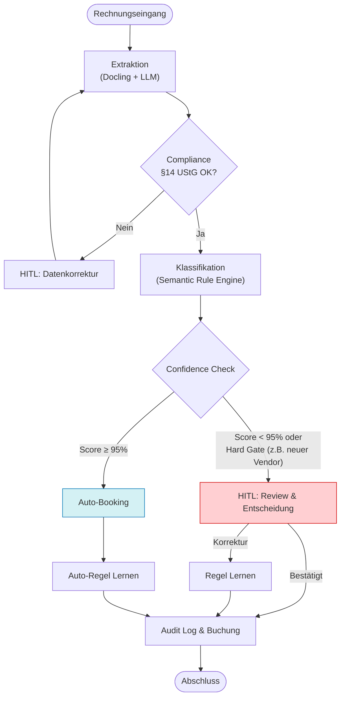
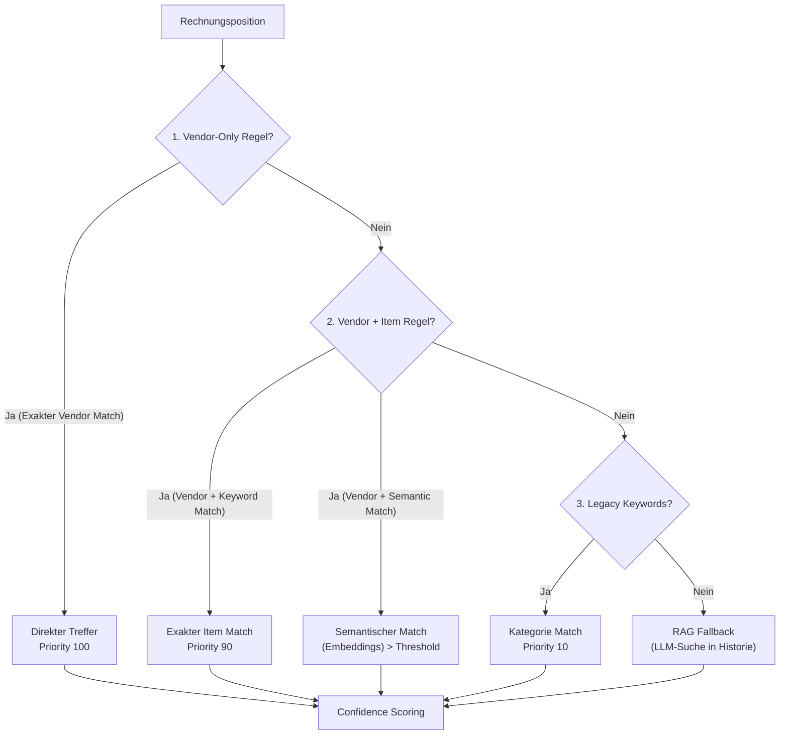

# Technical Report: Accounting Agent

## 1. Executive Summary

Der **Accounting Agent** automatisiert den Prozess der Rechnungsverarbeitung von der Extraktion bis zur Vorkontierung. Anders als reine LLM-Wrapper setzt dieser Agent auf eine **hybride Architektur**: Er nutzt LLMs für das Verständnis unstrukturierter Daten (OCR/Extraktion), verlässt sich aber für die Buchungsentscheidung primär auf deterministische und semantische Regeln, um Halluzinationen zu vermeiden und Auditierbarkeit zu gewährleisten.

**Kernfunktionen:**
*   **OCR & Extraktion:** Nutzung von `Docling` und LLMs zur Umwandlung von PDFs/Bildern in strukturierte Daten.
*   **Compliance-Prüfung:** Validierung aller Pflichtangaben nach §14 UStG.
*   **Semantische Kontierung:** Regelbasiertes Matching mit Vector-Embeddings für intelligente Zuordnungen.
*   **Human-in-the-Loop (HITL):** Eskalation unsicherer Fälle an den Benutzer.
*   **Kontinuierliches Lernen:** Automatische Generierung neuer Regeln aus Benutzer-Feedback.
*   **GoBD-Audit:** Unveränderliche Protokollierung aller Schritte.

---

## 2. Systemarchitektur

Der Agent folgt den Prinzipien der **Clean Architecture**, um Geschäftslogik strikt von Infrastruktur und externen Diensten zu trennen.

### High-Level Komponenten

```mermaid
graph TB
    subgraph "External Systems"
        direction TB
        User(("Buchhalter"))
        Azure["Azure OpenAI<br/>(LLM & Embeddings)"]
        Docling["Docling<br/>(OCR Service)"]
    end

    subgraph "Accounting Agent"
        direction TB
        subgraph "Application Layer"
            Orchestrator[Agent Executor]
        end

        subgraph "Domain Layer (Pure Python)"
            Models[Domain Models<br/>(Invoice, BookingProposal)]
            Rules[Accounting Rules]
            Confidence[Confidence Calculator]
        end

        subgraph "Infrastructure / Tools"
            TExtract[Extraction Tool]
            TCompliance[Compliance Checker]
            TRules[Semantic Rule Engine]
            THITL[HITL Review Tool]
            TAudit[Audit Log Tool]
        end
        
        subgraph "Persistence"
            RuleRepo[("Rule Repository<br/>(YAML)")]
            History[("Booking History<br/>(JSONL)")]
        end
    end

    User <--> Orchestrator
    Orchestrator --> TExtract
    Orchestrator --> TCompliance
    Orchestrator --> TRules
    Orchestrator --> THITL
    Orchestrator --> TAudit

    TExtract <--> Docling
    TExtract <--> Azure
    TRules <--> Azure
    TRules <--> RuleRepo
    TRules <--> History

    TRules --> Confidence
    Confidence --> Rules
```

### Schichtenmodell

1.  **Domain Layer:** Enthält die reinen Datenmodelle (`Invoice`, `LineItem`) und die Geschäftslogik (z.B. Konfidenz-Berechnungsformel), komplett ohne externe Abhängigkeiten.
2.  **Application Layer:** Koordiniert den Workflow (ReAct-Loop) und steuert die Tools.
3.  **Infrastructure Layer:** Implementiert die Schnittstellen zu externen Diensten (Azure OpenAI, Dateisystem) und stellt die Tools bereit.

---

## 3. Kern-Workflows

### 3.1 End-to-End Verarbeitungspipeline

Der Prozess einer Rechnung durchläuft eine strikte Zustandsmaschine:



### 3.2 Semantic Rule Matching Algorithmus

Die Zuordnung von Rechnungspositionen zu Konten (Kontierung) erfolgt über einen kaskadierenden Algorithmus, der Schnelligkeit mit Flexibilität verbindet.



*   **Vendor-Only:** Wenn ein Lieferant immer das gleiche liefert (z.B. "AWS" -> Cloud-Kosten), wird dies sofort erkannt.
*   **Semantic Match:** Für Lieferanten mit gemischtem Angebot (z.B. "Amazon") wird die Positionsbeschreibung vektorisiert und mit gelernten Mustern verglichen (z.B. "MacBook" ähnelt semantisch "Laptop" -> Konto GWG).

---

## 4. Technische Schlüsselkonzepte

### 4.1 Confidence Scoring & Hard Gates

Der Agent entscheidet nicht schwarz-weiß, sondern berechnet eine Wahrscheinlichkeit für die Korrektheit (`Confidence Score`). Dieser setzt sich aus 5 gewichteten Signalen zusammen:

1.  **Rule Type (25%):** Wie spezifisch ist die Regel? (Vendor-Only > RAG)
2.  **Similarity (25%):** Wie ähnlich ist der Text zur Regel? (1.0 bei exaktem Match)
3.  **Uniqueness (20%):** Gab es konkurrierende Regeln?
4.  **Historical (15%):** Wie oft war diese Regel in der Vergangenheit korrekt?
5.  **Extraction (15%):** Wie gut war die OCR-Qualität?

Zusätzlich gibt es **Hard Gates**, die unabhängig vom Score *immer* einen Menschen (HITL) erfordern:
*   **New Vendor:** Lieferant ist im System unbekannt.
*   **High Amount:** Rechnungsbetrag überschreitet Schwellwert (z.B. 5.000 €).
*   **Critical Account:** Zielkonto ist sensibel (z.B. Bank, Eigenkapital).

### 4.2 Auto-Learning Mechanismus

Das System verbessert sich selbstständig durch zwei Mechanismen:

1.  **Explizites Lernen (HITL):** Korrigiert der Benutzer einen Vorschlag, generiert der Agent eine neue Regel mit hoher Priorität (`Source: HITL_CORRECTION`).
2.  **Implizites Lernen (Auto):** Wird ein Vorschlag mit sehr hoher Konfidenz (>98%) automatisch verbucht, verfestigt der Agent dieses Wissen in einer neuen Regel (`Source: AUTO_HIGH_CONFIDENCE`).

---

## 5. Datenhaltung & Compliance

Um GoBD-Konformität sicherzustellen, verwendet der Agent ein **Append-Only** Speichermodell:

*   **`booking_history.jsonl`:** Jede Buchung ist ein unveränderlicher JSON-Eintrag. Änderungen werden als neue Einträge mit Referenz auf den alten Eintrag gespeichert (Stornierung/Neubuchung).
*   **Audit Trail:** Jede Aktion (Regel-Anwendung, User-Entscheidung, System-Fehler) wird mit Zeitstempel und Hash kryptografisch verkettet protokolliert.
*   **Regel-Versionierung:** Regeln werden nicht überschrieben, sondern neue Versionen werden hinzugefügt. Dies ermöglicht es, historische Buchungen auch mit dem damaligen Regelwerk nachzuvollziehen.
