# Accounting Agent - Workflow-Dokumentation

Diese Dokumentation beschreibt die Abläufe und Interaktionen zwischen den Komponenten des Accounting Agents im Detail. Sie ergänzt die Hauptdokumentation (`ARCHITECTURE.md`) mit fokussierten Sequenz- und Timing-Diagrammen.

---

## Inhaltsverzeichnis

1. [End-to-End Rechnungsverarbeitung](#1-end-to-end-rechnungsverarbeitung)
2. [Semantic Rule Matching](#2-semantic-rule-matching)
3. [Confidence-Bewertung](#3-confidence-bewertung)
4. [HITL-Workflow](#4-hitl-workflow)
5. [Regel-Lernen](#5-regel-lernen)
6. [RAG Fallback](#6-rag-fallback)
7. [Compliance-Prüfung](#7-compliance-prüfung)
8. [Audit & Persistenz](#8-audit--persistenz)

---

## 1. End-to-End Rechnungsverarbeitung

### 1.1 Überblick

Die Rechnungsverarbeitung ist ein mehrstufiger Prozess, der von der Dokumentenerfassung bis zur finalen Buchung reicht. Der gesamte Ablauf wird vom Taskforce-Framework orchestriert, wobei der Agent im ReAct-Modus (Reason + Act) arbeitet.

Der Prozess gliedert sich in sechs Hauptphasen:

| Phase | Beschreibung | Tools | Typische Dauer |
|-------|--------------|-------|----------------|
| **1. Extraktion** | PDF/Bild → strukturierte Daten | docling_extract, invoice_extract | 3-7 Sekunden |
| **2. Validierung** | §14 UStG Compliance-Prüfung | check_compliance | < 1 Sekunde |
| **3. Klassifikation** | Kontenzuordnung | semantic_rule_engine, rag_fallback | 2-5 Sekunden |
| **4. Bewertung** | Konfidenz und Hard Gates | confidence_evaluator | < 1 Sekunde |
| **5. Entscheidung** | Auto-Book oder HITL | hitl_review, ask_user | 0 - mehrere Minuten |
| **6. Finalisierung** | Speicherung und Audit | rule_learning, audit_log | < 1 Sekunde |

### 1.2 Vollständiges Sequenzdiagramm

Das folgende Diagramm zeigt alle Interaktionen zwischen Agent, Tools und Benutzer:

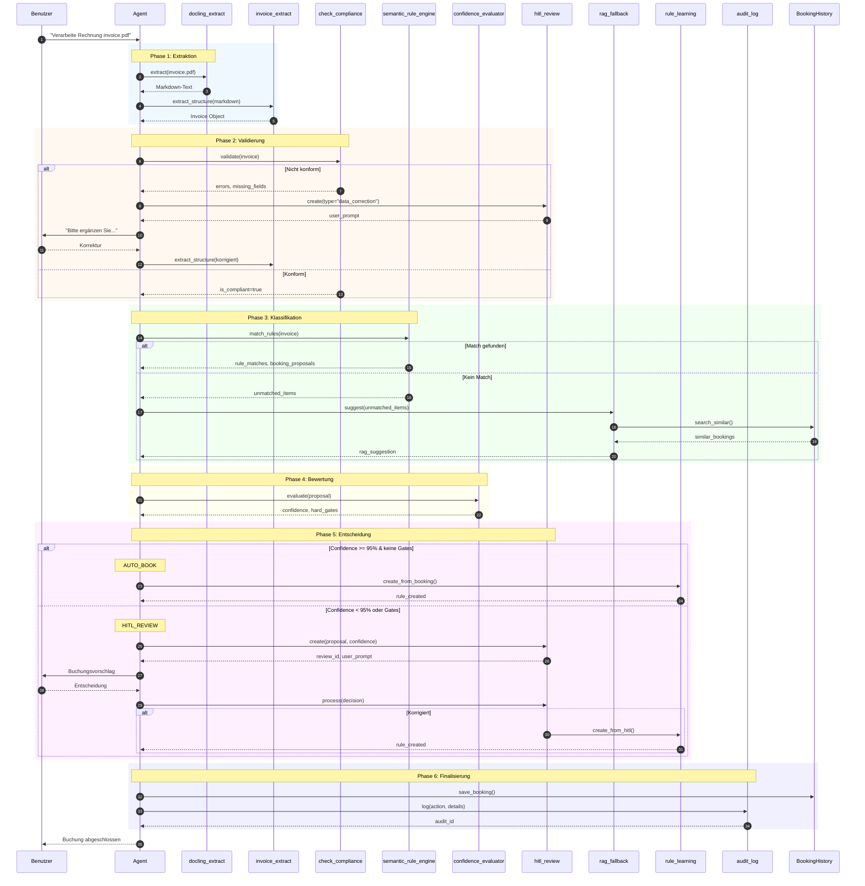

### 1.3 Phasen-Details

#### Phase 1: Extraktion

Die Extraktion wandelt ein Dokument (PDF, Bild, Scan) in strukturierte Daten um. Dieser Prozess besteht aus zwei Schritten:

**Schritt 1.1: Docling-Extraktion**

Das `docling_extract` Tool nutzt die Docling-Bibliothek, um das Dokument in Markdown zu konvertieren:

- **OCR**: Für gescannte Dokumente wird Optical Character Recognition angewendet
- **Layout-Analyse**: Tabellen, Überschriften und Absätze werden erkannt
- **Text-Extraktion**: Der gesamte Text wird in lesbarer Reihenfolge extrahiert

**Schritt 1.2: LLM-Strukturierung**

Das `invoice_extract` Tool nutzt ein LLM, um den Markdown-Text in ein strukturiertes `Invoice`-Objekt zu verwandeln:

- **Feld-Identifikation**: Lieferant, Datum, Beträge werden erkannt
- **Positions-Extraktion**: Einzelne Rechnungspositionen werden separiert
- **Normalisierung**: Beträge werden in einheitliches Format gebracht
- **Konsistenzprüfung**: Summen werden validiert

#### Phase 2: Validierung

Die Compliance-Prüfung stellt sicher, dass die Rechnung alle gesetzlichen Anforderungen erfüllt:

**Prüfschritte:**

1. **Betragsprüfung**: Ist es eine Kleinbetragsrechnung (< 250€)?
2. **Pflichtfelder**: Sind alle nach §14 UStG erforderlichen Felder vorhanden?
3. **USt-Konsistenz**: Stimmt die Summe der Einzelposten mit der Gesamtsumme überein?
4. **Datumslogik**: Ist das Lieferdatum plausibel (nicht in der Zukunft)?

**Bei Fehlern:**

Wenn kritische Felder fehlen, wird der Benutzer via HITL zur Ergänzung aufgefordert. Nach der Korrektur wird Phase 1.2 wiederholt.

#### Phase 3: Klassifikation

Die Klassifikation ordnet jede Rechnungsposition einem Sachkonto zu:

**Strategie-Reihenfolge:**

1. **Vendor-Only Regeln (Priority 100)**: Direktes Mapping Lieferant → Konto
2. **Vendor+Item Regeln (Priority 50-90)**: Kombination aus Lieferant und Positionsbeschreibung
3. **Legacy-Kategorien (Priority 10)**: Keyword-basierte Zuordnung
4. **RAG Fallback**: LLM-Vorschlag basierend auf historischen Buchungen

**Bei Erfolg:** `booking_proposals` werden erstellt
**Bei Misserfolg:** RAG Fallback wird aktiviert

#### Phase 4: Bewertung

Die Confidence-Bewertung berechnet einen Vertrauenswert und prüft Ausschlusskriterien:

**Berechnung:**
- 5 gewichtete Signale ergeben `overall_confidence`
- 3 Hard Gates werden geprüft (new_vendor, high_amount, critical_account)

**Entscheidung:**
- `confidence >= 0.95` UND keine Hard Gates → AUTO_BOOK
- Sonst → HITL_REVIEW

#### Phase 5: Entscheidung

Je nach Bewertungsergebnis:

**AUTO_BOOK Pfad:**
- Buchung wird sofort durchgeführt
- Automatische Regel wird gelernt (Priority 75)
- Keine Benutzerinteraktion erforderlich

**HITL_REVIEW Pfad:**
- Review-Dokument wird erstellt
- Benutzer erhält alle relevanten Informationen
- Benutzer wählt: Bestätigen / Korrigieren / Ablehnen
- Bei Korrektur: HITL-Regel wird gelernt (Priority 90)

#### Phase 6: Finalisierung

Die Finalisierung speichert alle Daten revisionssicher:

1. **Booking History**: Buchungsdatensatz mit Embedding für zukünftige Suchen
2. **Audit Log**: GoBD-konformer Eintrag mit Checksum
3. **Rule History**: Falls eine Regel gelernt wurde

### 1.4 Timing-Diagramm

Das folgende Diagramm zeigt die zeitliche Abfolge der Operationen bei einer typischen Rechnungsverarbeitung:

```mermaid
gantt
    title Rechnungsverarbeitung Timeline
    dateFormat ss
    axisFormat %S s

    section Extraktion
    Docling PDF Parse     :a1, 00, 3s
    LLM Strukturierung    :a2, after a1, 2s

    section Validierung
    Compliance Check      :b1, after a2, 1s

    section Klassifikation
    Rule Loading          :c1, after b1, 1s
    Embedding Compute     :c2, after c1, 2s
    Similarity Match      :c3, after c2, 1s

    section Bewertung
    Confidence Calc       :d1, after c3, 1s
    Hard Gate Check       :d2, after d1, 1s

    section Finalisierung
    Booking Save          :e1, after d2, 1s
    Audit Log             :e2, after e1, 1s
```

**Typische Gesamtdauer:** 12-15 Sekunden (ohne HITL)

---

## 2. Semantic Rule Matching

### 2.1 Algorithmus-Überblick

Das Semantic Rule Matching ist der Kern der automatischen Kontierung. Es kombiniert drei Matching-Strategien in einer priorisierten Reihenfolge.

**Grundprinzip:**

Das System versucht, für jede Rechnungsposition eine passende Regel zu finden. Dabei werden zuerst die zuverlässigsten Regeln (Vendor-Only) geprüft, bevor auf weniger spezifische Regeln zurückgegriffen wird.

### 2.2 Matching-Algorithmus Flowchart

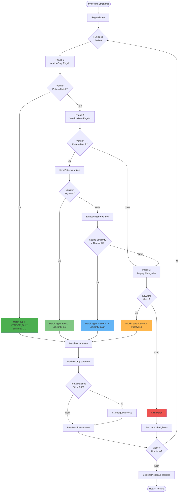

### 2.3 Phasen-Beschreibung

#### Phase 1: Vendor-Only Matching (Grün)

**Funktionsweise:**

1. Der Lieferantenname wird normalisiert (Kleinbuchstaben, Whitespace trimmen)
2. Für jede Vendor-Only Regel wird geprüft, ob das `vendor_pattern` enthalten ist
3. Bei Match: Sofortiger Abbruch, Konto wird zurückgegeben

**Beispiel:**

```yaml
vendor_rules:
  - rule_id: VR-AWS
    vendor_pattern: "amazon web services"
    target_account: "6805"
```

Rechnung von "Amazon Web Services EMEA SARL" → Pattern "amazon web services" ist enthalten → Match!

**Vorteile:**
- Schnellste Matching-Methode
- Höchste Zuverlässigkeit (Priority 100)
- Keine Embedding-Berechnung nötig

#### Phase 2: Vendor+Item Matching (Blau)

**Funktionsweise:**

1. Vendor-Pattern wird als Regex oder Substring geprüft
2. Bei Vendor-Match: Item-Patterns werden geprüft
3. Zuerst exakter Keyword-Match (schnell)
4. Falls nicht: Semantischer Match via Embeddings

**Exakter Match:**

```python
for pattern in rule.item_patterns:
    if pattern.lower() in item.description.lower():
        return RuleMatch(match_type="exact", similarity=1.0)
```

**Semantischer Match:**

```python
item_embedding = embed(item.description)
for pattern in rule.item_patterns:
    pattern_embedding = embed(pattern)  # Cached
    similarity = cosine_similarity(item_embedding, pattern_embedding)
    if similarity >= rule.similarity_threshold:
        return RuleMatch(match_type="semantic", similarity=similarity)
```

**Beispiel:**

```yaml
semantic_rules:
  - rule_id: SR-IT-EQUIPMENT
    vendor_pattern: ".*"  # Beliebiger Lieferant
    item_patterns:
      - "Laptop"
      - "Notebook"
      - "Computer"
      - "Monitor"
    target_account: "4985"
    similarity_threshold: 0.8
```

Positionsbeschreibung "MacBook Pro 16 Zoll M3":
- Exakter Match auf "Laptop"? Nein
- Embedding-Similarity zu "Laptop": 0.87 > 0.8 → Match!

#### Phase 3: Legacy Categories (Orange)

**Funktionsweise:**

Keyword-basierte Zuordnung mit optionaler bedingter Logik (z.B. Betragsschwellen).

```yaml
expense_categories:
  - category: it_equipment
    keywords: ["laptop", "pc", "server", "hardware"]
    conditions:
      - if: amount < 800
        account: "4985"  # GWG
      - else:
        account: "0420"  # Anlagevermögen
```

#### Ambiguitätsprüfung

Nach dem Sammeln aller Matches wird geprüft, ob mehrere Regeln ähnlich gut passen:

```python
if len(matches) >= 2:
    best = matches[0]
    second = matches[1]
    if abs(best.similarity - second.similarity) < 0.05:
        best.is_ambiguous = True
        best.alternative_matches = [second]
```

**Auswirkung:** Ambige Matches führen zu niedrigerer Uniqueness-Score in der Confidence-Bewertung.

### 2.4 Embedding-Vergleich

Das folgende Diagramm zeigt den Ablauf der Embedding-basierten Ähnlichkeitssuche:

```mermaid
flowchart LR
    subgraph "Input"
        ITEM[LineItem Description<br/>"Cloud Hosting Services"]
    end

    subgraph "Embedding Service"
        EMB1[Azure OpenAI<br/>Embedding API]
        CACHE{Cache<br/>Hit?}
    end

    subgraph "Rule Patterns"
        P1["Cloud Computing" → [0.12, -0.34, ...]]
        P2["Hosting" → [0.15, -0.28, ...]]
        P3["Server" → [0.08, -0.41, ...]]
    end

    subgraph "Similarity"
        COS[Cosine Similarity]
        RANK[Ranking]
    end

    ITEM --> CACHE
    CACHE -->|Ja| VEC[Cached Vector]
    CACHE -->|Nein| EMB1
    EMB1 --> VEC

    VEC --> COS
    P1 --> COS
    P2 --> COS
    P3 --> COS

    COS --> RANK
    RANK --> RESULT["Cloud Computing": 0.92<br/>"Hosting": 0.88<br/>"Server": 0.71]
```

**Erläuterung:**

1. Die Positionsbeschreibung wird in einen 1536-dimensionalen Vektor umgewandelt
2. Dieser Vektor wird mit den vorberechneten Pattern-Vektoren verglichen
3. Die Cosine Similarity (0.0-1.0) misst die semantische Ähnlichkeit
4. Das Pattern mit höchster Similarity über dem Threshold gewinnt

**Performance-Optimierungen:**
- Pattern-Embeddings werden beim Tool-Start vorberechnet
- LRU-Cache für Item-Embeddings (max. 1000 Einträge)
- Batch-Embedding für mehrere Positionen gleichzeitig

---

## 3. Confidence-Bewertung

### 3.1 Signal-Architektur

Die Confidence-Bewertung ist ein gewichtetes Scoring-System, das die Zuverlässigkeit einer Buchungsentscheidung quantifiziert.

**Designprinzipien:**

1. **Multi-Signal-Ansatz**: Kein einzelnes Signal dominiert
2. **Kalibrierte Gewichte**: Basierend auf empirischen Daten
3. **Hard Gates als Override**: Bestimmte Situationen erzwingen immer HITL

### 3.2 Signal-Berechnung

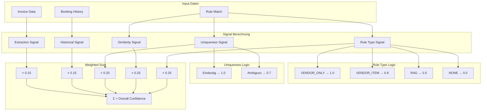

### 3.3 Signal-Definitionen

#### Signal 1: Rule Type (25%)

Bewertet die Art der angewendeten Regel:

| Regeltyp | Score | Begründung |
|----------|-------|------------|
| VENDOR_ONLY | 1.0 | Höchste Zuverlässigkeit - bewährte Zuordnung |
| VENDOR_ITEM (HITL) | 0.9 | Vom Benutzer bestätigte Zuordnung |
| VENDOR_ITEM (Exact) | 0.85 | Exakter Keyword-Match |
| VENDOR_ITEM (Semantic) | 0.8 | Semantischer Match, leicht unsicherer |
| RAG Fallback | 0.5 | LLM-Schätzung ohne Regel |
| Kein Match | 0.0 | Keine Grundlage |

#### Signal 2: Similarity (25%)

Die Cosine Similarity aus dem Matching:

- Bei VENDOR_ONLY oder EXACT: 1.0
- Bei SEMANTIC: Der berechnete Similarity-Wert (0.8-1.0)
- Bei RAG: Die vom LLM angegebene Konfidenz

#### Signal 3: Uniqueness (20%)

Misst, wie eindeutig die Zuordnung war:

| Situation | Score | Beschreibung |
|-----------|-------|--------------|
| Eindeutig | 1.0 | Nur eine Regel passt oder klarer Abstand |
| Leicht ambiguos | 0.8 | Zwei Matches, aber klarer Gewinner |
| Stark ambiguos | 0.7 | Mehrere sehr ähnliche Matches |
| Sehr unsicher | 0.5 | Viele gleichwertige Kandidaten |

#### Signal 4: Historical (15%)

Basiert auf der Erfolgshistorie der Regel:

```python
historical_score = successful_uses / total_uses
# successful_uses = Buchungen ohne nachträgliche Korrektur
# total_uses = Gesamtanwendungen der Regel
```

- Neue Regeln starten mit 0.5 (neutral)
- Minimum: 0.3 (Regel wurde oft korrigiert)
- Maximum: 1.0 (Regel wurde nie korrigiert)

#### Signal 5: Extraction (15%)

Die Qualität der Dokumentenextraktion:

| Qualität | Score | Indikatoren |
|----------|-------|-------------|
| Excellent | 0.95-1.0 | Digitale PDF, alle Felder erkannt |
| Good | 0.85-0.95 | Gute OCR, wenige Unsicherheiten |
| Medium | 0.70-0.85 | Scan mit Artefakten, einige Felder unsicher |
| Poor | 0.50-0.70 | Schlechte Qualität, viele Rekonstruktionen |

### 3.4 Hard Gate Prüfung

Nach der Confidence-Berechnung werden die Hard Gates geprüft:

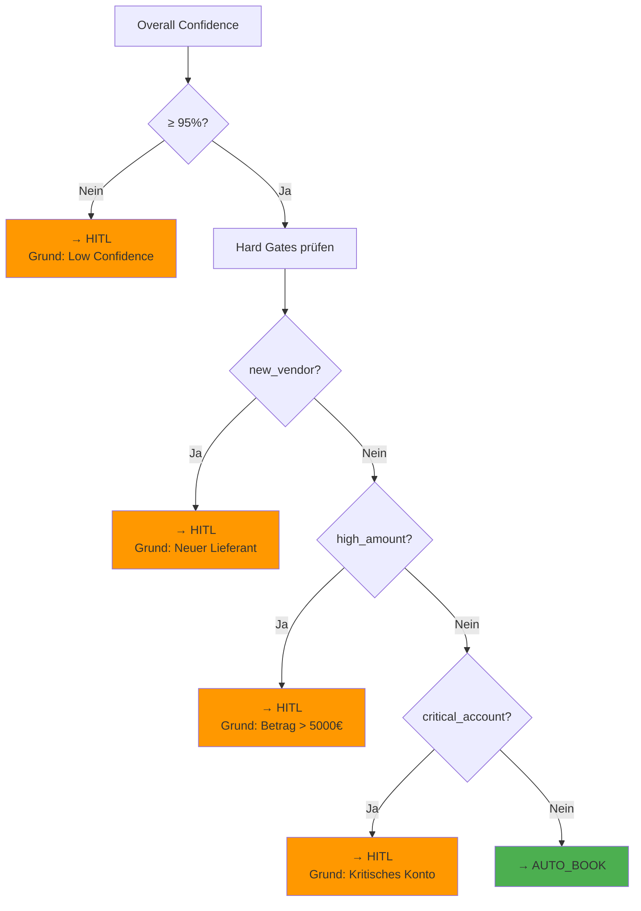

**Gate-Definitionen:**

| Gate | Prüfung | Default-Konfiguration |
|------|---------|----------------------|
| new_vendor | `booking_history.is_new_vendor(supplier)` | Aktiviert |
| high_amount | `invoice.total_gross > threshold` | 5.000 EUR |
| critical_account | `target_account in critical_list` | ["1800", "2100"] |

**Rationale für Hard Gates:**

- **new_vendor**: Erste Rechnungen von einem Lieferanten können leicht falsch klassifiziert werden
- **high_amount**: Bei hohen Beträgen hat ein Fehler größere finanzielle Auswirkungen
- **critical_account**: Bestimmte Konten (Bank, Eigenkapital) erfordern besondere Sorgfalt

---

## 4. HITL-Workflow

### 4.1 Zweck und Trigger

Der Human-in-the-Loop (HITL) Workflow ist der Qualitätssicherungsmechanismus des Systems. Er stellt sicher, dass unsichere Buchungen von einem Menschen geprüft werden.

**HITL wird ausgelöst bei:**

1. Confidence unter 95%
2. Ausgelöstem Hard Gate
3. Ambiguität im Rule Matching
4. Fehlenden Compliance-Feldern

### 4.2 Review-Erstellung

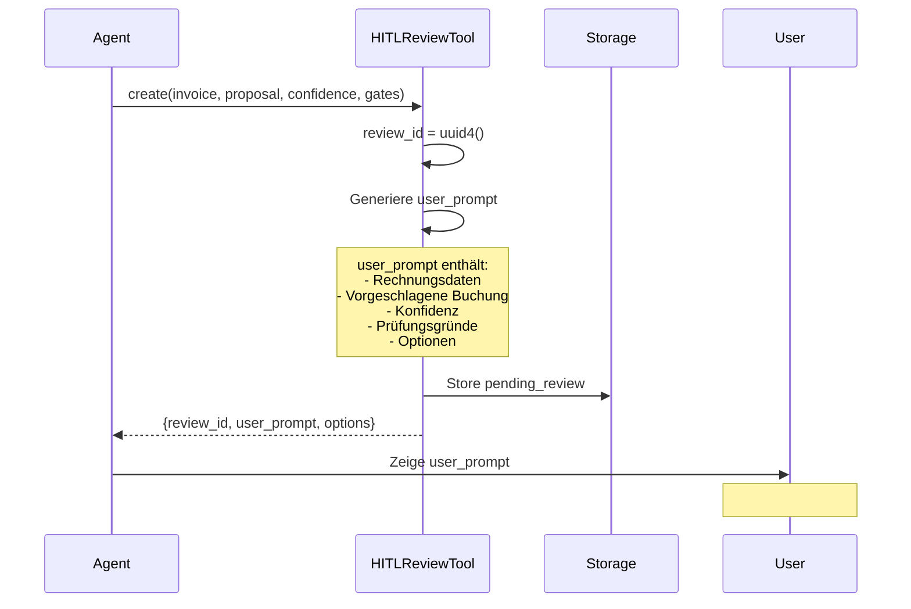

**Struktur des user_prompt:**

Der generierte Prompt enthält alle für die Entscheidung relevanten Informationen:

```markdown
## Buchungsvorschlag zur Prüfung

**Review-ID:** a1b2c3d4-5678-90ab-cdef

---

### Rechnungsdaten
| Feld | Wert |
|------|------|
| Lieferant | TechSupply GmbH |
| Rechnungsnummer | RE-2026-0042 |
| Rechnungsdatum | 25.01.2026 |
| Bruttobetrag | 595,00 EUR |
| Nettobetrag | 500,00 EUR |
| USt 19% | 95,00 EUR |

### Positionen
1. **Büromaterial Sortiment** - 500,00 EUR netto

---

### Vorgeschlagene Buchung
- **Sollkonto:** 4930 (Bürobedarf)
- **Habenkonto:** 1600 (Verbindlichkeiten)
- **Vorsteuerkonto:** 1576 (Vorsteuer 19%)
- **Buchungstext:** Büromaterial Sortiment - TechSupply GmbH

### Konfidenz-Details
- **Gesamtkonfidenz:** 87%
- **Regel:** SR-OFFICE (Semantic Match)
- **Ähnlichkeit:** 0.84

---

### Prüfungsgründe
- ⚠️ Konfidenz unter 95% (87%)
- ⚠️ Neuer Lieferant (erste Rechnung)

---

### Ihre Optionen
1. **Bestätigen** - Vorschlag wie dargestellt übernehmen
2. **Korrigieren** - Anderes Konto angeben (z.B. "4985 GWG")
3. **Ablehnen** - Buchung abbrechen und manuell bearbeiten
```

### 4.3 Review-Verarbeitung

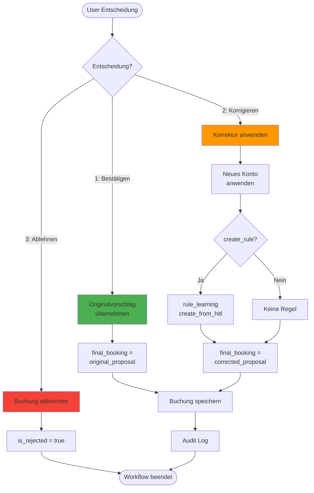

**Verarbeitung im Detail:**

**Option 1: Bestätigen**

Der Benutzer akzeptiert den Vorschlag ohne Änderung:

```python
result = hitl_review.process(
    review_id="a1b2c3d4",
    user_decision="confirm"
)
# result.final_booking = original_proposal
# result.is_hitl_correction = False
```

**Option 2: Korrigieren**

Der Benutzer gibt ein anderes Konto an:

```python
result = hitl_review.process(
    review_id="a1b2c3d4",
    user_decision="correct",
    correction={
        "target_account": "4985",
        "target_account_name": "GWG",
        "create_rule": True  # Optional: Regel lernen
    }
)
# result.final_booking hat aktualisiertes Konto
# result.is_hitl_correction = True
# result.rule_created = True (falls create_rule=True)
```

**Option 3: Ablehnen**

Der Benutzer bricht die automatische Buchung ab:

```python
result = hitl_review.process(
    review_id="a1b2c3d4",
    user_decision="reject",
    rejection_reason="Rechnung ist Dublettte"  # Optional
)
# result.is_rejected = True
# Kein final_booking
```

---

## 5. Regel-Lernen

### 5.1 Übersicht

Das Regellernen ermöglicht dem System, aus Erfahrung besser zu werden. Es gibt zwei Lernquellen:

| Quelle | Trigger | Resultierende Priority | Zuverlässigkeit |
|--------|---------|------------------------|-----------------|
| Auto-Learning | Confidence ≥ 95%, Auto-Book | 75 | Hoch |
| HITL-Learning | Benutzerkorrektur | 90 | Sehr hoch |

### 5.2 Auto-Learning Pipeline

```mermaid
flowchart TB
    subgraph "Trigger"
        BOOK[AUTO_BOOK<br/>Confidence ≥ 95%]
    end

    subgraph "Analyse"
        VENDOR[Vendor Name<br/>normalisieren]
        ITEMS[Line Items<br/>analysieren]
        ACCOUNT[Zielkonto<br/>ermitteln]
    end

    subgraph "Regeltyp-Entscheidung"
        CHECK{Nur Vendor<br/>relevant?}
        VO_TYPE[RuleType:<br/>VENDOR_ONLY]
        VI_TYPE[RuleType:<br/>VENDOR_ITEM]
    end

    subgraph "Regel-Erstellung"
        CREATE[AccountingRule<br/>erstellen]
        ID[rule_id:<br/>AUTO-{timestamp}]
        PRIO[priority: 75]
        SRC[source:<br/>AUTO_HIGH_CONFIDENCE]
    end

    subgraph "Persistenz"
        CONFLICT[Konfliktprüfung]
        SAVE[learned_rules.yaml<br/>speichern]
        HISTORY[rules_history.jsonl<br/>Eintrag]
    end

    BOOK --> VENDOR
    VENDOR --> ITEMS
    ITEMS --> ACCOUNT
    ACCOUNT --> CHECK

    CHECK -->|Ja| VO_TYPE
    CHECK -->|Nein| VI_TYPE

    VO_TYPE --> CREATE
    VI_TYPE --> CREATE

    CREATE --> ID
    ID --> PRIO
    PRIO --> SRC
    SRC --> CONFLICT

    CONFLICT --> SAVE
    SAVE --> HISTORY
```

**Wann wird VENDOR_ONLY vs. VENDOR_ITEM gewählt?**

```python
def determine_rule_type(invoice, booking_history):
    # Prüfe historische Buchungen für diesen Lieferanten
    history = booking_history.get_vendor_history(invoice.supplier_name)

    if len(history) >= 3:
        accounts = set(b.debit_account for b in history)
        if len(accounts) == 1:
            # Lieferant wird immer gleich gebucht
            return RuleType.VENDOR_ONLY

    # Verschiedene Konten je nach Position
    return RuleType.VENDOR_ITEM
```

### 5.3 HITL-Learning Pipeline

```mermaid
flowchart TB
    subgraph "Trigger"
        HITL[HITL Korrektur<br/>empfangen]
    end

    subgraph "Korrektur-Analyse"
        ORIG[Original:<br/>Konto 4930]
        CORR[Korrektur:<br/>Konto 4940]
        DIFF[Delta ermitteln]
    end

    subgraph "Regel-Erstellung"
        CREATE[AccountingRule<br/>erstellen]
        ID[rule_id:<br/>HITL-{timestamp}]
        PRIO[priority: 90<br/>↑ höher als Auto]
        SRC[source:<br/>HITL_CORRECTION]
    end

    subgraph "Konflikt-Behandlung"
        FIND[Konflikt-Regeln<br/>finden]
        DEACT[Alte Regeln<br/>deaktivieren]
    end

    subgraph "Persistenz"
        SAVE[learned_rules.yaml<br/>speichern]
        HISTORY[rules_history.jsonl<br/>Eintrag]
    end

    HITL --> ORIG
    ORIG --> CORR
    CORR --> DIFF

    DIFF --> CREATE
    CREATE --> ID
    ID --> PRIO
    PRIO --> SRC

    SRC --> FIND
    FIND --> DEACT
    DEACT --> SAVE
    SAVE --> HISTORY
```

**Besonderheit bei HITL-Learning:**

HITL-Regeln haben eine höhere Priorität (90) als Auto-Regeln (75). Wenn eine HITL-Korrektur erfolgt, bedeutet das, dass eine vorherige Zuordnung falsch war. Die neue Regel soll Vorrang haben.

**Konfliktauflösung:**

Wenn die neue Regel mit einer bestehenden Regel konfligiert (gleicher Vendor, überlappende Items, anderes Konto), wird die alte Regel deaktiviert:

```python
conflicting_rules = rule_repository.find_conflicting_rules(new_rule)
for conflict in conflicting_rules:
    rule_repository.deactivate_rule(
        conflict.rule_id,
        reason=f"Superseded by {new_rule.rule_id}"
    )
```

---

## 6. RAG Fallback

### 6.1 Aktivierungsbedingungen

Der RAG (Retrieval-Augmented Generation) Fallback wird aktiviert, wenn:

1. Keine Vendor-Only Regel passt
2. Keine Vendor+Item Regel über dem Similarity-Threshold liegt
3. Keine Legacy-Kategorie matcht

### 6.2 Kontext-Aufbau

```mermaid
flowchart TB
    subgraph "Input"
        ITEM[Unmatched LineItem<br/>"Spezial-Widget XY"]
        VENDOR[Vendor Name<br/>"TechCorp GmbH"]
    end

    subgraph "Semantic Search"
        EMBED[Item Description<br/>→ Embedding]
        SEARCH[BookingHistory<br/>search_similar()]
        FILTER[Vendor Filter<br/>optional]
    end

    subgraph "Kontext"
        TOP5[Top 5<br/>Similar Bookings]
        FORMAT[Als Kontext<br/>formatieren]
    end

    subgraph "LLM Prompt"
        SYSTEM[System Prompt:<br/>Buchhaltungs-Experte]
        USER[User Prompt:<br/>Item + Kontext]
        CALL[LLM Call]
    end

    ITEM --> EMBED
    VENDOR --> FILTER
    EMBED --> SEARCH
    FILTER --> SEARCH
    SEARCH --> TOP5
    TOP5 --> FORMAT

    FORMAT --> USER
    SYSTEM --> CALL
    USER --> CALL

    CALL --> RESULT[JSON Response:<br/>account, confidence,<br/>reasoning]
```

**Semantic Search:**

Die Suche in der Booking History verwendet Embeddings:

```python
async def search_similar(query: str, vendor_name: str = None, limit: int = 5):
    query_embedding = await embed(query)

    results = []
    for booking in booking_history:
        if vendor_name and vendor_name not in booking.supplier_name:
            continue
        similarity = cosine_similarity(query_embedding, booking.embedding)
        results.append((similarity, booking))

    results.sort(reverse=True)
    return results[:limit]
```

### 6.3 LLM Prompt und Response

**System Prompt:**

```
Du bist ein erfahrener Buchhalter mit Expertise im deutschen Steuerrecht.
Deine Aufgabe ist es, Rechnungspositionen dem korrekten Sachkonto (SKR03) zuzuordnen.

Regeln:
1. Sei konservativ bei der Konfidenz-Angabe
2. Wenn du unsicher bist, gib mehrere Alternativen an
3. Begründe deine Entscheidung kurz
4. Antworte immer im JSON-Format
```

**User Prompt (Beispiel):**

```
Ordne die folgende Rechnungsposition einem Sachkonto zu.

Rechnung:
- Lieferant: TechCorp GmbH
- Position: "Spezial-Widget XY für Produktionsanlage"
- Betrag: 1.200,00 EUR netto
- USt: 19%

Ähnliche historische Buchungen:
1. MaschinenbauCo: "Ersatzteil für Produktionsmaschine" → Konto 4970 (Reparaturen)
2. TechParts AG: "Komponente für Fertigung" → Konto 4970 (Reparaturen)
3. IndustrieBedarf: "Werkzeug für Produktion" → Konto 4985 (GWG)

Antworte im JSON-Format mit:
- suggested_account: Kontonummer
- account_name: Kontobezeichnung
- confidence: Deine Konfidenz (0.0-1.0)
- reasoning: Kurze Begründung
- legal_basis: Rechtsgrundlage
- alternative_accounts: Liste von Alternativen
```

**LLM Response:**

```json
{
    "suggested_account": "4970",
    "account_name": "Reparaturen und Instandhaltung",
    "confidence": 0.70,
    "reasoning": "Basierend auf zwei ähnlichen Buchungen scheint es sich um ein Ersatzteil für die Produktion zu handeln. Da es als 'Spezial-Widget' bezeichnet wird, könnte es auch ein GWG sein.",
    "legal_basis": "§4 Abs. 4 EStG",
    "alternative_accounts": [
        {
            "account": "4985",
            "name": "GWG",
            "reason": "Falls Anschaffungskosten < 800€ und eigenständig nutzbar"
        },
        {
            "account": "4830",
            "name": "Betriebsbedarf",
            "reason": "Falls Verbrauchsmaterial"
        }
    ]
}
```

### 6.4 Response-Verarbeitung

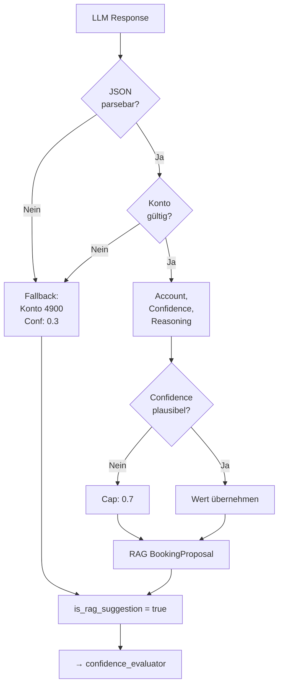

**Sicherheitsmaßnahmen:**

1. **Konto-Validierung**: Prüfung ob Konto existiert
2. **Confidence-Cap**: LLM-Konfidenz wird auf max. 0.7 begrenzt
3. **RAG-Flag**: Vorschläge werden als RAG markiert (niedrigerer rule_type_score)

---

## 7. Compliance-Prüfung

### 7.1 Prüfungslogik

Die Compliance-Prüfung validiert Rechnungen gegen die Anforderungen des §14 UStG:

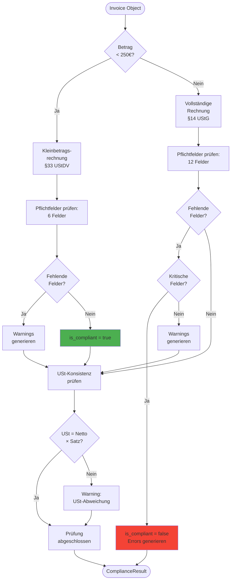

### 7.2 Feldkategorien

**Kritische Felder (führen zu is_compliant=false):**

- Lieferantenname
- Lieferantenanschrift
- Rechnungsnummer
- Rechnungsdatum
- Steuernummer/USt-IdNr. (außer Kleinbetrag)

**Nicht-kritische Felder (führen zu Warnings):**

- Lieferdatum (§14 erlaubt "im Monat der Lieferung")
- Empfängername (bei B2B oft implizit)

---

## 8. Audit & Persistenz

### 8.1 Datenfluss-Übersicht

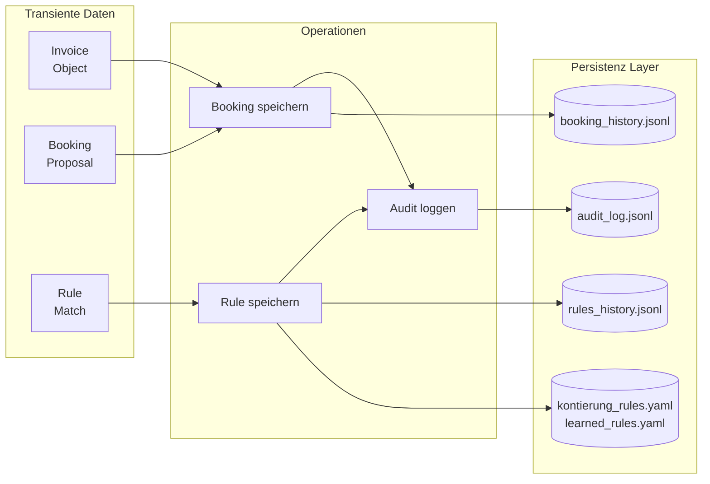

### 8.2 Append-Only Garantie

Alle historischen Daten werden nur angehängt, nie überschrieben oder gelöscht:

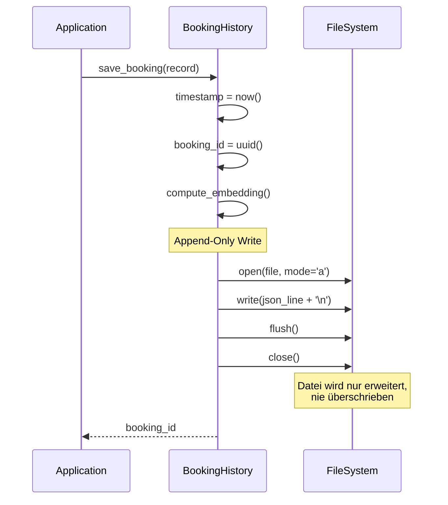

**GoBD-Compliance:**

- Keine DELETE-Operationen
- Keine UPDATE-Operationen (nur APPEND)
- Jeder Eintrag hat Timestamp und Checksum
- 10-Jahre-Aufbewahrung unterstützt

---

*Workflow-Dokumentation - Version 1.0*
*Letzte Aktualisierung: 2026-01-27*
